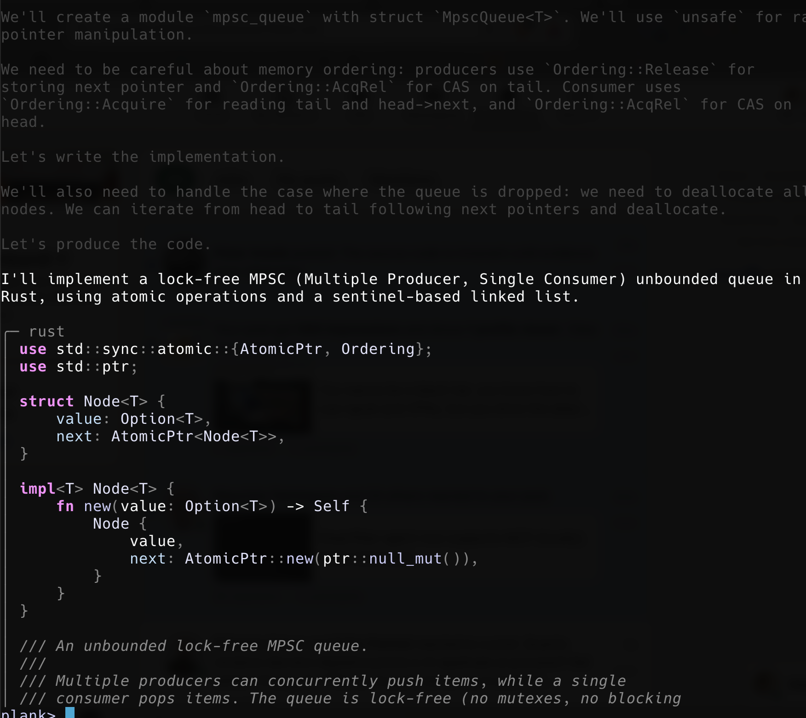
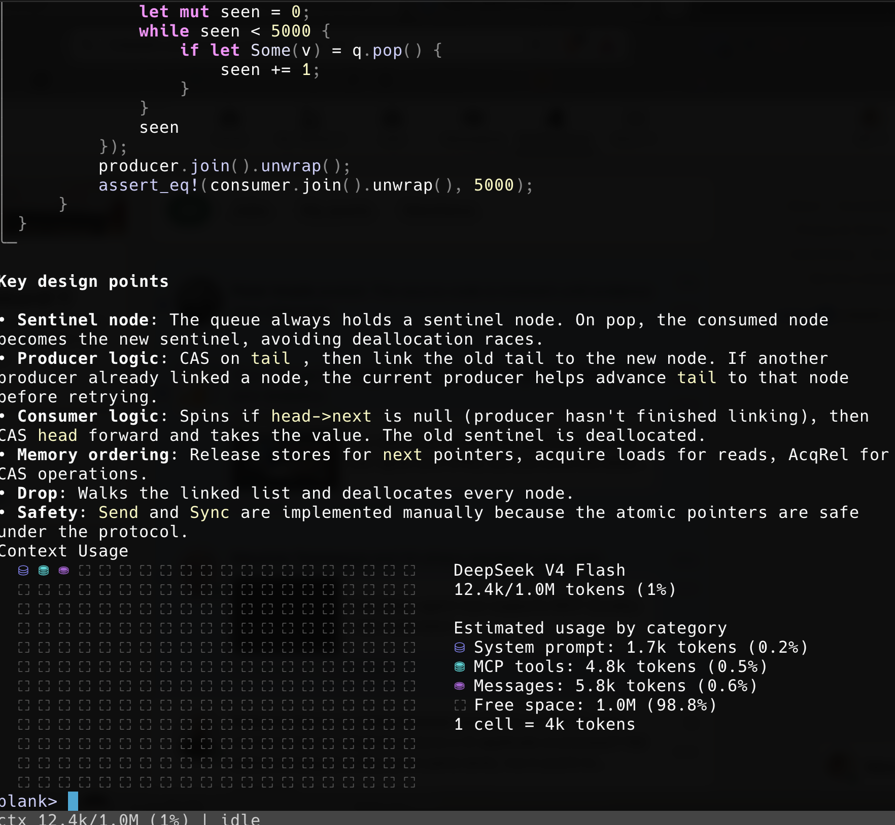
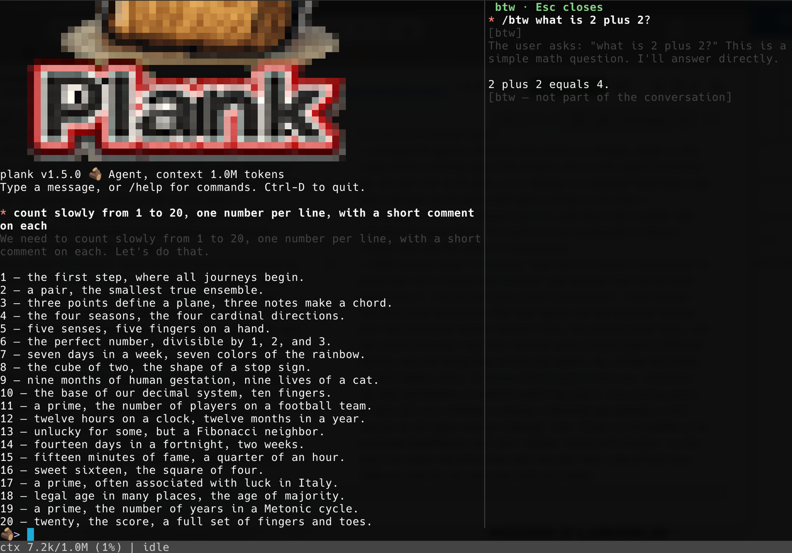
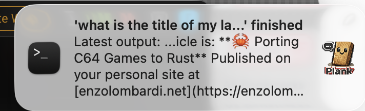
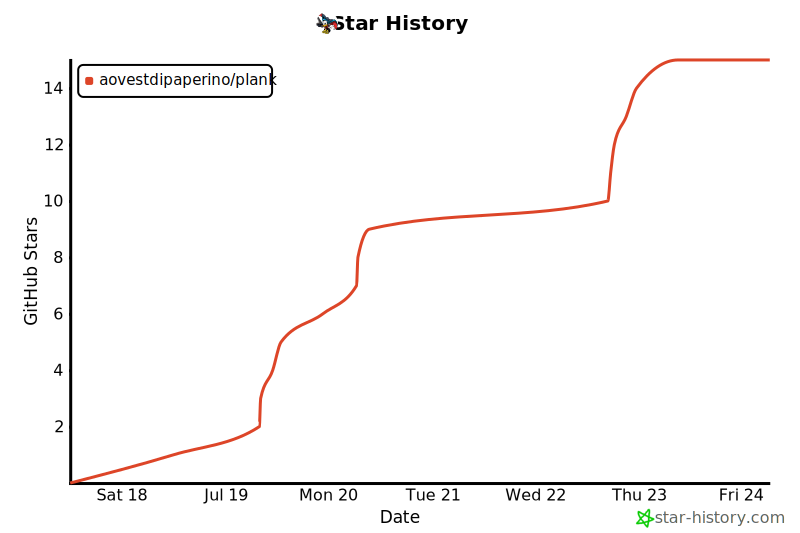

# plank

<p align="center">
  
</p>

<p align="center">
  <a href="https://github.com/aovestdipaperino/plank/stargazers"></a>
  <a href="https://opensource.org/licenses/MIT"></a>
  <a href="https://www.rust-lang.org/"></a>
  <a href="https://ai.enzolombardi.net/"></a>
</p>

Plank is a fast-moving agent harness built on the [ds4](https://github.com/aovestdipaperino/ds4) C reference (`ds4_agent`). It was ported functionality-by-functionality (not line-by-line), with each C section becoming an idiomatic Rust module, so changes landing in `ds4_agent` stay easy to port over — the upstream remains the source of truth for wire formats and prompt text, while plank iterates quickly on everything around it.

Plank is an interactive coding agent with a Ratatui TUI, a plain terminal REPL, a one-shot headless mode, and a set of built-in tools (shell, file read/edit, web).

> **macOS only.** Plank targets macOS exclusively: inference uses the original ds4 C engine with the Metal backend, linked via the `refs/ds4` submodule. Other platforms are not supported.

## Installing

Homebrew is the only distribution channel (plank is not on crates.io):

```sh
brew tap aovestdipaperino/tap
brew install plank-agent         # stable channel
brew install plank-agent-beta    # beta channel
```

Or in one step without a prior tap: `brew install aovestdipaperino/tap/plank-agent`. Prebuilt bottles exist for Apple Silicon and Intel Macs; on other setups Homebrew builds from source (requires Rust). Upgrade with `brew upgrade plank-agent`.

> **Note — formula naming.** The Homebrew formulas are `plank-agent` / `plank-agent-beta`, not `plank`, because a `plank` formula already exists in Homebrew and the bare name collides. The installed binary is still just `plank` — you run `plank`, only the `brew install` name carries the `-agent` suffix.

Releases follow a two-channel scheme where the patch number *is* the channel: every `vX.Y.0` is a stable release, and any patch above 0 is a beta (the app's version banner shows ` BETA` accordingly). A series opens with its stable `.0` and accumulates beta work as patch bumps (`v2.5.1`, `v2.5.2`, …); promoting a beta to stable opens the next minor as an identical `v2.6.0` (stable) / `v2.6.1` (beta) pair. The two formulas conflict since both install a `plank` binary, so switch channels with `brew uninstall plank-agent && brew install plank-agent-beta` (or the reverse). See [VERSIONING.md](VERSIONING.md) for the channel model and the promote-to-stable process.

## Building

Requires macOS (Apple Silicon or Intel) with the Xcode command line tools. Clone with the submodule to get the ds4 engine:

```sh
git clone --recurse-submodules https://github.com/aovestdipaperino/plank
cd plank
cargo build --release
```

- **With `refs/ds4` present:** `build.rs` builds `libds4core.a` from the Metal-backend objects and links the required frameworks, enabling the `ds4_engine` cfg.
- **Missing submodule:** plank still builds, but without the native engine it uses the echo engine only (useful for development/CI).

You will also need a GGUF model file (e.g. `ds4flash.gguf`) for real inference; see the `download_model.sh` script in `refs/ds4`.

## Usage

```sh
plank            # interactive REPL
plank --help     # full option list
```

Run with a prompt argument for one-shot headless mode.

### Model download

Real inference needs the DeepSeek V4 Flash GGUF. You can point plank at any copy with `-m <path>`, but with no flag it looks in the default location (`~/.plank/ds4flash.gguf`) and, when nothing is there, offers to fetch the quantized model (~87 GB) from Hugging Face — one keypress and it downloads in place with live progress:

<p align="center">
  
</p>

Details worth knowing:

- **Resumable.** The download streams to a `.part` file next to the destination; if it's interrupted (Ctrl-C, network drop), the next launch detects the partial file and resumes from where it stopped instead of starting over.
- **Guarded.** The default quant needs ~82 GB resident, so plank refuses to download or load on machines with less than 96 GB of RAM — you find out before spending hours on the transfer, not after.
- **Honest about the wait.** An 87 GB download takes a while; the progress bar keeps you company with size/rate counters and a rotation of two hundred status messages ("Almost sentient. Please hold." among them).
- **Headless-safe.** With stdin not attached to a terminal there is no prompt to answer, so plank exits with instructions instead of hanging a script.

Without a model (or on non-macOS platforms) plank still runs against a built-in echo stub — useful for developing the UI and tools, not for real inference.

### Plank-only features

plank tracks `ds4_agent` for the core agent loop but moves faster on the user-facing side. A few of the things that exist only in plank:

- **Full-screen Ratatui TUI** — markdown rendering with syntax-highlighted code, mouse-wheel scrollback, and an animated status bar that shows the working directory and git branch; the C reference is a plain line REPL. Resumed sessions replay through the same renderer, so history comes back as markdown with thinking dimmed, not flat text.
- **Type while it thinks** — each turn runs on a worker thread, so the prompt stays live during generation and you can queue the next message.
- **`/btw` side questions** — ask something mid-task; the running generation genuinely suspends, answers in a split panel, and resumes byte-for-byte with no re-prefill.
- **Checkpoints, resume, and instant KV restore** — `/checkpoint`/`/rollback` and `/resume` snapshot the live engine KV alongside the transcript, so returning to a conversation skips re-prefilling it.
- **Git-style diff cards** — an `edit` (or an overwriting `write`) renders as a change card with an `Update(path)` header, an added/removed summary, and red/green `@@` hunks; a brand-new file streams its content dimmed as it is written.
- **`agent` sub-agent tool** — the model delegates a bounded task to a fresh scoped sub-agent and gets back only its conclusion, keeping the main transcript clean; bounded so a sub-agent can't itself delegate.
- **Plan mode** — `EnterPlanMode` holds the model read-only (research only) until it proposes a plan you approve with `ExitPlanMode`, before any edits land.
- **`@` file completion, `glob`, and a model-visible task list** that survives compaction.
- **Extensible** — skills (user- *and* model-invoked), named subagents, an expanded hook system, MCP tools and resources, and a `settings.json` for durable preferences.
- **`ask` tool** — when a turn is genuinely ambiguous the model can pose a multiple-choice question instead of guessing; you pick in a panel (or numbered list in the REPL), and it degrades cleanly when there's no user to ask.
- **Desktop notifications & live window title** — long turns end with a persistent macOS banner (`'<prompt>' finished` and the tail of the answer; `interrupted` for aborted turns), configurable to fire `always`, only while `unfocused`, or `never`; the terminal title tracks the task (`🪵 plank - fix the bug…`).

See **[docs/FEATURES.md](docs/FEATURES.md)** for the complete list.

### Highlights

Assistant replies render as markdown in the TUI, with tree-sitter syntax highlighting for fenced code blocks:

<p align="center">
  
</p>

The `/context` command visualizes context-window usage by category:

<p align="center">
  
</p>

`/btw` answers a side question in a split panel while the main task keeps its place — here the model counts to 20 on the left while a `/btw what is 2 plus 2?` is answered on the right, with nothing written to the conversation:

<p align="center">
  
</p>

Long turns end with a native macOS notification — your prompt as the headline and the tail of the answer as the body, wearing your terminal's icon and plank's logo. `ui.notifications` picks when they fire: `always`, `unfocused` (only while the terminal isn't focused), or `never`:

<p align="center">
  
</p>

### Settings file

Preferences you'd otherwise retype every launch live in `settings.json`, hierarchical like the MCP configs: `~/.plank/settings.json` applies globally, `./.plank/settings.json` in the working directory overrides it key by key. Everything is optional — the file need not exist, and any subset of keys works. Edit it in-session with `/config` (an interactive TUI form, or `/config <section>.<key> <value>` from the prompt, e.g. `/config ui.showThinking false`); changes write `./.plank/settings.json` and apply immediately.

```json
{
  "engine": { "model": "~/models/ds4.gguf", "threads": 8,
              "backend": "metal", "power": 80, "ctx": 262144 },
  "ui":     { "respectGitignore": true, "popupRows": 15, "indexRefreshSecs": 5,
              "historySize": 512, "showToolCalls": false, "showToolResults": false,
              "showThinking": true, "notifications": "always", "notifyAfterSecs": 10 },
  "tools":  { "task": false, "agent": false, "planMode": false },
  "safety": { "sandbox": true, "btwSuspend": true },
  "mcp":    { "timeoutSecs": 30 },
  "ask":    { "maxOptions": 7 }
}
```

| Group | Key | Default | What it does |
|---|---|---|---|
| `engine` | `model` | `~/.plank/ds4flash.gguf` | Model file to load (`~` expanded). Same as `-m`. |
| | `threads` | engine default | Worker threads. Same as `-t`. |
| | `backend` | platform default | `metal`, `cuda`, or `cpu`. Same as `--backend`. |
| | `power` | unset | GPU power cap percent. Same as `--power`. |
| | `ctx` | 1048576 | Context window in tokens. Same as `-c`. |
| `ui` | `respectGitignore` | `true` | Whether `@` completion honours `.gitignore` for untracked files. |
| | `popupRows` | 15 | Rows the `@` completion popup offers. |
| | `indexRefreshSecs` | 5 | How long the file index is trusted before a rebuild. |
| | `historySize` | 512 | Prompt history entries retained. |
| | `showToolCalls` | `false` | Show the model's `🛠️` tool-call banners. Off keeps the UI uncluttered; the tools still run. |
| | `showToolResults` | `false` | Echo tool result text into the scrollback. Off keeps the UI clean; the model still receives the results. |
| | `showThinking` | `true` | Render the model's thinking (dimmed) in the scrollback. Off hides it from the display; the model still produces it. |
| | `notifications` | `always` | When desktop notifications fire: `always`, `unfocused` (only while the terminal window isn't focused), or `never`. |
| | `notifyAfterSecs` | 10 | Minimum turn duration before a turn-end notification; awaiting-input notifications ignore it. |
| | `crtOff` | `true` | CRT power-off animation on clean TUI exit. |
| `safety` | `sandbox` | on (macOS) | Default for the bash write sandbox. Same as `--sandbox`/`--no-sandbox`. |
| | `btwSuspend` | `true` | Default for `/btw` mid-generation suspend. Same as `--btw-suspend`/`--disable-btw-suspend`. |
| `mcp` | `timeoutSecs` | 30 | How long an MCP server has to answer before it's considered dead. Raise it for a slow-starting server, since a server that misses the deadline is dropped along with all of its tools. |
| `ask` | `maxOptions` | 7 | Most options the `ask` tool may offer in one question (minimum is fixed at 2). |
| `tools` | `task` | `false` | Enable the `task` todo-list tool. Off by default — it, like `agent`/`planMode`, has no counterpart in the C reference the model was trained on, so a small model tends to misuse it. |
| | `agent` | `false` | Enable the `agent` sub-agent delegation tool. |
| | `planMode` | `false` | Enable plan mode (`EnterPlanMode`/`ExitPlanMode`). |

Precedence runs left to right, each layer overriding the one before:

```text
built-in defaults → ~/.plank/settings.json → ./.plank/settings.json → environment → command-line flags
```

Because a settings file can move you off Metal or shrink the context — and both are invisible once the UI is up, showing only as "plank got slow" — plank prints one line at startup naming what is in force:

```text
plank: settings in effect (/path/to/.plank/settings.json): threads=3, backend=cpu, ctx=65536
```

It lists only settings actually in effect: a value a command-line flag overrode is not mentioned, and with no settings file (or one that changes nothing) there is no line at all.

Two things the file deliberately does **not** do:

- **It holds no secrets.** `./.plank/settings.json` sits inside your working tree and is easy to commit by accident, so there is no API-key setting — keep it on `--api-key` or the provider's environment variable.
- **It holds no per-run choices.** `--prompt`, `--non-interactive`, `--ui-remote`, `--trace`, `--chdir`, `--seed`, and the serve/control options describe one invocation rather than a preference, so they have no settings key.

A broken settings file never stops plank from starting: malformed JSON, a wrongly-typed value, an unknown key, or an unrecognised backend name each fall back to that key's default. (The same unrecognised name passed to `--backend` is still an error — a flag is an explicit instruction, a config file is a preference.) One limitation: settings are read from the directory plank launches in, so project-scoped settings do not follow `--chdir`.

### MCP servers

Plank can load external tools from stdio and Streamable HTTP MCP servers. Configs are hierarchical like Claude Code's user and project scopes: `~/.plank/.mcp.json` applies globally, and `./.mcp.json` in the working directory (or the file given with `--mcp-config`) overrides same-named servers and adds new ones. Both use the standard `mcpServers` format — a `command` entry is spawned as a stdio subprocess, a `url` entry is reached over Streamable HTTP (optional `headers` carry e.g. an `Authorization` token):

```json
{
  "mcpServers": {
    "demo": {
      "command": "some-mcp-server",
      "args": ["--flag"],
      "env": {"KEY": "value"},
      "primaryTools": ["tool_a"]
    },
    "remote": {
      "type": "http",
      "url": "http://127.0.0.1:6510/mcp",
      "headers": {"Authorization": "Bearer <token>"}
    }
  }
}
```

Tools are exposed to the model as `mcp__<server>__<tool>`. The optional `primaryTools` list controls prompt size: listed tools get their full schema in the system prompt, the rest appear in a compact directory and are described on demand via the built-in `mcp_describe` tool. Omit the key to make every tool primary.

### Remote, hosted, and shared engines (beta)

The v2 beta channel extends plank past a single local process. All of it is off by default; a plain `plank` still runs the local Metal engine exactly as before.

- **Serve and connect** — `plank serve` hosts the local ds4 engine over HTTP+SSE so another machine can use it; `plank --remote <url>` points a thin client at that host (drive from a laptop, infer on the Metal box). The transport is synchronous, adds no async runtime, and streams tokens as they generate. Token auth via `--remote-token` / `$PLANK_REMOTE_TOKEN`; keep it behind an SSH tunnel or a TLS reverse proxy.
- **Hosted providers** — behind the same `Engine` trait, `--provider openai --model <name>` targets any OpenAI-compatible endpoint (`--base-url`, `--api-key` / `$OPENAI_API_KEY`; covers vLLM, Ollama, OpenRouter, Together) and `--provider anthropic` targets the Anthropic Messages API (`$ANTHROPIC_API_KEY`). Native provider tool calls are synthesized back into plank's DSML tool syntax, so tools dispatch identically regardless of backend, and multi-turn tool-call ids are threaded through. Anthropic prompt caching (`cache_control`) is on by default (`--provider-cache`).
- **Shared engine** — `plank serve --shared-engine` loads the weights once and serves many concurrent sessions from a single cooperative GPU thread (round-robin at token granularity; the one Metal queue means time-sliced, not parallel). A freshly attached session restores the warm system-prompt prefix instead of cold-prefilling it. `--max-sessions` and `--kv-budget-bytes` cap admission, `--session-ctx-size` sizes each session's context, and `--idle-reclaim-secs` snapshots idle sessions to disk and restores them on demand; `/info` reports live-session and KV accounting.
- **Remote control** — `plank --control[=ADDR]` opens a loopback WebSocket so another process, a browser, or the `plank remote <url>` terminal client can attach to a running instance: it mirrors the output, sends prompts/commands/`/btw`/interrupts, and takes or hands back control (single controller, many mirrors, with a reconnect grace window). A self-contained web client is served at `/`. Auth is a bearer token (`--control-token`), with an `--control-origin` allow-list for browsers and `--control-queue-max` slow-client eviction.
- **`--ui-remote[=PORT]`** — for driving the TUI from a test harness: opens a `127.0.0.1`-only listener (bare form picks an ephemeral port, `=PORT` a fixed one) accepting line-delimited JSON `keypress`/`snapshot`/`uitree` commands. `snapshot`/`uitree` replies are held until the screen reflects any keys sent first, so a harness can assert without sleeping. One client at a time; a second simply queues.

### Using OpenAI or Anthropic providers

plank can drive a hosted model instead of the local one. The provider sits behind the same `Engine` trait as the Metal backend, so tools, sessions, `/btw`, compaction, and the rest of the agent loop behave identically — native provider tool calls are translated back into plank's own tool protocol on the way through.

Pick a provider with `--provider` and name the model with `--model`. The API key is read from the provider's environment variable, so you normally do not pass it on the command line:

```sh
# OpenAI
export OPENAI_API_KEY=sk-...
plank --provider openai --model gpt-4o

# Anthropic
export ANTHROPIC_API_KEY=sk-ant-...
plank --provider anthropic --model claude-sonnet-4-5
```

Both providers work with a one-shot prompt too: `plank --provider anthropic --model <name> -p "..."`.

**Flags**

| Flag | Meaning |
|---|---|
| `--provider openai\|anthropic` | Selects the provider family. `openai` speaks the OpenAI-compatible Chat Completions API; `anthropic` speaks the Anthropic Messages API. |
| `--model NAME` | The provider's model name (not a local GGUF path). Required with `--provider`. |
| `--api-key KEY` | The key, if you would rather not use the environment variable. Prefer the env var — a key on the command line lands in your shell history. |
| `--base-url URL` | Overrides the endpoint. Defaults to `https://api.openai.com/v1` and `https://api.anthropic.com/v1`. |
| `--provider-cache on\|off` | Anthropic prompt caching over the stable prefix (tools + system). On by default; ignored for `--provider openai`. |

**Key resolution** — `--api-key` wins if given, otherwise `$OPENAI_API_KEY` (openai) or `$ANTHROPIC_API_KEY` (anthropic). With neither set, startup fails with a clear message rather than a confusing API error.

**OpenAI-compatible gateways** — `--provider openai` plus `--base-url` reaches anything that speaks the OpenAI Chat Completions shape: vLLM, Ollama, OpenRouter, Together, LM Studio, and similar. For example, a local Ollama:

```sh
plank --provider openai --model llama3.3 \
      --base-url http://localhost:11434/v1 --api-key ollama
```

**What stays the same** — every plank tool (`read`/`edit`/`bash`/`glob`/`search`/…), the MCP tools, `@` completion, sessions and `/resume`, `/btw`, and compaction all work unchanged against a provider. The one difference is the system prompt: a provider gets plank's own prompt with native tool definitions, never the byte-parity DeepSeek prompt (which is meant only for the local model it was trained on).

**Notes** — `--provider` cannot be combined with `--remote` or the local backend selectors (`--metal`/`--cuda`/`--cpu`); it *is* the engine for that run. `/usage` reports billed token counts for the session, including Anthropic cache read/write and hit rate. The key is never written to `settings.json` — it stays on the environment or `--api-key` by design.

## Project layout

Each module in `src/` maps to one functional section of the original `ds4_agent.c`:

- `engine.rs` / `ds4engine.rs` / `ffi.rs` — inference engine abstraction and native ds4 bindings
- `session.rs`, `compact.rs`, `sysprompt.rs` — conversation state, compaction, system prompt
- `tools/` — built-in agent tools (bash, edit, files, web) and the MCP client
- `ui.rs`, `render.rs`, `statusbar.rs`, `editor.rs`, `viz.rs` — terminal UI
- `config.rs`, `settings.rs`, `trace.rs`, `interrupt.rs`, `status.rs` — configuration, persistent settings, tracing, signal handling

## Star History

<!-- Chart is rendered in CI by .github/workflows/star-history.yml (the hosted
     star-history.com embed broke with GitHub's 2026-06-30 stargazers API
     restriction). The action rewrites everything between these markers. -->
<!-- star-history:start -->
<picture>
  <source media="(prefers-color-scheme: dark)" srcset="assets/star-history/star-history-dark.svg">
  
</picture>
<!-- star-history:end -->

## License

[MIT](LICENSE)
