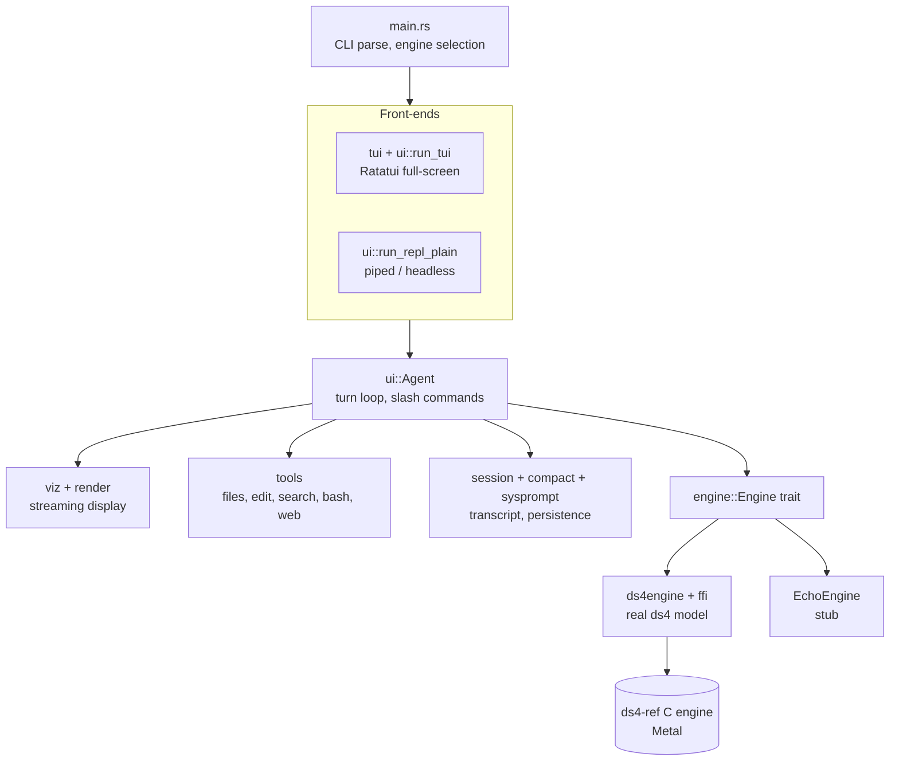
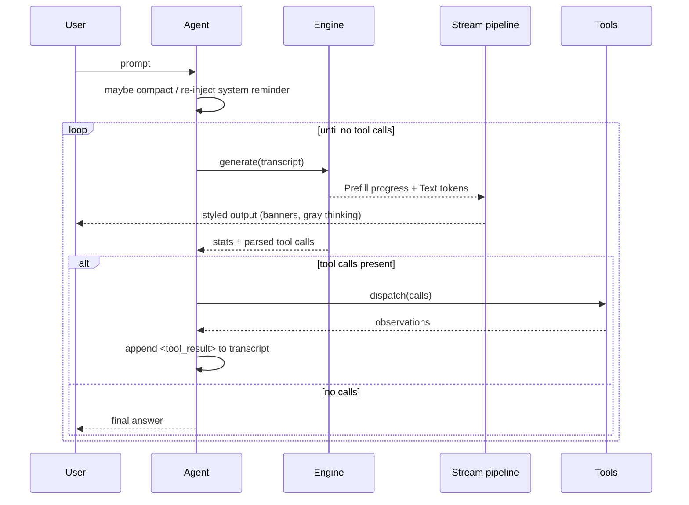

# plank Architecture

plank is a Rust port of the `ds4_agent` reference (a single-file C agent for the
DeepSeek V4 Flash model). It is a **functionality-by-functionality** port, not a
line-by-line translation: each C section became an idiomatic Rust module with
its own tests, while preserving the model-facing behavior (prompt shape, tool
protocol, output formats) that the model was trained on.

The C reference lives in the `ds4-ref` git submodule and is the source of truth
for wire formats and prompt text.

## Design principles

- **Narrow engine surface.** All inference sits behind the `Engine` trait, so
  the agent, UI, and tools never touch model internals. A stub `EchoEngine`
  keeps the whole app runnable without a model.
- **Sink-agnostic rendering.** Model output flows through a streaming pipeline
  whose final destination (stdout, or a Ratatui buffer) is a swappable sink.
- **Preserve model-facing formats.** Tool output framing, the DSML tool-call
  syntax, and the system prompt are reproduced verbatim from the C reference.
- **Correctness before cleverness.** The KV cache reuses only a genuinely
  matching token prefix; a stale disk checkpoint is rebuilt, never trusted.

## Layers

## The turn lifecycle

A "turn" is one user prompt driven to a settled answer. The agent generates,
runs any tool calls the model emitted, feeds the results back, and repeats until
a generation produces no tool calls.

## Module reference

### Agent core (`ui.rs`, `worker.rs`)
Owns the `Agent` struct (engine, session, tools, system prompt, trace) and the
turn loop (`run_turn` / `worker_turn`). Hosts the two interactive front-ends and
the slash-command handlers. Also holds `render_transcript`, which flattens the
message list into the `[system]`/`[user]`/`[assistant]` text the engine tokenizes.

In the TUI, each turn runs on a scoped worker thread (the C's "Model Worker
Thread" split): the worker owns the agent — generation, tool dispatch,
compaction — and reports over an mpsc channel of `worker::UiEvent`s (the
`RenderSink` calls made by its stream renderer, plus log lines and status
snapshots). The UI thread stays in a real event loop: the next prompt remains
editable while the model runs, Enter queues it (the worker drains queued lines
into the transcript between tool rounds, like the C's `queued_user_drain`;
lines left over when the turn settles start a fresh turn), and Esc/Ctrl-C set
a shared interrupt flag. The plain line REPL keeps the synchronous inline
loop — with piped stdin there is no live input to multiplex.

### Engine abstraction (`engine.rs`, `ds4engine.rs`, `ffi.rs`)
- `engine.rs` — the `Engine` trait (`generate`, `warm_system_prompt`,
  `count_tokens`, `ctx_size`), the event types (`EngineEvent::{Prefill, Text}`),
  options, stats, and the `EchoEngine` stub.
- `ffi.rs` — raw declarations for the subset of the ds4 C API plank uses
  (engine open/close, chat-template tokenization, session sync/sample/eval,
  KV snapshots). Present only under the `ds4_engine` cfg.
- `ds4engine.rs` — the safe `Ds4Engine` wrapper. Keeps one live session alive
  across turns so `ds4_session_sync` reuses the cached KV prefix and only
  prefills the new suffix. Streams `Prefill` events via a display-progress
  callback and samples with cooperative interrupt.

### Streaming display (`viz.rs`, `render.rs`, `dsml.rs`)
Model text is fed byte-by-byte through a pipeline:
1. `viz::StreamRenderer` detects the DSML tool-call marker (in plain text and
   inside `<think>` blocks), suppresses raw markup, and emits human-friendly
   tool banners. It routes output to a `RenderSink` (visible, thinking, and
   red-styled error banners; raw DSML never reaches the screen, even on parse
   failure).
2. `render.rs` (stdout path) turns that into ANSI: markdown, syntax
   highlighting, and gray thinking text.
3. `dsml.rs` is the strict parser that turns a completed stanza into executable
   `ToolCall`s.

### Tools (`tools/`)
`dispatch` maps a `ToolCall` to an implementation, mirroring the C tool table:
`files.rs` (read/more/write/list), `edit.rs` (edit with `[upto]` anchoring,
search), `bash.rs` (sync + async jobs), `web.rs` (`google_search`, `visit_page`).
Output framing matches the C byte-for-byte.

### Sessions & context (`session.rs`, `compact.rs`, `sysprompt.rs`)

See `docs/SYSTEM-PROMPT.md` for the full story of how the system prompt is
built, snapshotted to `sysprompt.kv`, and invalidated across versions.
- `session.rs` — save/load/list/switch/delete with SHA-1 identities and history
  rendering under `~/.plank/kvcache`.
- `compact.rs` — the durable-summary + verbatim-tail rebuild and its pressure
  thresholds.
- `sysprompt.rs` — the verbatim tools/system prompt, datetime context, and the
  token-distance policy for re-injecting the system-prompt reminder.

### Terminal front-ends (`tui.rs`, `status.rs`, `statusbar.rs`, `editor.rs`)
- `tui.rs` — the Ratatui presentation layer: a styled scrollback `OutputLog`
  (a `RenderSink`), the frame layout, and the magenta-colored progress bar.
  `OutputView` tracks the scroll viewport: it follows the newest output by
  default, pins in place when the user wheels back (also mid-generation),
  and shows a jump-to-bottom hint until End resumes following.
- `status.rs` — the compact footer text and the prefill progress bar.
- `statusbar.rs` — the single-line `\r`-updated bar for the stdout path.
- `editor.rs` — `LineBuffer`/`History` primitives reused by the TUI input.

### Support (`config.rs`, `trace.rs`, `interrupt.rs`, `logo.rs`, `repro.rs`)
CLI parsing, trace logging (`--trace`), the SIGINT flag for interrupting
generation, the startup banner, and `/repro` — a read-only diagnostic dump of
the exact rendered engine input plus generation knobs, written to
`~/.plank/repro/` for bug reports.

## Data flows worth understanding

### System-prompt KV cache
On startup the agent warms the cache before the first turn:

1. `Ds4Engine::warm_system_prompt` builds system-only chat tokens and computes a
   fingerprint = `SHA-1(model_name + "\0" + system_prompt)`.
2. If `sysprompt.kv` exists and its stored fingerprint matches, the snapshot is
   restored (`ds4_session_load_snapshot`) — no prefill.
3. Otherwise it shows **"Updating system prompt cache..."**, prefills the system
   prompt (streaming the progress bar), and saves a fresh checkpoint.

Within a run, the live session then makes each turn reuse the common prefix, so
only the new user/assistant suffix is evaluated.

### Per-session KV payloads

`/save` also snapshots the live engine KV to a sidecar next to the transcript
(`~/.plank/kvcache/<sha>.payload`). The raw KV bytes come from the shared
`Engine::snapshot_kv` / `restore_kv` primitive (the same one `/checkpoint`
uses, wrapping `SessionSnapshot::as_bytes` / `restore_bytes` in `snapshot.rs`);
`snapshot_kv` returns `None` on the echo stub, so no payload is written there.
The payload sidecar and fingerprint staleness check live one layer up, in the
`Agent` (`save_session_payload` / `load_session_payload` in `ui.rs`, backed by
`session::write_payload` / `read_payload`) — there is no second hand-rolled
KV-serialize path at the FFI level. The payload file layout matches
`sysprompt.kv`: a fingerprint line, then the raw `ds4_session_save_snapshot`
bytes. The fingerprint is `SHA-1(model_name + "\0" + system_prompt + "\0" +
rendered_transcript)`, so *any* drift — different model, changed system prompt,
or a transcript that gained turns or was compacted since the save — makes the
payload stale.

`/switch` and `/resume` try to restore the payload; on a fingerprint match the
resumed session skips re-prefilling the transcript entirely. A stale, missing,
or unloadable payload silently falls back to a full prefill: stale payloads
are rebuilt, never trusted (the C reference's policy). `/strip <sha>` deletes
the payload while keeping the transcript, reporting the token count a later
`/switch` pays to rebuild it; `/list` shows payload size or `stripped`.
Transcript files stay in the v1 text format — payloads are pure sidecar
caches, so old session files and old readers are unaffected. Upgrade
maintenance (`upgrade.rs`) deletes `*.payload` on minor/major bumps purely to
reclaim disk; correctness never depends on that because of the fingerprint.

### Interruption
Between tokens the engine polls an `interrupt` closure. In the TUI the worker
thread's closure reads `TurnShared::interrupt`, set by the UI thread on
Esc/Ctrl-C (plus the SIGINT atomic); in the plain path it reads the SIGINT
atomic (`interrupt.rs`) directly.

## Front-end selection

`main::run` picks the path from the terminal:

| stdin & stdout are a TTY | `--non-interactive` | Front-end |
| --- | --- | --- |
| yes | no | Ratatui TUI (`run_tui`) |
| no | no | Plain line REPL (`run_repl_plain`) |
| — | yes | Headless stdin protocol (`run_non_interactive`) |

The TUI uses the alternate screen, so block-based terminals (Warp) render it as
a proper full-screen app rather than reflowing it.

## Build

`build.rs` compiles the ds4 C engine from the `ds4-ref` submodule on macOS
(Metal objects → `libds4core.a`), links Foundation + Metal, and emits the
`ds4_engine` cfg. Off macOS, or without the submodule, the cfg is absent and
plank builds with the `EchoEngine` only. The Metal kernel directory is baked in
so the engine can locate its `.metal` sources at runtime.

## Testing

Each module carries unit tests (the DSML parser, renderers, tools, session
persistence, compaction thresholds, config parsing). The pure logic is testable
without a model; the `EchoEngine` exercises the turn loop end-to-end. The
pre-commit hook runs `cargo fmt` and `cargo clippy --workspace --all-targets`.
