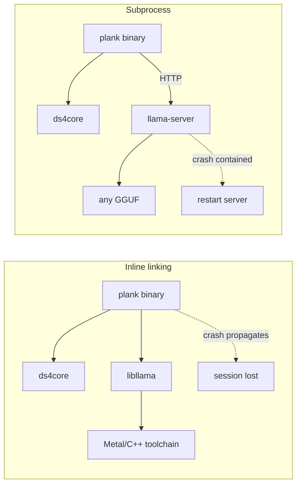

# August 1st Benchmark: Why Not To Link llama.cpp Inline

On August 1st 2026 we measured four models against plank to answer a narrow
question: are open GGUF models good enough to be worth supporting, and if so,
how should plank talk to them? The models turned out to be good enough. The
interesting result was the second half of the question, because the obvious
answer (link `libllama` into the plank binary the way `ds4core` is linked) is
the wrong one.

This document records what we measured and why the in-process route is not
worth taking.

## What was measured

Every model ran the same ten HumanEval problems, chosen from the hard tail of
the set because an easy spread produced a 10/10 for the first model tested and
therefore could not rank anything. Grading executed the reference tests in a
subprocess. The three llama.cpp models were run twice, on an idle machine, and
their scores pooled.

| Model | Score | Size | Peak tok/s | Mean tok/s | Peak/min | Wall clock | Thinking | Engine |
|---|---|---|---|---|---|---|---|---|
| DeepSeek V4 Flash (antirez IQ2XXS) | 8/10 | 86.7 GB | n/a | n/a | n/a | 905 s | n/a | plank native `ds4core` |
| Ornith-1.0-35B | 16/20 | 22.3 GB | 53.6 | 51.8 | 1.07x | 940 s | 155k ch | llama.cpp |
| GLM-4.7-Flash | 13/20 | 17.5 GB | 79.4 | 59.7 | 1.80x | 680 s | 118k ch | llama.cpp |
| Qwen3-Coder-Next | 13/20 | 49.6 GB | 59.2 | 45.5 | 1.38x | 69 s | 0 | llama.cpp |

The DeepSeek row is a single run of ten rather than a pooled twenty, ran on a
different engine, and carried plank's full agent loop (a system prompt of about
21,700 tokens plus the tool registry) where the other three received a bare
prompt over the API. Its wall clock is therefore not comparable. Its score is,
because the problems, the extraction and the grader were identical.

The headline is that Ornith-1.0-35B matches DeepSeek V4 Flash's score at a
quarter of the size, on stock llama.cpp, with no custom engine, no 96 GB memory
floor and no single-instance lock. `gemma-4-31B` was also exercised on the tool
path and passed, at 26 tok/s.

Tool dispatch through plank worked for every model tested. Qwen3-Coder-Next and
Ornith called `read` correctly on the first attempt. GLM-4.7-Flash and
gemma-4-31B both invented a `tokensave_config` tool, received `unknown tool`,
and recovered without help. That recovery is worth noting on its own: the agent
loop is robust to a model guessing wrong.

## How plank talks to these models today

It already works, and it required no changes to plank at all:

```sh
llama-server -m model.gguf --jinja -c 65536 -ngl 99
plank --provider openai --base-url http://127.0.0.1:8080/v1 --model whatever
```

`ProviderEngine` sets `wants_structured()`, so plank sends a native `tools`
array and llama.cpp returns native `tool_calls`, which plank renders back into
DSML for display. The wire format the model was trained on is never involved,
so the byte-parity constraints that govern the ds4 path do not apply here.

## The case against linking inline

### llama.cpp cannot run the model plank exists for

`DeepSeek-V4-Flash` reports `general.architecture = deepseek4`. Upstream
llama.cpp b9820, current at time of writing, rejects it:

```
error loading model: unknown model architecture: 'deepseek4'
```

This is not version lag. `ds4core` exists precisely because upstream cannot run
this model. Linking `libllama` in would therefore not replace anything. plank
would carry two native inference engines, two build paths, two sets of Metal
linkage and two upgrade treadmills, to support one architecture each. The
subprocess route carries one native engine and shells out for the rest.

### The GGUF ecosystem is less stable than it looks

We downloaded 96.8 GB of `DeepSeek-V4-Flash-0731` from a reputable publisher.
Every integrity check passed: exact byte counts on all three shards, no
truncation, clean retry history. The file was unusable. Its metadata omits
`deepseek4.vocab_size`, which `ds4core` requires, and no engine on the machine
could load it. A working quant of the same model carries 38 `deepseek4` keys;
that one carried 37.

A three megabyte range request against the header would have caught it before
the first byte of bulk transfer. The lesson for the loader boundary is that
model files vary in ways that are invisible to provenance and size checks, and
that the component absorbing that variance should be replaceable without
rebuilding the agent. A separate process is replaceable. A statically linked
library is not.

### Process isolation converted failures into non-events

Across the day, models failed to load, servers were killed and swapped four
times, and one 86.7 GB model was loaded while a 97 GB download ran. Every
failure was contained in the server process. plank itself never crashed,
because the failure could not reach it.

Inline, `unknown model architecture` is an abort inside the agent's own address
space, in a session that may hold an unsaved transcript. The same is true of
the out-of-memory conditions that a 128 GB machine running an 86.7 GB model
lives close to.

### The performance argument does not hold up

The reason to link inline is to own the KV cache. Two measurements undercut it.

First, llama-server already reports prefix cache hits
(`prompt_tokens_details.cached_tokens`), so the cross-turn reuse that motivates
in-process work is partly available over HTTP.

Second, and more decisively, generation runs between 40 and 80 tokens per
second. At that rate a local HTTP round trip is not a measurable cost. The
costs that did show up are of a completely different order. GLM-4.7-Flash spent
158,000 characters on reasoning to reach the same score Qwen3-Coder-Next
reached with none, taking 680 seconds against Qwen's 69. Two of GLM's ten
problems, and two of Ornith's, ended in `NO_CODE (finish=length)`, meaning
20,000 to 28,000 characters of reasoning ran into the token cap without
producing an answer.

Tokens spent dominates tokens per second, and neither is affected by whether
the engine is linked or spawned. Optimising the transport would be optimising
the wrong thing by two orders of magnitude.

### What linking would genuinely buy, and what it costs

The honest case for inline is the aside family: `generate_aside`,
`generate_aside_forked` and `generate_multiplexed`, which back `/btw`. Those
need a forked session and token-level interleaving on one context, which the
HTTP API does not express. Over the provider path they degrade to the
boundary-scheduled queue, which is a real loss of a real feature.

That is the trade to weigh. The price of recovering `/btw` for third-party
models is a second native engine, a C++ API that changes faster than plank's
release cadence, crash surface inside the agent process, build complexity on
top of an already conditional `build.rs`, and a loader that must absorb the
metadata variance described above. For a capability that degrades gracefully
rather than breaking.



## Recommendation

Keep llama.cpp at arm's length and spend the effort on the gaps that showed up
in the provider path instead. Three are worth fixing and none require linking
anything:

`ProviderEngine::ctx_size` reports plank's default rather than the server's
real context window, so the status bar claimed 1.0M tokens while the server was
configured for 65,536. plank would happily let a user run far past what a model
was trained on. The value is available from the server.

Reasoning models route their thinking into a separate `reasoning_content`
field, which plank renders as ordinary visible text rather than as thinking.
Three of the four models tested are reasoning models.

Driving a local server currently requires `--provider openai`, a `--base-url`
and a dummy `OPENAI_API_KEY`. A `--llama-cpp URL` shorthand would say what is
actually happening.

A fourth item is not about llama.cpp at all. plank's session-start context
includes `CLAUDE.md`, which documents the tokensave MCP tools, so models
reasonably infer those tools are registered when they are not. Two of four
models hallucinated `tokensave_config` on their first turn. plank is
advertising tools it does not dispatch.

## Reproducing

The harness used here was exploratory and lives outside the repository. The
findings that shaped it are worth carrying into anything more permanent:

Pin the problem subset rather than sampling per run, and pick from the hard
tail, because an easy subset returns 100% for every modern model and ranks
nothing.

Give reasoning models a large token budget and record `finish_reason`.
A budget sized for a non-reasoning model reports truncation as incorrectness.
Our first run scored 20% purely from this and the true figure was 70%.

Concatenate the original prompt with the model's answer before grading.
Several HumanEval problems define helper functions in the prompt that the tests
call, and grading the model's block alone produces spurious `NameError`
failures.

Do not trust a self-test that only grades canonical solutions. Ours passed
10/10 through both of the bugs above, because canonical solutions are function
bodies appended to a prompt and never exercise the extraction path.

Pin temperature and seed. Unpinned, scores moved by one problem in ten between
otherwise identical runs.

Do not benchmark while a large download runs. One problem took 1,878 seconds at
2.8 tokens per second under page cache pressure, against 42 to 82 tokens per
second for the same model on an idle machine.
