# KV caching in plank

This document explains *why* plank's KV cache is shaped the way it is, and then
*what* each piece does. It is self-standing: you should not need to read the
source to follow it, and it does not assume you have read the other documents
in this directory.

It reads top to bottom. Parts 1 through 3 are the narrative: the problem, the
forces acting on it, and the reasoning that produced the design. Part 4 is the
mechanics reference, organised by layer, and is where you go to answer "what
exactly does this function do". The remaining parts cover diagnosing a miss,
test coverage, the debugging stories, and the invariants to check before
changing anything. `FINDINGS.md` records the individual traps, each with the
debugging session that found it, and `docs/ARCHITECTURE.md` shows where these
pieces sit in the rest of plank.

A note on scope. Everything here concerns the local Metal-backed engine running
DeepSeek V4 Flash. Hosted providers have their own prompt-caching mechanisms with
entirely different economics, and plank uses them, but they are not this.

---

## Part 1: The requirement

### Where the time actually goes

A language model turn has two phases with wildly different costs. **Prefill**
reads the prompt and builds the attention key/value tensors for every token in
it. **Decode** then emits one token at a time, each step attending over
everything already in that KV state.

Decode is what you watch happen. Prefill is what you wait through before
anything appears. On a local Metal backend, prefill runs at a few hundred tokens
per second. That number is the entire reason this subsystem exists, because of
what gets fed to it.

plank's system prompt is thousands of tokens before you have typed anything: the
tool contract, every MCP server's schemas and instructions, the sub-agent roster.
Add project context, which means every `AGENTS.md` and `CLAUDE.md` plank
discovered, plus your memory file. Then add the conversation, which for a real
working session reaches tens of thousands of tokens. The model's context window
is one million tokens, and long sessions genuinely use a serious fraction of it.

Now consider the naive implementation, where each turn hands the model the whole
prompt and lets it read from the beginning. Turn *n* re-reads everything turns 1
through *n-1* already read, so the total prefill work over a conversation grows
with the square of its length:

| | Turn 1 prefills | Turn 2 prefills | Turn 3 prefills |
|---|---|---|---|
| **No reuse** | system + context + Q1 | system + context + Q1 + A1 + Q2 | system + context + Q1 + A1 + Q2 + A2 + Q3 |
| **With reuse** | system + context + Q1 | A1 + Q2 | A2 + Q3 |

The first row is quadratic in the length of the conversation. The second is
linear. At a thousand-token system prompt that difference is an annoyance; at
plank's actual prompt sizes it is the difference between a usable agent and one
that stalls for most of a minute before every reply.

What makes the second row possible is that the attention state for a prefix does
not depend on anything that comes after it. So if the model has already read
`system + context + Q1 + A1`, and the next prompt starts with exactly those same
tokens, the KV state for them is still valid and only the remainder needs
reading.

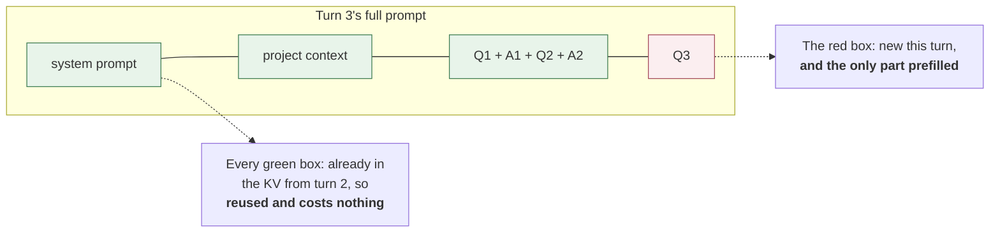

### Four requirements

From that, four requirements fall out, and they are listed in priority order
because they conflict and the order is how the conflicts get settled.

**R1. Reuse across turns.** Within one run of the process, turn *n+1* must not
re-read what turn *n* already read.

**R2. Reuse across launches.** Quitting plank and starting it again must not cost
a full rebuild of the system prompt. This is a separate requirement from R1
because it forces the KV state onto disk, which introduces every hard problem in
this document. R1 alone could be satisfied by keeping one session alive in
memory.

**R3. Never reuse wrongly.** This dominates R1 and R2, and understanding why is
the key to the whole design. A wrongly reused KV does not raise an error. It
produces a model whose attention state was built from a *different prompt than
the one on screen*. It will answer confidently, using tool definitions it no
longer has, a system prompt you edited an hour ago, or a conversation that
belongs to a different session. There is no exception, no log line, and no
plausible way for a user to diagnose it. Compared to that, a cache miss costs
some seconds.

**R4. Bounded disk.** Snapshots of a million-token-capable attention state are
large: hundreds of megabytes for a system prompt, and around a gigabyte for a
long conversation. Left unmanaged this reaches tens of gigabytes, which it did on
the author's machine before the retention policy described in Part 3 existed.

---

## Part 2: The constraints

R3 would be easy if identity were simple. It is not, and four properties of the
underlying machinery are the reason.

### The unit of identity is tokens, not text

The obvious way to check whether a cached KV matches the current prompt is to
compare the prompt text. This does not work, and the reason is worth internalising
because it recurs throughout the design.

Byte-pair encoding is many-to-one. Many token sequences decode to the same
string, and the tokenizer picks exactly one canonical segmentation of them, the
one its merge order produces. The *sampler* is under no such constraint. It can
emit `"in"` followed by `"to"` where the encoder would have produced the single
token `"into"`, split a number or an identifier at a different boundary, or emit
a rare standalone token that the merge rules would have absorbed into its
neighbour.

So detokenising a reply and retokenising it is not the identity function on token
ids, even though it is on text. One differing id shifts every position after it,
and the KV state is indexed by position. A cache validated on text but keyed to
positions is a cache that can be confidently wrong, which is precisely the R3
failure.

This has a direct consequence that shapes the on-disk format: a persisted KV must
carry the token sequence it was built from. Text is not enough to reconstruct it.

### The engine can only extend, never rewrite

The backend keeps more state than a token count can describe: sliding-window
attention rows, compressed KV rows, indexer rows, compressor frontiers. Its sync
operation can extend the live state forward but cannot roll it back behind its
live end, because a position count does not describe how to undo those
structures.

The counter-intuitive consequence is that a prompt which is a strict *prefix* of
the live KV cannot be reused at all. It matches perfectly, on every token, and
the reuse is still impossible. This is exactly what `/new` and `/clear` produce,
which is why resetting a session used to silently rebuild the entire system
prompt, and why plank now restores a checkpoint at the tier boundary instead of
trying to shrink the live state.

There is a user-visible corollary. If the code reports the raw matching prefix
length in this situation, the progress bar arrives already full and then sits
there through a multi-thousand-token prefill with no feedback. To anyone
watching, that is a hang. So the reusable length is reported as zero unless the
whole live state is being kept.

This constraint bites in a second, less obvious place: micro-compaction
clears old tool-result bodies by rewriting their text *in place*, mid-session.
That is not appending or removing a message — it is exactly the "roll back
behind the live end" case the engine cannot do, at whatever point the
rewritten message sits. Absent a mitigation, every micro-compaction pass costs
a full re-prefill of everything from that point on, including the large
stretch of the transcript that did not change. A measured 18-turn session paid
72,769 tokens re-prefilled this way across five full rebuilds — see
`docs/superpowers/specs/2026-08-31-kv-snapshot-ladder-design.md` for the numbers
and Part 3 below for the fix.

The two outcomes side by side, for a rewrite at span 3 of a 12-span transcript:

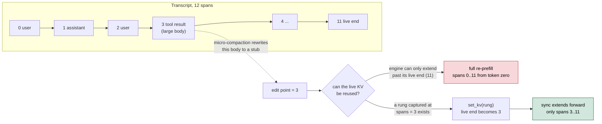

And the same thing as it unfolds turn by turn, with and without a rung
(`docs/img/kv-microcompact-ladder.gif`):

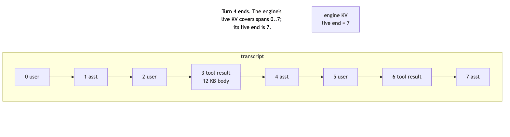

### A cache boundary has to fall on a message boundary

You might reasonably want to snapshot the KV in the middle of a long block of
context text, at whatever offset is convenient. You cannot.

Byte-level BPE merges across a seam, so `tokenize(stable)` is not necessarily a
prefix of `tokenize(stable + volatile)`. Two pieces of text that concatenate
cleanly can tokenise to sequences that diverge at the join. On top of that, the
chat template wraps each message and closes that wrapper at the message's end, so
a mid-message split lands inside a structure that is not closed.

This is why plank injects its session-start context as *two* separate user
messages, a stable one and a volatile one, rather than one concatenated block.
The text the model sees is identical. The tokenisation is now guaranteed to have
a reusable boundary between them.

### A snapshot is the whole session, not a range

The capture primitive serialises the entire live session. There is no API for
"snapshot the first N positions".

That sounds like a limitation and is really a scheduling constraint: it means the
order of operations when building a layered prefix is not a matter of taste. You
must sync to the end of tier *i*, capture and persist tier *i*, and only then
sync tier *i+1*. Building the full prefix and then trying to attribute parts of
it to individual tiers retroactively is not possible.

Worse, that mistake is undetectable by fingerprint. Persisting tier *i* after
prefilling tier *i+1* writes tier *i+1*'s KV under a key that is genuinely,
correctly computed for tier *i*. The key is right. The bytes are wrong. Nothing
downstream can tell.

### The shape of the trust decision

Putting R3 together with the above gives the rule the entire implementation
serves, and it is worth stating as a single sentence: **reuse only a genuinely
matching token prefix, and rebuild anything else rather than trust it.** Every
fingerprint, version byte, and signature in this document is there to make the
wrong-reuse failure impossible rather than rare.

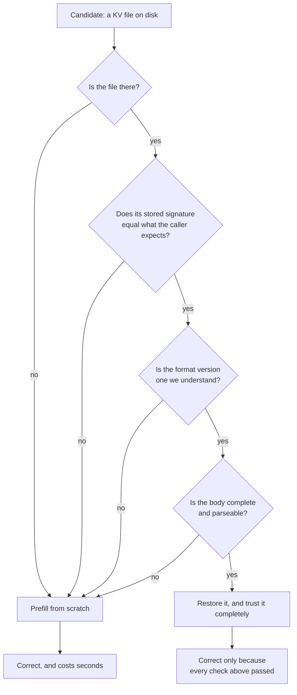

Two design commitments come out of that diagram.

The first is that every rejection path leads to the same place. Absent, stale,
truncated, and written-by-an-older-version are not distinguished by the caller,
because there is no useful difference between them: all four mean "prefill
instead". Collapsing them removes a whole category of bug where one rejection
reason is handled and another is overlooked.

The second is that a rejection must be cheap and routine, never exceptional. If
a cache miss were expensive or awkward to handle, there would be pressure to
avoid one, and that pressure is exactly what produces a wrongly trusted cache.

---

## Part 3: The design

### Separate by rate of change

The single most important design decision is that the prompt prefix is not one
cache entry but a hierarchy of them, split by *how often each part changes*.

This is not a size optimisation. It is a consequence of R2 and R3 together. The
system prompt changes when plank is upgraded or an MCP server is added, perhaps
weekly. Project context changes when you edit `AGENTS.md`, perhaps daily. Git
status changes between turns. If those live in one cache entry, that entry's
lifetime is the lifetime of its *most volatile* member, and the expensive stable
part gets thrown away every time the cheap volatile part moves.

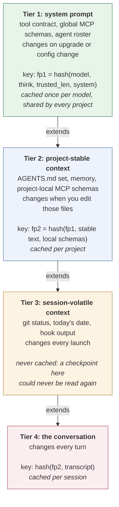

Read the key lines from the top down and the chaining is visible: `fp2` is
computed from `fp1`, and tier 4's key from `fp2`. Note that tier 3 sits in the
chain as prefix text but contributes no key of its own, because it is never
stored.

Three decisions inside that structure are worth their own explanation.

**Each fingerprint chains its parent's.** Tier 2's key is computed *from* tier
1's key, not merely alongside it. This is what makes the lookup sound. Because a
child's key embeds its parent's, a valid deep tier is proof that every tier above
it is also valid. The walk can therefore restore the deepest hit without
independently revalidating the chain above it, and "the deepest valid tier" and
"the last tier of the leading valid run" are guaranteed to be the same thing. A
stale checkpoint cannot be mistaken for a fresh one, because staleness anywhere
in the chain changes every key below it.

**Tier 3 is deliberately never cached.** Caching it would be strictly wasteful.
Its content changes every launch, so a checkpoint written for it could never be
read by anything. Recognising which parts of a system are *not worth caching* is
as much a part of cache design as deciding what is.

**Project-local MCP schemas key tier 2, not tier 1.** They reach the model
through the system prompt text, so the naive placement is tier 1. Putting them
there would make tier 1 project-specific, destroying the one property that makes
it worth its size: that the same system prompt on the same model is the same
tokens in every project you work in. So the local schemas are folded into tier
2's *key* while their text stays where the model needs it. There is a matching
subtlety for global MCP servers: their schemas are rendered from a cached
advertisement rather than from a live handshake, so a server that fails to start
this morning cannot invalidate the most expensive tier in the system.

### Some key material does not change the text

Tier 1's key includes two inputs that do not alter a single byte of the prompt,
and both are there because they change its *tokens*.

The reasoning level matters because `ThinkMode::Max` prepends a
reasoning-effort preamble ahead of the system prompt. Identical system text,
different token prefix.

The trusted length (`trusted_len`) is subtler and is the better illustration of
why textual identity is insufficient. It marks where the tokenizer stops
treating the prompt as trusted control text. Inside that span, the `｜DSML｜`
markup delimiter is the model's own dedicated vocabulary token; outside it, the
same characters become spelled-out BPE pieces. Identical bytes, different token
stream, same position indices pointing at different things.

A checkpoint keyed on the text alone would be restored under the wrong setting
and prefilled against a KV that does not describe it. This is R3 failing quietly,
and it is the kind of bug that would be found weeks later by someone noticing the
model behaved oddly at one reasoning level.

### A depth-indexed ladder resolves the in-place-rewrite case

The tier hierarchy above solves reuse for the *stable* parts of the prompt.
It does nothing for micro-compaction's in-place rewrite, because a tier
boundary sits at a fixed depth and a rewrite can land anywhere past it in the
conversation. What that case needs instead is a snapshot that can be taken
*anywhere* a rewrite might later occur, so the restore can pick whichever one
predates the actual edit.

The shape of the fix follows directly from two facts about micro-compaction's
own behaviour. First, it walks the transcript oldest-to-newest, and a cleared
body becomes a stub too small to be a candidate again — so the point past
which it rewrites next only ever moves forward, never back. Second, a
snapshot only helps when it predates the edit; one at the live end is useless,
since the live end is exactly where the next edit already isn't. Together
these mean a single rolling snapshot cannot work (it always postdates the
next edit), but a small **ladder of snapshots at increasing depths** does:
whichever rewrite comes next, some rung on the ladder already sits behind it.

`kvladder.rs` implements this as pure logic — spans and token counts only, no
engine dependency — with the ladder capped at three rungs (measured snapshot
economics make more possible, but each rung is 200-400 MB on disk, and the
cache already runs to tens of gigabytes) and a minimum spacing between
consecutive rungs, so captures spread out rather than clustering uselessly
near the live end. `Agent` (`ui.rs`) owns the two moments that make this
correct: it captures a rung once per turn when the ladder wants one, timed
*after* any compaction that turn already ran (so the rung's prefix is stable
when it is signed), and it restores a rung strictly *before* micro-compaction
mutates the transcript, using the already-known edit point to pick the
deepest usable one. Restoring after the mutation would fingerprint the wrong
prefix; deciding whether to restore only *after* calling `set_kv` — an actual
review finding on this branch — throws away the live KV for nothing on the
turn the pass declines to fire, and then does so again every turn after,
since the reclaimable total only grows. The decision and the restore must use
the exact same selection call, made before either one touches the engine.

The capture and the restore, as one sequence across two turns:

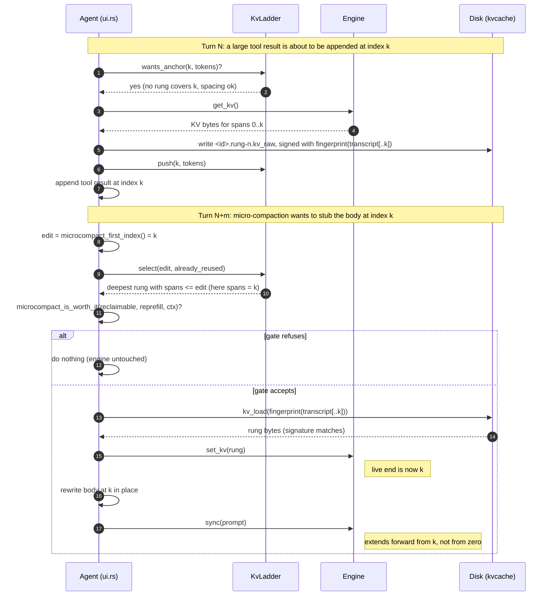

The ladder also has to follow the transcript through every edit that is not a
plain append, because a rung describing a prefix that no longer exists is worse
than no rung: `wants_anchor` keeps reporting the depth as covered while `select`
hands back a prefix that is gone. So rollback discards the ladder and marks the
payload dirty; a fork keeps only the rungs at or below the kept prefix
(`KvLadder::truncate_to`); a sub-agent sidechain (`/subagent`, the `agent` tool,
tracked by `sidechain_depth` and `in_sidechain()`) never stores the payload,
pushes a rung or micro-compacts, and `end_subagent_fork` truncates the rungs past
`fork_at` when it folds the sidechain back out; deleting or renaming a session
removes its `<id>.rung-N.kv_raw` blobs, and renaming the live one drops its
in-memory ladder as well. On the retention side, the keep set handed to the sweep
includes the live rungs, each fingerprinted over the transcript truncated to its
own depth, which is the same rule the lookup uses.

Every transcript operation and what it does to the ladder:

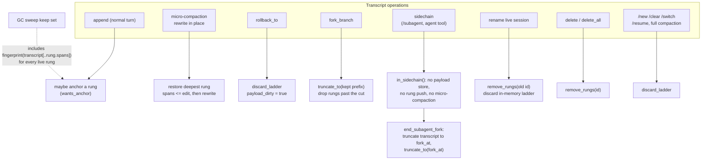

The ladder's life across a session, including eviction, rollback, fork and a
sidechain (`docs/img/kv-ladder-lifecycle.gif`):

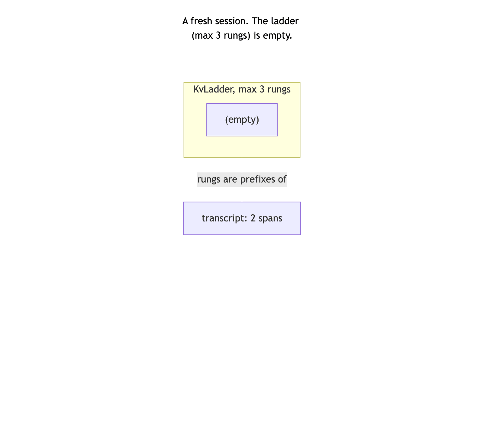

The decision itself is the last piece, and it is not a property of the ladder
at all. Whether an opportunistic pass is worth its prefill cost is a question
about *the value of context*, and that value is not constant: reclaiming a few
thousand tokens is worthless when the window is 2% full and valuable when it is
nearly full, because in the second case the alternative is not "do nothing" but
a full compaction — a model round-trip plus a total KV rebuild. A fixed
bytes-per-token ratio cannot express that, and a measured run showed exactly
the failure mode: a ratio of 1.16 refused at every turn, correctly at 2%, and
with no mechanism to ever accept it. So the floor is a function of context
pressure — strict while the window is roomy, relaxing linearly at the point
full compaction fires to a small epsilon (`MICROCOMPACT_FLOOR_EPSILON`, 0.05)
rather than to nothing, since "accept anything" would let a marginal pass spend
a rewrite moments before a full compaction threw the result away. It is
anchored to *the same* threshold `should_compact` uses rather than a second one
of its own, so the cheap decision can never sit blocking in front of the
expensive one. The precise gate is in Layer 7 below.

One caveat a reader should carry away: this accepting branch has never fired in
a live session. It has only ever run in unit tests with a synthetic small
`ctx_size`, because no benchmark yet built fills enough of a 1M-token window to
relax the floor. The refusals are measured; the acceptance is designed.

### One value type, one writer, one reader

Every persisted KV in plank, whether it is a system-prompt checkpoint, a project
tier, or a session's conversation, is the same type in the same format, written
by one function and read by one function.

This was not the original state. There were three near-identical
`fingerprint + bytes` implementations and two different payload shapes. The
consolidation matters for a reason specific to this problem: a cache whose
correctness depends on a signature check is only as trustworthy as its *least
careful* reader. Three readers means three places for someone to add a
well-intentioned fallback, and one such fallback is enough to reintroduce R3.
With one reader, the trust decision exists in exactly one place and can be
audited by reading a dozen lines.

The read is fallible by value rather than by exception. It returns an optional,
and nothing above it makes a trust judgment about cached bytes.

### Metadata has to be advisory

plank keeps a small JSON file beside each KV body recording what it is, which
snapshot it extends, its size, how often it has been reused, when it was last
used, and whether it is pinned. That metadata is what makes the cache
inspectable, and it is what retention decisions read.

It is also, deliberately, incapable of affecting whether a KV is trusted. The
signature embedded in the body remains the only trust input. A missing sidecar, a
corrupt one, or one that disagrees with the body all degrade the display and
reset some counters. None of them can make a good body unusable, and none of them
can make a bad body usable.

The reason is a direct application of R3. The sidecar is a second, unsigned
description of the same bytes. The moment it can gate a load, the cache has two
sources of truth about identity, and they can disagree. Keeping it advisory means
the metadata can be as rich and as lossy as convenience dictates, because
nothing correctness-critical depends on it.

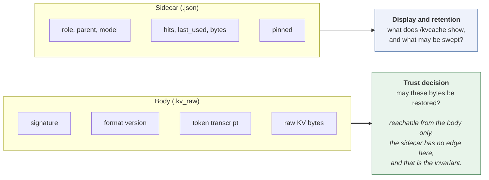

The absence of an edge from the sidecar to the trust decision is the invariant. If
a change ever draws one, the property is gone.

### Retention: age first, then a ceiling

R4 asks for bounded disk, and the first attempt at it was to keep only the
*current* fingerprint for each tier and delete every sibling. That is beautifully
simple and turned out to be a poor trade.

The problem is that it makes cache identity and cache retention the same
decision. Switch reasoning level, and the checkpoint for the level you just left
is deleted, because it is no longer current. Switch back, and you pay a full
system-prompt prefill. Alternate between two models, and neither ever has a warm
checkpoint. The policy optimised disk perfectly and defeated R2 in the process.

The replacement separates the two questions. Retention is now about *value*, and
value is estimated from age and use, which is what the metadata sidecar exists to
record: a blob lives while it is pinned, in use, holding something up, or simply
young enough. It runs in two phases.

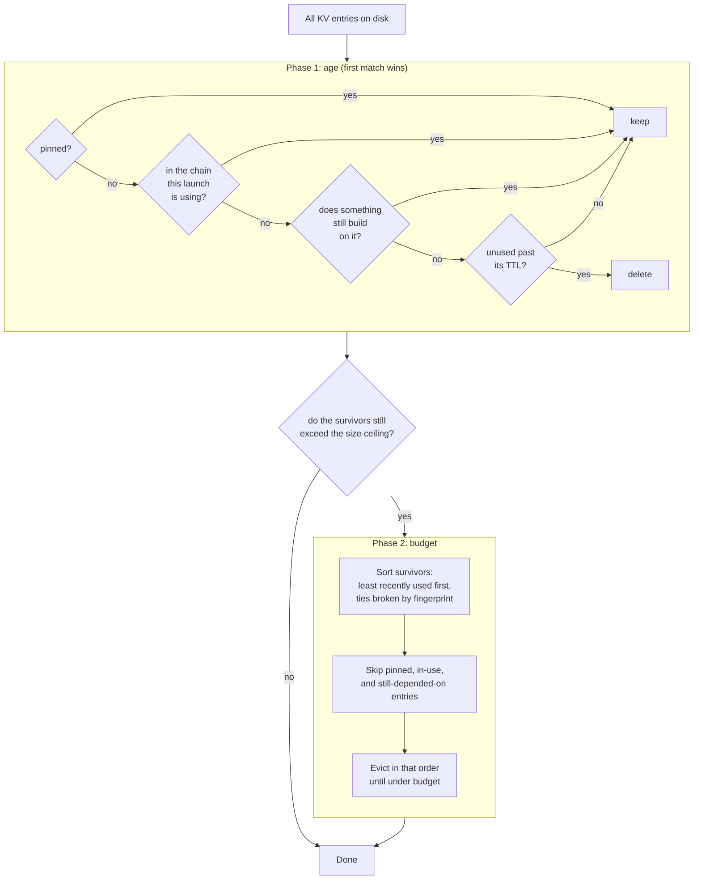

Four decisions in there each answer a specific failure.

**Phase 1 evaluates "does something still build on it" against the entry set as
it stood before the sweep began**, not against a set shrinking as files are
deleted. This makes the outcome independent of the order the directory happens to
be read in, which is the difference between a policy you can reason about and one
that behaves differently on two machines. The cost is that a chain whose bottom
entry expires today has its parent collected on the *next* run rather than this
one. That one-level-per-run cascade is the intended behaviour, not a bug to be
optimised away.

**Phase 2 evaluates the same question against the survivors of phase 1.** The
asymmetry is deliberate and it is easy to get wrong in either direction. If phase
2 used the pre-sweep set, an entry whose only dependent just expired would be
protected forever and no budget could ever reclaim it.

**Phase 2 sorts before it evicts.** Size-based eviction was originally rejected
outright, on the grounds that it would make one entry's fate depend on other
entries' sizes and on traversal order. Sorting first removes that objection
entirely: the eviction order is a total order derived from the data, so the
outcome is a pure function of the inputs. Size-awareness was never the real
problem; unordered size-awareness was.

**A budget is a target, not a licence.** If every remaining entry is pinned, in
use, or still depended upon, the sweep stops over budget rather than deleting
something protected. R4 is the lowest-priority requirement, and this is where
that ordering shows up in the code.

One small thing worth stating because the inverse reading would be catastrophic:
a size ceiling of zero means *unbounded*, not "evict everything". Read the other
way, it would wipe the entire cache on every launch for anyone who never
configured a limit.

---

## Part 4: The mechanics

### How the pieces divide the problem

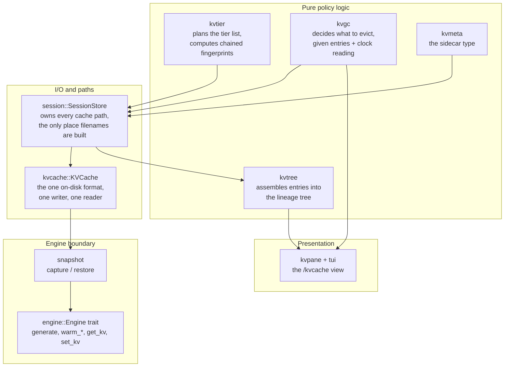

The division is not arbitrary. Everything that constitutes a *policy decision*
lives in a pure function taking its inputs explicitly, including the current
time. That is what makes the retention rules testable at all: the sweep's
decision logic is a function from a list of entries and a clock reading to a list
of deletions, so the awkward cases (an expired parent with a live child, a
zero-length TTL, a pinned entry decades past its expiry) are ordinary unit tests
rather than filesystem choreography.

Correspondingly, everything that touches the filesystem is deliberately dumb. The
store owns every path so that no other code constructs a cache filename, which
is what allows the naming scheme to be reasoned about as a whole.

### The two things being cached

Do not confuse them; almost every bug in this area came from doing so.

| | **Live KV** | **Checkpoint** |
|---|---|---|
| Where | in the engine (C session, GPU/unified memory) | a `.kv_raw` file under `~/.plank/kvcache/`, with a `.json` sidecar beside it |
| Lifetime | one process | across launches and across sessions |
| Written by | every `generate` | `warm`, and session save |
| Trusted because | it was built by this process | its signature matches what the caller expects |

A checkpoint is a *snapshot of a live KV plus the tokens it was built from*.
Restoring one is `set_kv`; capturing one is `get_kv`.

### Layer 1: the live KV within a turn

`Ds4Session` keeps **one** C session alive for the whole run, so consecutive
turns extend the same KV instead of rebuilding it. Each `generate` does:

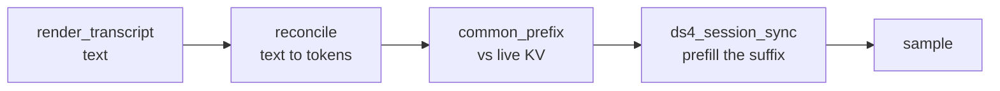

Two properties of that path are load-bearing:

**Tokens, not text, are the unit of matching.** `reconcile` parses the rendered
transcript into role-tagged sections, diffs them against the `TokenTranscript`
the engine already holds, and retokenizes only from the first divergence.
A section that differs by one trailing space is a different section, and
everything after it re-prefills. This is why `kvtier::plan` canonicalizes each
tier's text to exactly what the turn will tokenize — an untrimmed tier and a
trimmed turn diverge at the first tier and rebuild everything below it.

**The sync is extend-only.** `ds4_session_sync` cannot rewrite behind its live
end: the backend still holds SWA rows, compressed KV rows, indexer rows and
compressor frontiers for the old suffix, and a token count cannot roll those
back. So a prompt that is a strict *prefix* of the live KV — exactly what
`/new` and `/clear` produce — matches completely and is still rebuilt from
zero.

`engine::reusable_prefix(pos, common)` encodes that: it returns `pos` only when
`common == pos`, and `0` otherwise. Reporting the raw `common` there would prime
the progress bar as already complete and then run a multi-thousand-token prefill
with no feedback — a hang, as far as anyone watching is concerned.

### Layer 2: volatility tiers

The prompt prefix is a hierarchy ordered **most stable first**, each tier an
extension checkpoint of the one above it. `kvtier::plan` builds the list;
`kvtier::warm` walks it.

| Tier | Content | Key | Storage |
|---|---|---|---|
| 1 | system prompt, global MCP tool defs, sub-agent roster | `fp1 = sha1(model ‖ think ‖ trusted_len ‖ system)` | `sysprompt-<fp1>.kv_raw`, model-global |
| 2 | project-stable context: `AGENTS.md`/`CLAUDE.md`, memory, local MCP tool defs | `fp2 = tier(fp1, stable ‖ local defs)` | `<project-key>/project-<fp2>.kv_raw` |
| 3 | session-volatile: git status, date, hook output | — | never cached |
| 4 | conversation turns | `tier(fp2, transcript)` | `<session>.kv_raw` |

Each fingerprint **chains its parent's**, which is what makes the walk sound:
a deep tier matching proves every ancestor matches, so the walk can restore the
deepest hit without independently revalidating what sits above it.

#### What is allowed in Tier 1

Only inputs stable across sessions: the verbatim tools prompt, MCP schemas and
instructions, `-sys` text, the agent roster. Per-session data — date, git state,
`AGENTS.md` contents — belongs in `ContextContent` and lands in Tier 2 or 3.
The `fingerprinted_prompt_contains_no_volatile_bytes` test enforces this. A
volatile byte in Tier 1 does not corrupt anything; it just means the most
expensive tier misses on every launch. `think` and `trusted_len` are key
material for the token-level reason given in Part 3.

### Layer 3: the warm walk

At startup, plank has a planned tier list and a directory of checkpoints, and has
to get the engine into the best state it can.

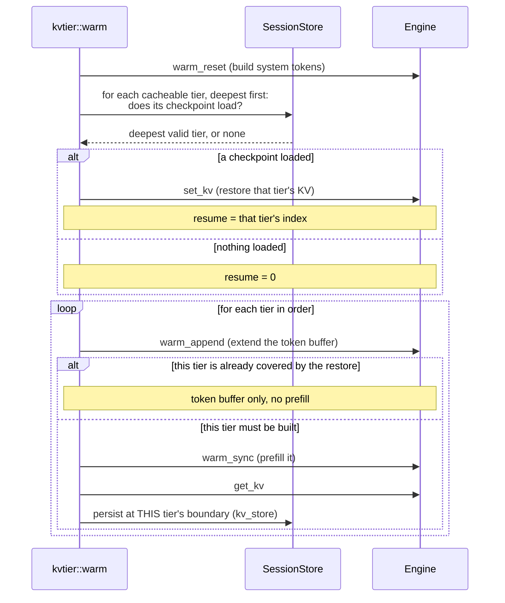

Three properties of that loop are load-bearing, and each was learned by getting
it wrong.

**The token buffer is extended for every tier, including restored ones.** The
engine's cumulative token buffer has to describe the *whole* restored prefix.
Skip the append for a restored tier and you leave a hole; the next sync sees a
common prefix shorter than the buffer, rewrites the session's checkpoint from
that truncated buffer, and discards the restored KV. A deep cache hit then costs
more than a cold start, which is a memorably confusing thing to debug.

**Each tier is captured at its own boundary**, for the whole-session-snapshot
reason from Part 2: `get_kv` snapshots the *whole* session, not a range.
Persisting after the next tier has synced would store the next tier's KV under
this tier's key, undetectable by fingerprint because the key would be genuinely
correct for what it claims to be and wrong for what it holds. This is the
constraint that fingerprints cannot protect you from.

**A tier that is skipped is never written.** This follows from the two above and
is the subtlest consequence in the system. The walk restores the deepest valid
tier and skips everything above it; a skipped tier is never prefilled; a tier
never prefilled is never captured. So once Tier 2 is valid, **Tier 1 stops being
written**, and if it was never written before that, it never will be.

For the main engine this is invisible, because Tier 2 is a superset of Tier 1 and
restoring it is strictly better. It matters for any consumer that needs Tier 1
*alone*, which is exactly the situation of a sub-agent running on a different
engine than its parent. That consumer has to warm Tier 1 explicitly rather than
assuming the main walk left it on disk; see the alt local engine in Layer 6.

### Layer 4: on-disk format

Every blob body is a `.kv_raw` file, and every body has a sibling `.json`
sidecar holding its metadata, distinguished only by extension. The `.kv`
extension means **session transcript** and nothing else:

```
~/.plank/kvcache/
  sysprompt-<fp1>.kv_raw     the tier 1 body
  sysprompt-<fp1>.json       its advisory metadata
  <project-key>/
    project-<fp2>.kv_raw     tier 2 for one project
    project-<fp2>.json
  cheeky-bell.kv             a session TRANSCRIPT (user data)
  cheeky-bell.kv_raw         that session's KV payload
  cheeky-bell.json           its metadata
  cheeky-bell.rung-0.kv_raw  a ladder rung (Layer 7)
```

Paths keep their tier-derived names, so this is a sidecar addition rather than a
content-addressed re-layout. Both files of a pair are created together and swept
together; a body without its sidecar is legal and simply displays with
synthesized defaults.

The extension split is worth a note, because it was not always there. `.kv`
originally meant both "session transcript" and "tier 1 checkpoint", which forced
the garbage collector to filter candidate filenames by prefix so it would not
delete a user's saved conversation while trying to clean up checkpoints. A
deletion routine whose safety rests on a filename prefix match is one careless
glob away from destroying user data. Bodies now have their own extension and
`.kv` means transcript, exclusively. The safety property became structural rather
than vigilant.

That distinction also draws the sharpest line in the subsystem. Everything with a
`.kv_raw` extension is a *rebuildable cache*: deleting it costs time and nothing
else. A `.kv` transcript is *user data*: it is the conversation. The one-shot
migration that introduced this layout (see Garbage collection below) deleted
every old-format body and did not touch a single transcript, and every scan that
feeds the sweep filters on `.kv_raw` precisely so that a transcript is not merely
unlikely to be deleted but unreachable by the code that deletes things.

#### The body

One writer, one reader: `KVCache::persist` and `KVCache::from_file`.

```
<signature>\n<version:u8><encoded transcript><raw kv bytes>
```

- **signature** — what the caller expects this file to be. `KvKey::signature()`
  supplies it: `fp1` for Tier 1, `fp2` for Tier 2, the payload fingerprint for a
  session. A mismatch is a miss.
- **version** — `FORMAT_VERSION`, currently 2. Bumping it invalidates every
  cached file, which is safe: all of them are rebuildable.
- **transcript** — the tokens this KV was built from, carried for the BPE reason
  from Part 2: text cannot reconstruct the token ids. Empty for tier
  checkpoints, which have no conversation in them. Carrying it in the same type
  is what lets a resumed session avoid re-prefilling from its first reply.

A read is fallible **by value**: missing file, signature mismatch, truncated
body and unknown version are all `None`, and `None` always means "prefill
instead". `KVCache::decode` is the only place that decides; no other code in
plank makes a trust decision about cached bytes.

#### Writes are atomic, because two plank processes can share a directory

Bodies and sidecars are both written to a process-suffixed temporary file and
renamed into place. Two plank instances can have the same cache directory open,
and a half-written body that still parses would be a wrongly trusted cache, which
is R3 again. The rename makes the transition atomic, so an interrupted write
cannot leave a half-checkpoint that reads as valid, and the process suffix keeps
two writers from sharing a temporary file, since interleaved writes to one
temporary path could splice two snapshots into a body that decodes cleanly and
describes nothing.

#### The metadata sidecar

`kvmeta.rs` owns the sidecar: one `KvMeta` per body, serialized as JSON.

```json
{
  "version": 1,
  "role": "system" | "project" | "session",
  "fingerprint": "a19f…",
  "parent": "7c02…",
  "model": "…",
  "created": 1770000000,
  "last_used": 1770000000,
  "hits": 41,
  "bytes": 92274688,
  "pinned": false,
  "label": { }
}
```

`parent` is `null` for a system blob and a fingerprint string otherwise, which is
what lets `kvtree.rs` reassemble the tier chain that the warm walk builds in
memory and then forgets. `created` and `last_used` are Unix seconds, `hits`
counts successful loads, and `bytes` caches the body's size so rendering the tree
does not stat every blob. `version` is this schema's own counter, deliberately
independent of `kvcache::FORMAT_VERSION`: a schema change must not invalidate
blobs, so a sidecar whose version does not match `META_VERSION` is ignored rather
than migrated.

`label` is role-specific and exists purely to make the tree readable:

- `system`: `think_mode`, `trusted_len`, `global_mcp` (server names)
- `project`: `project_path`, `agents_files`, `local_mcp` (server names)
- `session`: `name`, `title`
- `unknown`: nothing recorded, the shape a synthesized sidecar takes

That split is also the audit surface for MCP segregation. Global tool defs are
Tier 1 material and local ones Tier 2, so a global server name may appear only on
a `system` label and a local one only on a `project` label. Before the split the
property was a claim in a document; now a test can read it off the labels
(`a_local_mcp_name_never_reaches_a_system_label`).

**The trust invariant: metadata is advisory.** The signature inside the body is
the only trust input for restoring cached bytes, and `KVCache::decode` is the
only place that decides. A missing, corrupt, or disagreeing sidecar degrades the
display and resets some counters; it can never invalidate a good blob and never
validate a bad one. Sidecar parse failure is swallowed into a synthesized
default, and sidecar writes are best-effort because a lost counter update is not
worth failing a persist over. This is the property a future change is most likely
to break: the moment anything reads a sidecar field to decide whether a body may
be loaded, a hand-edited or stale JSON file becomes able to feed the model a KV
built from a different prompt. `a_corrupt_sidecar_never_blocks_a_good_blob` pins
it.

### Layer 5: session payloads

A saved session carries its KV as a `<id>.kv_raw` blob, keyed differently
from the tiers: the file is named after the session id, which is stable across
resaves, but it is only trusted when its stored signature equals
`payload_fingerprint(model, think, trusted_len, system, transcript_render)`.
Keying on the id alone would make a payload captured under a different model or
system prompt a hit.

Restoring a payload **skips the warm walk entirely** (`skip_warm_after_restore`).
The payload is a superset of every tier prefix — it came from a session that had
already been warmed — so there is nothing left to warm, and running the walk
afterwards is strictly destructive: its last act per tier is `set_kv` on a
checkpoint whose transcript is empty by construction, which rewinds the live KV
from the end of the conversation back to the tier boundary and clears the token
transcript. Measured at 165 tokens re-prefilled on a two-turn session, scaling
with the whole conversation.

### Layer 6: forks and sidechains

A sub-agent runs as a fork of the live transcript. Two mechanisms keep the
parent's KV intact:

**`fork_kv` snapshot/restore.** `begin_subagent_fork` captures the live KV
before the sidechain diverges it; every fork-end path calls `restore_fork_kv`.
Without it the post-fork prompt (parent prefix + the small report) diverges
behind the sidechain's live end, and the extend-only sync re-prefills the whole
parent context from token zero rather than just the report. The stack is LIFO
and pushes `None` rather than skipping, so a nested fork cannot pop the parent's
snapshot.

**Sidechains never write the live session's cache.** A `sidechain_depth`
counter, raised by `/subagent` and the `agent` tool and read through
`in_sidechain()`, gates `store_payload`, `save_payload_if_dirty`, rung anchoring
and opportunistic micro-compaction: the sidechain's messages are about to be
truncated back out, so a payload or rung captured over them would describe a
prefix that no longer exists and miss forever. `end_subagent_fork` truncates the
transcript to `fork_at` and then truncates the ladder past it
(`KvLadder::truncate_to`), and every fork-end path goes through it.

**Clean-room sidechains on an alternate engine.** When a definition names its
own engine, the parent engine is never called, so there is nothing to snapshot
(`snapshot_kv: false`). The parent transcript is stashed and only the framed
task is visible, which keeps parent context out of a provider's billing and out
of the sidechain's prompt.

#### The alt local engine

A `provider: local` sub-agent under a provider main agent means two engines
alive at once, and this is where Tier 1's write-once problem bites: the
sidechain is clean-room, so its prompt is the system prompt plus the framed task
with **no** project or session context between them. It needs Tier 1 alone.
Restoring Tier 2 would seed its KV with tokens its prompt does not contain.

So the alt engine is warmed at startup with a tier list of **one**. With nothing
deeper to short-circuit it, Tier 1 is prefilled and written — which is also what
makes `sysprompt-*.kv_raw` exist at all on a machine whose Tier 2 has been valid for
months.

Two configuration requirements, both silent when missed:

- The alt engine needs `set_trusted_system_prefix` and `set_think_mode` applied
  exactly as the main engine does, because `warm_reset` builds its tokens from
  those fields. An unconfigured engine tokenizes the same system text
  differently from whatever wrote the checkpoint, restores a KV its token buffer
  does not describe, and prefills anyway — reporting success.
- `/think` must reach every cached alt engine. The level is Tier 1 key material,
  so an engine left behind builds tokens at one level while being keyed at
  another: a disagreement between the key and the tokens, which no fingerprint
  can catch.

### Layer 7: the snapshot ladder

Micro-compaction rewrites old tool-result bodies to a stub *in place*
(`compact::microcompact`). That is exactly the case Layer 1 rules out reuse
for: the engine can only extend its live end, never roll back behind it, so a
rewrite anywhere in the transcript forces a full re-prefill from token zero —
even though everything before the rewrite is still correct. A snapshot taken
*before* the rewrite point is a legitimate restore target: restoring it makes
the engine's live end equal to the snapshot's, and the next sync genuinely
extends forward from there. Part 3 explains why a ladder of such snapshots is
the right shape and shows it in motion; this section is the precise mechanics.

`kvladder.rs` keeps a small, depth-indexed ladder of such snapshots ("rungs")
per live session, in memory (`Agent::ladder`) plus one blob per rung on disk.

The end-of-turn decision, from edit point to the next sync:

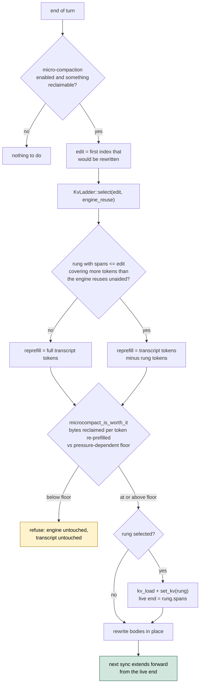

**Not yet proven in production.** The accepting path — a pass that actually
fires and a rung that is actually restored — has only ever been exercised by
unit tests with a synthetic small `ctx_size`. It needs the window around 42%
full before the pressure-dependent floor relaxes far enough, and no benchmark
run to date has come close to filling a 1M-token window (measured sessions
reach 2-3%). What *has* been measured live is the refusing path; see
`FINDINGS.md`.

- **Naming and location.** A rung's blob is `<id>.rung-<n>.kv_raw`, next to the
  session's own `<id>.kv_raw` payload and `<id>.kv` transcript, where `<n>` is
  a *monotonically increasing* slot index minted by `KvLadder::push` — not a
  vector position. A session's fourth rung is `rung-3`, its fifth `rung-4`,
  and so on for the life of the process; nothing ever reuses a lower index.
- **Trust rule.** Identical to every other KV blob in this system: a rung is
  read back through `SessionStore::kv_load`, which trusts only the signature
  embedded in the body, never the filename or its sidecar. The signature is
  `payload_fingerprint` computed over the transcript *as it stood at capture
  time* — i.e. truncated to the rung's own `spans` — because that is what
  `render_transcript` produced when the blob was written, and
  `render_transcript` has no length-dependent formatting, so replaying that
  same truncation later reproduces the byte-identical render to fingerprint
  against.
- **Placement.** A rung is captured as an *anchor*, immediately before a tool
  result larger than `MICROCOMPACT_MIN_BYTES` is appended to the transcript
  (`Agent::anchor_rung_before_tool_result`). At that instant
  `transcript.len()` is exactly the index that result will occupy, which is
  exactly the index `microcompact_first_index` later reports as the edit point,
  so `select`'s `spans <= edit` holds with equality. Capturing at *turn ends*
  instead — the original design — can never work: micro-compaction clears
  oldest-first, so the edit sits near the start of the transcript, while within
  a single turn the transcript jumps from 1 span to 6 and no turn boundary
  exists at a usable depth. A measured 18-turn session captured 11 turn-end
  rungs and used none of them.
- **Spacing.** `KvLadder::wants_anchor` suppresses a capture when the ladder
  already holds a rung shallow enough to cover this index (the same test
  `select` applies), unless the new anchor is at least
  `LADDER_ANCHOR_MIN_SPACING_TOKENS` (8192) tokens deeper. Since
  `microcompact_first_index` is monotone non-decreasing, only a handful of
  anchors per session are ever useful.
- **Eviction.** At most `LADDER_MAX_RUNGS` (3) rungs are held per session.
  Pushing a fourth evicts whichever interior rung's removal least widens the
  largest remaining gap — never the shallowest rung (the only one that can
  cover an edit near the start of the transcript) and never the newest.
- **Selection and restore.** `KvLadder::select(edit, already_reused)` returns
  the deepest rung with `spans <= edit` that covers more tokens than the engine
  would reuse unaided — so a restore is only performed when it is a genuine
  improvement, never a regression. `Agent::restore_rung_below` performs the
  restore strictly *before* the transcript is mutated, and only once the gate
  below has accepted; the same selection result drives both the decision and
  the restore.
- **Lifecycle.** Rungs are a live-session accelerator, not history: they are
  deleted outright when the session they belong to is replaced or rewritten
  (`/new`, `/clear`, `/switch`, `/resume`, a full compaction, or a clean exit —
  `Agent::discard_ladder`, `SessionStore::remove_rungs`), and swept as a
  backstop by GC (below) for the case where none of those exit paths ran — a
  crash, a `SIGKILL`, or a machine losing power mid-session. Transcript
  edits that keep the session get the matching housekeeping: `rollback_to`
  discards the ladder and marks the payload dirty; `fork_branch` truncates it
  to the kept prefix (`KvLadder::truncate_to`, which drops every rung deeper
  than the cut and hands them back for deletion); `SessionStore::delete`,
  `delete_all` and `rename` remove `<id>.rung-N.kv_raw` along with the
  session, and renaming the live session discards its in-memory ladder too,
  since the rungs were keyed on the old id. Sidechains are covered in Layer 6:
  `in_sidechain()` blocks rung anchoring, and `end_subagent_fork` truncates the
  ladder to `fork_at`.
- **GC treatment.** A rung gets its own role, `KvRole::Rung`, with a dedicated
  TTL derived as `min(ttlSessionDays, 1 day)` (`RUNG_BACKSTOP_SECS`) rather than
  the full `kvcache.ttlSessionDays` — a rung is worthless the instant its
  process is gone, unlike a saved session payload, so there is no reason to let
  a crash-orphaned one survive as long as one. Phase 2's budget pass also
  always evicts rungs first (`evict_rank(KvRole::Rung) == 0`, everything else
  `1`), since a rung is the cheapest thing in the cache to recreate and the one
  role that is *never* history a later run would miss. And a rung is never
  parented to its session in the metadata graph: `plan_sweep`'s "has a
  surviving child" rule (Phase 1, item 3) would otherwise make the single most
  disposable blob in the cache the thing keeping the session payload — and the
  tier checkpoint above it — alive. The keep set the sweep is handed does
  include the live session's rungs, each under the fingerprint of the
  transcript truncated to that rung's depth (the same rule `select` looks them
  up by), so a running session's ladder is never collected out from under it.
- **The gate, and why it depends on context pressure.** An opportunistic pass
  is only taken when `compact::microcompact_is_worth_it(reclaimable,
  reprefill_tokens, ctx_size, ctx_used)` agrees, where `reprefill_tokens` is
  the rendered transcript's token count minus whatever the selected rung
  covers. The comparison is bytes reclaimed per token re-prefilled against a
  floor, and that floor is **not fixed**: it is
  `MICROCOMPACT_BYTES_PER_TOKEN_FLOOR` (2.0) while used context sits at or
  below half of `compact::compaction_trigger_used(ctx_size)`, then relaxes
  linearly to a small epsilon (`MICROCOMPACT_FLOOR_EPSILON`, 0.05) at that
  trigger — the exact point `should_compact` starts firing, so the cheap
  decision and the expensive one are anchored to the same threshold and cannot
  contradict each other (`compact::microcompact_floor`). The floor bottoms out
  at an epsilon rather than at zero because zero means "accept any pass at
  all", and the opportunistic pass runs at the end of a turn while
  `should_compact` is consulted at the start of the next: a pass barely
  clearing the minimum could spend a `set_kv` and a rewrite immediately before
  a full compaction discarded the ladder and rebuilt anyway.
  The reason for the relaxation is that the value of reclaiming context is not
  constant. A measured run offered 12,344 bytes for 10,674 re-prefilled tokens
  — a ratio of 1.16 — in a window 2% full, where the right answer is no:
  ~3,300 tokens of context are not worth ~98 s of prefill when nothing is
  short. The same trade at 60-80% of the window is clearly worth taking,
  because there the alternative is a full compaction: a model round-trip
  *plus* a total KV rebuild. At or past the trigger the floor sits at the
  epsilon and the opportunistic pass can no longer be the blocker — full
  compaction is imminent and will rebuild the KV regardless, so refusing a
  cheap pass there is strictly worse. The decision is monotone in each input:
  more bytes reclaimed or more pressure makes it more willing, more tokens
  re-prefilled less. The `microcompact gate refused:` debug line reports
  `ctx_used`, `ctx_size` and the effective `floor` alongside the bytes and
  tokens.

A rung restore is a performance mechanism only: on a miss (stale fingerprint,
missing blob, or no rung shallow enough) the code path is identical to having
no ladder at all — the transcript rewrite proceeds and the next turn simply
re-prefills, exactly as it always did.

### Garbage collection

Checkpoints run to hundreds of megabytes, and a plank upgrade, an MCP server
added or removed, or a model switch forks a new one while the old one keeps its
file. Part 3 explains why retention moved from "keep the current fingerprint,
delete every sibling" to a value-based policy. `kvgc.rs` owns that policy,
`SessionStore::sweep` executes it, and a best-effort sweep runs at startup.

The sweep is two phases, both pure functions of (nodes, active fingerprints,
policy, now).

**Phase 1, per node, first match wins:**

1. `pinned`: keep.
2. In the tier chain this launch is using: keep. Recency for these nodes is
   refreshed by the load itself (`SessionStore::kv_load`), not by the sweep.
   The active set includes the live session's rungs, each under the
   fingerprint of the transcript truncated to that rung's depth.
3. Has a surviving child: keep. An expired system prompt with a live session
   below it stays.
4. `now - last_used >= ttl(role)`: delete the `.kv_raw` and its `.json`.

Otherwise keep. The comparison is `>=` rather than `>` so that a TTL of zero
means "collect on sight" instead of being a silent no-op.

Rule 3 reads the node set as it stood **before** the sweep began, not one
mutating as files are unlinked, which is what makes the outcome independent of
directory scan order. The cost is that a parent whose last child died this run
needs one more run to go, so a dead chain collects one level per launch. That
bottom-up cascade is the intended behaviour, not a defect.

**Phase 2, the budget pass**, runs only once phase 1's verdicts are fully
determined. If the survivors still total more than `kvcache.maxBytes`, they are
evicted in a globally sorted order (rungs first by `evict_rank`, then ascending
`last_used`, ties broken by fingerprint), skipping pinned nodes, nodes in the
active chain, and nodes with a child that survived phase 1, stopping as soon as
the total is under budget. Sorting before evicting is what keeps this
order-independent. Note that phase 2 re-derives "has a surviving child" against
the *post*-phase-1 survivors, the opposite of phase 1: a parent whose only child
just expired must become evictable rather than immortal under any budget.

Settings, read from `settings.json`:

| key | default | meaning |
|---|---|---|
| `kvcache.ttlSessionDays` | 14 | idle days a session payload survives |
| `kvcache.ttlTierDays` | 30 | idle days a system or project checkpoint survives |
| `kvcache.maxBytes` | 21474836480 (20 GB) | ceiling for the budget pass; `0` disables it |

There is no separate user-facing setting for the rung TTL: it is derived as
`min(ttlSessionDays, 1 day)` (`RUNG_BACKSTOP_SECS`), so a stricter session TTL
can only tighten it, never loosen it.

`maxBytes = 0` means **unbounded**, never "evict everything". The inverse
reading would wipe the cache on every launch for anyone who never set the key.
The ceiling is also a target rather than a licence: a cache of nothing but pinned
and active blobs stays over budget, and the footer says so.

A verdict maps to a **path**, not to a fingerprint. Two bodies can legitimately
carry the same fingerprint (a root `sysprompt-X.kv_raw` beside a
`<projkey>/project-X.kv_raw`, or the same `project-X` under two project
directories), so a fingerprint-keyed delete could unlink a file the sweep had
decided to keep.

Each verdict is re-checked against the disk immediately before the unlink. A
sibling process persisting a multi-hundred-megabyte body spans the whole window
between the scan and the delete, so a body whose sidecar has moved since the scan
is skipped rather than deleted under metadata that no longer describes it.

Version transitions (`upgrade.rs`) deliberately do **not** drop KV caches: they
self-validate by signature and format version. Only the image cache, which has no
such guard, is dropped on a major bump.

#### One-shot migration to the sidecar layout

The pre-sidecar layout is wiped rather than adopted, once, by
`SessionStore::migrate_legacy_blobs`, which `main.rs` calls before any terminal
setup and which is guarded by a `.kvformat-2` marker in the cache directory.
Synthesized metadata would carry no lineage and unreliable counters, and every
tier rebuilds on demand, so adopting the old files would buy nothing. Deleted:
`sysprompt-*.kv`, `<projkey>/project-*.kv`, `*.payload`, the legacy bare
`sysprompt.kv`, and `sysprompt-last.prompt`. **Every `<id>.kv` transcript is
preserved**, so resuming a session across the migration works exactly as before
and pays one re-prefill. The reclaimed byte count is reported once, on that first
launch.

### Browsing the cache: `/kvcache`

Because lineage is recorded rather than implied, the cache can be displayed as
what it structurally is, which is a forest: system prompts at the roots, project
contexts hanging off them, session payloads below those. `/kvcache` renders that
with per-entry size, hit count, age, and expiry state, and allows pinning,
deleting, and sweeping.

This is not only a convenience. Before the metadata existed, the tier chain was
implied by a chain of hashes and was therefore unobservable, so the only way to
answer "why did my system prompt rebuild this morning" was to reason about it from
first principles. Making the structure visible converted a class of
reason-it-out problems into look-at-it problems.

`kvtree.rs` groups the sidecars into a forest by `parent`, and `kvpane.rs` turns
that forest into rows, selection and key handling. A node naming a parent with no
file on disk renders under an `(orphaned)` heading rather than disappearing: a
blob you cannot see is a blob you cannot delete, and those are exactly the ones
worth deleting.

In the TUI, `/kvcache` opens a centered modal: `↑↓` move, `←→` fold, `p` pin, `d`
delete (with a `y` confirmation), `g` sweep now, `Esc` close. The plain-stdout
REPL has no pane, so it prints the same tree statically and takes
`/kvcache pin|unpin|rm|gc` subcommands. Both front ends read the same rows, per
the two-parallel-paths rule in `CLAUDE.md`.

Rows, collapse keys and pin/delete actions are keyed on a **scan index** — the
position of the blob in `SessionStore::kv_blob_nodes`, the one walk every caller
shares — not on a fingerprint. A fingerprint cannot identify a file: two bodies
may share one, and a session sidecar records the *payload* fingerprint, which
never equals the `<id>` its body is named after. So the two same-fingerprint
bodies described above fold, pin and delete independently. The REPL subcommands
keep their `<fp-prefix>` argument, resolving it to an index first and still
refusing a prefix that matches nothing or more than one blob. Because a session
row is labelled by its *name*, its detail line also carries the first 8 characters
of its fingerprint, so the handle `/kvcache rm` wants is one you were shown.

An index is a position in a scan, not a durable handle, so `kv_blob_paths` sorts
by path (making both the row order and the phase-2 budget tie-break reproducible)
and every row carries its fingerprint alongside its index. A mutation retakes the
scan and refuses unless the blob at that index still carries the expected
fingerprint, with a second check that the body is present under a matching sidecar
immediately before an unlink. Without that, a blob unlinked by a second plank or a
sub-agent between the pane being drawn and a `d` press would shift every later
index down one and the delete would hit the neighbouring body. A refusal is the
right answer there: the cache moved, so the pane has to be reopened.

---

## Part 5: Diagnosing a miss

A silent hit and a silent miss look identical, which is why `kvtier::Restored`
names the outcome and callers print it with the fingerprint and the exact path:

| Outcome | Meaning | Usual cause |
|---|---|---|
| `Yes` | restored | — |
| `NoKey` | tier is not cacheable, or no store | Tier 3, or a store-less caller |
| `NoCheckpoint` | nothing on disk under this key | never warmed at this fingerprint, or the prompt changed |
| `Unreadable` | present, keyed right, would not load | stale format, interrupted write |
| `EngineRefused` | bytes loaded, engine rejected them | built by a different build |

`NoCheckpoint` is the common one, and the fingerprint is usually the answer: it
covers the system prompt, and the sub-agent roster is part of the system prompt,
so a project with its own `.plank/agents` keys Tier 1 differently from the same
model in any other directory.

`kv_debug` logging reports, per generate, the prompt length, the cached prefix,
the percentage reused, and — on a full rebuild — that the prompt was a strict
prefix of a longer live KV. `reconcile` logs the first divergent span with both
sides, which is how a mismatch in invisible characters gets found. The
`microcompact gate refused:` line described in Layer 7 covers the ladder's
refusing path.

---

## Part 6: Test coverage

None of this needs a model. `SpyEngine` in `kvtier.rs` records what the walk
asked the engine to do, and `ScriptedEngine` in `ui.rs` covers the agent-level
pairings. The ladder's accepting path runs only under a synthetic small
`ctx_size`, as noted in Layer 7.

What the tests deliberately pin, beyond the walk's logic:

- the checkpoint **file** appears after a one-tier warm — not merely that a
  prefill ran, since nothing else would notice `warm` ceasing to write Tier 1
- a **second launch** restores instead of prefilling, using two separate engines
  because a launch is a fresh process
- a valid deep tier leaves Tier 1 unwritten — the known gap, pinned so closing
  it is a decision rather than a surprise
- warm and GC in the order a launch runs them: neither is wrong alone, and the
  pair deleted what the launch had just written
- all four `Restored` outcomes, because conflating absent with unreadable sends
  an investigation the wrong way
- `fingerprinted_prompt_contains_no_volatile_bytes`,
  `a_local_mcp_name_never_reaches_a_system_label` and
  `a_corrupt_sidecar_never_blocks_a_good_blob`, each guarding one of the
  invariants in Part 8

---

## Part 7: What went wrong along the way

Every item here cost real debugging time and is recorded in `FINDINGS.md` with
more detail. They are collected because the *pattern* is instructive: almost
every one is a case of two things that looked interchangeable not being
interchangeable.

Text and tokens looked interchangeable. They are not, because BPE is many-to-one
and the sampler does not respect canonical segmentation.

A tier's fingerprint and a tier's bytes looked like they could be written at any
convenient moment. They cannot, because a snapshot covers the whole session, and
capturing late stores the next tier's bytes under a key that is genuinely correct
for this one.

Two extensions looked like a naming detail. They were the difference between a
deletion routine that structurally cannot touch user data and one that merely
tries not to.

A cache index and a cache identity looked equivalent when the pane was rewritten
to address entries by position in a scan. They are not, because a scan is a
snapshot of a directory that another process can change underneath you, so a
position resolved against a fresh scan can name a different file than the one the
user selected. The fix was to carry an identity alongside the position and refuse
to act when the two disagree, which turns a silent wrong-file deletion into a
visible "reopen the pane".

Two "fingerprints" looked like the same concept when the display was wired up.
One was derived from a filename stem and the other from the sidecar's contents,
and for session payloads they legitimately differ. Every test fixture happened to
construct entries where they coincided, so a broken code path passed twelve
reviews before a whole-branch pass caught it. The lesson there is about test
fixtures rather than about caches: a fixture that makes two distinct things equal
cannot detect code that confuses them.

A test whose fixtures were freshly written stopped testing anything the
moment retention became age-based, because freshness alone kept its entries
alive. It passed with the entire feature it guarded deleted. Any test that
asserts something survives a policy has to make sure the policy's *other*
protections are not silently doing the work.

Turn ends looked like a fine place to snapshot for micro-compaction. They are
not, because the edit point sits near the start of the transcript and no turn
boundary exists at a usable depth; the anchor has to be taken immediately before
the large tool result itself.

A speculative `set_kv` looked harmless when the gate was expected to accept.
It is not, because on the turn the gate refuses the live KV has already been
thrown away, and the reclaimable total only grows, so the same waste repeats
every turn after.

---

## Part 8: The invariants

If you change anything in this subsystem, these are the properties to check. Each
one, if broken, produces a failure that is silent rather than loud.

**Only a signature in a body decides whether its bytes may be restored.** Not a
sidecar, not a filename, not a timestamp.

**No fingerprint function changes without a deliberate decision.** Changing one
silently invalidates every cached checkpoint on every user's disk. That is not a
correctness failure, but it is an expensive one, and it is invisible except as
"plank got slow".

**Session transcripts are never deleted by cache code.** Every scan that feeds a
deletion filters on the body extension, so the code that deletes cannot see a
transcript.

**A deletion verdict resolves to a path and is identity-checked before acting.**
Not to a fingerprint, which two entries can share, and not to a bare position,
which another process can invalidate.

**A tier's checkpoint is captured while the cursor sits exactly at its own
boundary.** No fingerprint can catch a violation.

**Global and project-local MCP schemas stay in their own tiers.** A local schema
reaching tier 1 makes the most expensive checkpoint project-specific, which
quietly costs a rebuild per project.

**Retention decisions are pure functions of their inputs**, including the clock
reading. A policy that reads the filesystem while deciding is a policy nobody can
test.

**A ladder rung is looked up under the fingerprint of the transcript
truncated to its own recorded depth, never the current transcript.** Get this
backwards and every rung misses forever, silently, while the feature looks
fully wired up — nothing short-circuits, nothing errors, the code path simply
never hits.

**Nothing that mutates the engine's live KV runs before the decision that
justifies it.** A `set_kv` restore is only valid to perform once the caller
already knows it will use the result; performing it speculatively and then
declining leaves the engine worse off than doing nothing.

**A sidechain never writes the live session's cache.** A payload or rung
captured over messages that are about to be truncated back out describes a
prefix that will not exist, and would miss forever.

### Known gap

If the main engine's Tier 2 checkpoint is invalidated, it rebuilds from token
zero rather than restoring Tier 1, because Tier 1 will not exist unless
something else created it. Closing that needs a second snapshot taken at the
Tier 1 boundary — the boundary rule above means an existing snapshot cannot be
reused for it — so it costs one extra capture on a cold walk. Not done.
