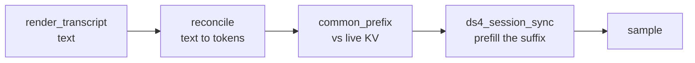
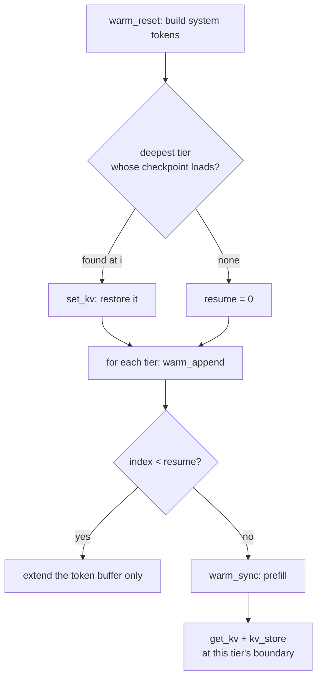

# KV cache mechanics

Prefill is the expensive half of local inference. A cold system prompt runs to
thousands of tokens, and at a few hundred tokens/second of prefill that is a
visible stall before the model has said anything. Everything in this document
exists to avoid paying it twice.

The rule the whole design serves is one sentence: **reuse only a genuinely
matching token prefix, and rebuild anything else rather than trust it.** A
wrongly reused KV does not error — it produces a model that has silently read a
different prompt than the one on screen. Every fingerprint, version byte, and
signature below is there to make that failure impossible rather than rare.

Related reading: `docs/ARCHITECTURE.md` for where these pieces sit, `FINDINGS.md`
for the traps that cost a debugging session each.

## The two things being cached

Do not confuse them; almost every bug in this area came from doing so.

| | **Live KV** | **Checkpoint** |
|---|---|---|
| Where | in the engine (C session, GPU/unified memory) | a file under `~/.plank/kvcache/` |
| Lifetime | one process | across launches and across sessions |
| Written by | every `generate` | `warm`, and session save |
| Trusted because | it was built by this process | its signature matches what the caller expects |

A checkpoint is a *snapshot of a live KV plus the tokens it was built from*.
Restoring one is `set_kv`; capturing one is `get_kv`.

## Layer 1: the live KV within a turn

`Ds4Session` keeps **one** C session alive for the whole run, so consecutive
turns extend the same KV instead of rebuilding it. Each `generate` does:



Two properties of that path are load-bearing:

**Tokens, not text, are the unit of matching.** `reconcile` parses the rendered
transcript into role-tagged sections, diffs them against the `TokenTranscript`
the engine already holds, and retokenizes only from the first divergence.
A section that differs by one trailing space is a different section, and
everything after it re-prefills. This is why `kvtier::plan` canonicalizes each
tier's text to exactly what the turn will tokenize — an untrimmed tier and a
trimmed turn diverge at the first tier and rebuild everything below it.

**The sync is extend-only.** `ds4_session_sync` cannot rewrite behind its live
end: the backend still holds SWA rows, compressed KV rows, indexer rows and
compressor frontiers for the old suffix, and a token count cannot roll those
back. So a prompt that is a strict *prefix* of the live KV — exactly what
`/new` and `/clear` produce — matches completely and is still rebuilt from
zero.

`engine::reusable_prefix(pos, common)` encodes that: it returns `pos` only when
`common == pos`, and `0` otherwise. Reporting the raw `common` there would prime
the progress bar as already complete and then run a multi-thousand-token prefill
with no feedback — a hang, as far as anyone watching is concerned.

## Layer 2: volatility tiers

The prompt prefix is a hierarchy ordered **most stable first**, each tier an
extension checkpoint of the one above it. `kvtier::plan` builds the list;
`kvtier::warm` walks it.

| Tier | Content | Key | Storage |
|---|---|---|---|
| 1 | system prompt, global MCP tool defs, sub-agent roster | `fp1 = sha1(model ‖ think ‖ trusted_len ‖ system)` | `sysprompt-<fp1>.kv`, model-global |
| 2 | project-stable context: `AGENTS.md`/`CLAUDE.md`, memory, local MCP tool defs | `fp2 = tier(fp1, stable ‖ local defs)` | `<project-key>/project-<fp2>.kv` |
| 3 | session-volatile: git status, date, hook output | — | never cached |
| 4 | conversation turns | `tier(fp2, transcript)` | `<session>.payload` |

Each fingerprint **chains its parent's**, which is what makes the walk sound:
a deep tier matching proves every ancestor matches, so the walk can restore the
deepest hit without independently revalidating what sits above it.

The split is by *rate of change*, not by size. Tier 3 is never checkpointed
because git status moves between turns; Tier 1 is model-global because the same
system prompt on the same model is the same tokens in every project.

### What is allowed in Tier 1

Only inputs stable across sessions: the verbatim tools prompt, MCP schemas and
instructions, `-sys` text, the agent roster. Per-session data — date, git state,
`AGENTS.md` contents — belongs in `ContextContent` and lands in Tier 2 or 3.
The `fingerprinted_prompt_contains_no_volatile_bytes` test enforces this. A
volatile byte in Tier 1 does not corrupt anything; it just means the most
expensive tier misses on every launch.

### Why `think` and `trusted_len` are key material

Neither changes the prompt's *bytes*, and both change its *tokens*:

- `ThinkMode::Max` prepends a reasoning-effort preamble ahead of the system
  prompt, so two levels give identical text a different token prefix.
- `trusted_len` is where the tokenizer stops treating the prompt as trusted
  control text. Inside that span, `｜DSML｜` becomes the model's dedicated
  vocabulary token; outside it, spelled-out BPE pieces. Same bytes, different
  stream.

A checkpoint keyed on the text alone would be restored under the wrong one and
prefilled against a KV that does not match it.

## Layer 3: the warm walk



Three rules in that diagram are easy to get wrong:

**Append for every tier, including restored ones.** The engine's cumulative
token buffer must describe the *whole* restored prefix. Skipping the append for
a restored tier leaves a hole, and the next sync — seeing a common prefix
shorter than the buffer — rewrites the session's checkpoint from that truncated
buffer, throwing the restored KV away. A deep hit then costs more than a cold
start.

**Capture at the tier's own boundary.** `get_kv` snapshots the *whole* session,
not a range. Persisting after the next tier has synced would store the next
tier's KV under this tier's key — undetectable by fingerprint, because the key
would be genuinely correct for what it claims to be and wrong for what it holds.

**A skipped tier is never written.** This follows from the two above and is the
subtlest consequence in the system: `warm` restores the deepest tier and skips
everything above it, a skipped tier is never prefilled, and a tier never
prefilled is never persisted. Once Tier 2 is valid, **Tier 1 stops being
written** — and if it was never written before that, it never will be.

That is invisible for the main engine, which restores Tier 2, a superset. It
matters for any consumer that needs Tier 1 *alone* — see the sub-agent section.

## Layer 4: on-disk format

One writer, one reader: `KVCache::persist` and `KVCache::from_file`.

```
<signature>\n<version:u8><encoded transcript><raw kv bytes>
```

- **signature** — what the caller expects this file to be. `KvKey::signature()`
  supplies it: `fp1` for Tier 1, `fp2` for Tier 2, the payload fingerprint for a
  session. A mismatch is a miss.
- **version** — `FORMAT_VERSION`, currently 2. Bumping it invalidates every
  cached file, which is safe: all of them are rebuildable.
- **transcript** — the tokens this KV was built from. Empty for tier
  checkpoints, which have no conversation in them. Carrying it in the same type
  is what lets a resumed session avoid re-prefilling from its first reply.

A read is fallible **by value**: missing file, signature mismatch, truncated
body and unknown version are all `None`, and `None` always means "prefill
instead". No other code in plank makes a trust decision about cached bytes.

Writes go through a temp file and rename, so an interrupted write cannot leave a
half-checkpoint that reads as valid.

## Layer 5: session payloads

A saved session carries its KV as a `<id>.payload` sidecar, keyed differently
from the tiers: the file is named after the session id, which is stable across
resaves, but it is only trusted when its stored signature equals
`payload_fingerprint(model, think, trusted_len, system, transcript_render)`.
Keying on the id alone would make a payload captured under a different model or
system prompt a hit.

Restoring a payload **skips the warm walk entirely** (`skip_warm_after_restore`).
The payload is a superset of every tier prefix — it came from a session that had
already been warmed — so there is nothing left to warm, and running the walk
afterwards is strictly destructive: its last act per tier is `set_kv` on a
checkpoint whose transcript is empty by construction, which rewinds the live KV
from the end of the conversation back to the tier boundary and clears the token
transcript. Measured at 165 tokens re-prefilled on a two-turn session, scaling
with the whole conversation.

## Layer 6: forks and sidechains

A sub-agent runs as a fork of the live transcript. Two mechanisms keep the
parent's KV intact:

**`fork_kv` snapshot/restore.** `begin_subagent_fork` captures the live KV
before the sidechain diverges it; every fork-end path calls `restore_fork_kv`.
Without it the post-fork prompt (parent prefix + the small report) diverges
behind the sidechain's live end, and the extend-only sync re-prefills the whole
parent context from token zero rather than just the report. The stack is LIFO
and pushes `None` rather than skipping, so a nested fork cannot pop the parent's
snapshot.

**Clean-room sidechains on an alternate engine.** When a definition names its
own engine, the parent engine is never called, so there is nothing to snapshot
(`snapshot_kv: false`). The parent transcript is stashed and only the framed
task is visible, which keeps parent context out of a provider's billing and out
of the sidechain's prompt.

### The alt local engine

A `provider: local` sub-agent under a provider main agent means two engines
alive at once, and this is where Tier 1's write-once problem bites: the
sidechain is clean-room, so its prompt is the system prompt plus the framed task
with **no** project or session context between them. It needs Tier 1 alone.
Restoring Tier 2 would seed its KV with tokens its prompt does not contain.

So the alt engine is warmed at startup with a tier list of **one**. With nothing
deeper to short-circuit it, Tier 1 is prefilled and written — which is also what
makes `sysprompt-*.kv` exist at all on a machine whose Tier 2 has been valid for
months.

Two configuration requirements, both silent when missed:

- The alt engine needs `set_trusted_system_prefix` and `set_think_mode` applied
  exactly as the main engine does, because `warm_reset` builds its tokens from
  those fields. An unconfigured engine tokenizes the same system text
  differently from whatever wrote the checkpoint, restores a KV its token buffer
  does not describe, and prefills anyway — reporting success.
- `/think` must reach every cached alt engine. The level is Tier 1 key material,
  so an engine left behind builds tokens at one level while being keyed at
  another: a disagreement between the key and the tokens, which no fingerprint
  can catch.

## Garbage collection

Checkpoints run to hundreds of megabytes, and a plank upgrade, an MCP server
added or removed, or a model switch orphans one permanently. GC is **by
fingerprint, not by mtime** — the current revision is the only one any future
launch can hit.

`gc_system_checkpoints` takes a **set** of fingerprints to keep, because a
session can hold more than one engine and each has its own Tier 1. Passing only
the main engine's deletes the other's on every launch; under a provider main
agent it deletes *every* checkpoint in the directory, since the provider's own
fingerprint never has a file and so nothing matches the keep.

Version transitions (`upgrade.rs`) deliberately do **not** drop KV caches: they
self-validate by fingerprint and format version. Only the image cache, which has
no such guard, is dropped on a major bump.

## Diagnosing a miss

A silent hit and a silent miss look identical, which is why `kvtier::Restored`
names the outcome and callers print it with the fingerprint and the exact path:

| Outcome | Meaning | Usual cause |
|---|---|---|
| `Yes` | restored | — |
| `NoKey` | tier is not cacheable, or no store | Tier 3, or a store-less caller |
| `NoCheckpoint` | nothing on disk under this key | never warmed at this fingerprint, or the prompt changed |
| `Unreadable` | present, keyed right, would not load | stale format, interrupted write |
| `EngineRefused` | bytes loaded, engine rejected them | built by a different build |

`NoCheckpoint` is the common one, and the fingerprint is usually the answer: it
covers the system prompt, and the sub-agent roster is part of the system prompt,
so a project with its own `.plank/agents` keys Tier 1 differently from the same
model in any other directory.

`kv_debug` logging reports, per generate, the prompt length, the cached prefix,
the percentage reused, and — on a full rebuild — that the prompt was a strict
prefix of a longer live KV. `reconcile` logs the first divergent span with both
sides, which is how a mismatch in invisible characters gets found.

## Test coverage

None of this needs a model. `SpyEngine` in `kvtier.rs` records what the walk
asked the engine to do, and `ScriptedEngine` in `ui.rs` covers the agent-level
pairings.

What the tests deliberately pin, beyond the walk's logic:

- the checkpoint **file** appears after a one-tier warm — not merely that a
  prefill ran, since nothing else would notice `warm` ceasing to write Tier 1
- a **second launch** restores instead of prefilling, using two separate engines
  because a launch is a fresh process
- a valid deep tier leaves Tier 1 unwritten — the known gap, pinned so closing
  it is a decision rather than a surprise
- warm and GC in the order a launch runs them: neither is wrong alone, and the
  pair deleted what the launch had just written
- all four `Restored` outcomes, because conflating absent with unreadable sends
  an investigation the wrong way

## Known gap

If the main engine's Tier 2 checkpoint is invalidated, it rebuilds from token
zero rather than restoring Tier 1, because Tier 1 will not exist unless
something else created it. Closing that needs a second snapshot taken at the
Tier 1 boundary — the boundary rule above means an existing snapshot cannot be
reused for it — so it costs one extra capture on a cold walk. Not done.
