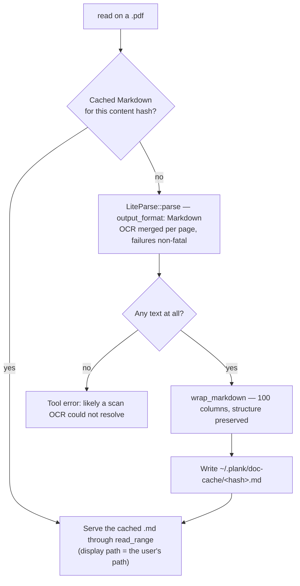

# liteparse integration plan: documents as Markdown, in-process

Status: **implemented** in `src/doc/` behind the default `docparse` feature.
The open questions below were settled by measurement; see "What the probe
found." Supersedes the extraction half of
`PDF-INGESTION.md`, which stays the reference for *shape* — extend `read`,
cache the result, page through `more` — while this plan replaces the
hand-written extractor it assumed.

## Why revisit

`PDF-INGESTION.md` was written on the premise that the two credible options
were (a) hand-rolling a `lopdf` extractor with layout heuristics, or (b) taking
on a Python plus torch document-conversion stack. It rejected (b) on dependency
weight and signed up for (a): heading detection from relative font size, list
items from leading glyphs, column detection from x-position clustering. That is
the fiddly, low-yield part of the work, and it is a permanent maintenance
surface.

[liteparse](https://github.com/run-llama/liteparse) (Apache-2.0, run-llama) is
that extractor, already written, in Rust:

```sh
cargo add liteparse
```

It is spatial text extraction over PDFium with bounding boxes, plus a Markdown
writer that reconstructs headings, tables, and lists from those boxes — exactly
the output `extract.rs` was specified to produce. It ships bundled Tesseract OCR
and a `is_complex()` triage call that reports whether a page needs OCR at all.
No API key, no network, no downloaded weights on the default feature set.

The dependency-weight objection that ruled out Marker and Docling does not
apply. This is a crate, not a Python environment, and it links into the same
binary.

## What it changes

| `PDF-INGESTION.md` component | Under this plan |
| --- | --- |
| `pdf/extract.rs` (lopdf + layout heuristics) | deleted before it is written — `liteparse` with `output_format: Markdown` |
| `pdf/render.rs` (page → PNG for vision) | only for the vision fallback, if that fallback survives at all |
| triage rule (chars-per-area, column clustering) | none needed — `parse` merges OCR per page internally |
| vision fallback for scanned pages | second-line: bundled Tesseract handles ordinary scans |
| `pdf/cache.rs` | `doc/cache.rs`, unchanged in design |
| non-goal: Office formats | still a non-goal — liteparse reaches them via LibreOffice |

The vision path is demoted rather than deleted. Tesseract on a clean scan is
faster and more predictable than a VLM; a VLM is better on a photographed page,
a handwritten annotation, or a figure that has to be *described* rather than
transcribed. Keep `VISION-MODEL.md` as the third tier, entered only when OCR
returns near-nothing.

## Architecture



### The cache file is the integration point

`tools/files.rs:192` (`tool_read`) and `tools/files.rs:220` (`tool_more`) both
funnel into `read_range`, which takes a *path* and owns line spans, windowing,
the `continue_offset=` footer, and `MoreState`. So the conversion does not need
to touch paging at all:

1. `tool_read` sees a path with a parseable extension.
2. Convert (or hit the cache) to `~/.plank/doc-cache/<sha256>.md`.
3. Call `read_range` on the cache path.
4. `more` continues from the cache file with no new paging code.

The one accommodation this needs: without it the model would see cache paths in
the `read` footer and in every subsequent `more`, which invites it to `read` or
`edit` a file in `~/.plank`. So `read_range` now takes `read_path` and `path`
separately — bytes from the former, every user-visible string from the latter —
and `MoreState` carries both. For every non-document file the two are the same
string, so nothing else changes. `ctx.note_read` (which feeds
`compact::build_reinjection`) records the user's path for the same reason.

### Module: `src/doc/`

Narrower than `src/pdf/` because liteparse absorbs most of it.

- **`mod.rs`** — extension routing from `tool_read`, the single `parse` call,
  `wrap_markdown`, and error mapping into `Tool error:` observations.
- **`cache.rs`** — content-addressed store under `~/.plank/doc-cache/`,
  mirroring `imagepaste.rs` in layout and LRU pruning (64 entries), keyed on
  the source document's hash so an edited PDF reconverts without an
  invalidation step. A read touches the entry's mtime, so eviction is by last
  use rather than by age of conversion.

The per-page "which tier produced this" record the plan called for is **not**
built: with no vision engine in the tree yet, there is no second tier to
reconvert into. It belongs with the vision work, not ahead of it.

There is no `extract.rs`. That is the point.

## What the probe found

Measured on macOS with a standalone crate before touching plank:

1. **Binary and build cost.** 401 transitive crates; 45s for a clean debug
   build, 39s release. Statically linked release binary: **19.5 MB** with
   Tesseract, 16.8 MB without. PDFium arrives prebuilt (~15 MB in the build
   dir), not as a C++ build. Against plank's existing 123 MB release binary
   this is ~16% — acceptable as a default.
2. **Bundled Tesseract.** `tesseract-rs` compiles libtesseract from source via
   CMake, which is the bulk of the build-time difference (45s → 19s without
   it). It costs only 2.8 MB of binary. Kept on, because it is what makes
   scanned PDFs work *without* the still-unimplemented vision engine —
   confirmed on an image-only PDF: 2.2s, text recovered. Quality tracks scan
   resolution; a low-DPI rasterisation lost most of its words.
3. **`tokio`.** Confirmed async (`parse`, `is_complex`). The `docparse` feature
   pulls `dep:tokio` in its own right, so `--no-default-features` still builds
   without it. `convert` uses the same current-thread block-on shim as obscura.
4. **Version velocity.** Pinned `=2.10`, as planned.
5. **MSRV.** Builds on plank's pinned toolchain. Not a blocker.

Two findings changed the design:

- **Per-page triage is unnecessary.** `parse` already merges OCR per page
  internally when `ocr_enabled` is set, so the planned `is_complex()` → re-parse
  loop is dead weight. One `parse` call covers both tiers. Setting
  `ocr_failure_fatal: false` is what preserves the partial-success bias — the
  crate defaults it to fatal.
- **The output needs wrapping.** liteparse reflows each paragraph onto a single
  line, so a prose page arrives as one 5000-character line. `read` windows by
  *line*, which would make `max_lines` meaningless and leave `more` with
  nothing to continue. `doc::wrap_markdown` hard-wraps prose at 100 columns and
  leaves table rows, headings, and fenced code alone.

## Feature gating

Follows `use_obscura`: a `docparse` feature owning `dep:liteparse` and
`dep:tokio`, on by default. The `doc` module is always compiled so extension
routing and wrapping stay CI-tested; only the conversion itself is gated, and
with the feature off `to_markdown` returns a message naming the flag that would
fix it. `cargo build --no-default-features` and its clippy run are both clean.

## Prompt-side cost: one sentence, not zero

**Corrected.** The claim below ("the model does not learn anything new") was
wrong in the one way that matters: a model that believes a `.pdf` is unreadable
never calls `read` on one — it shells out to `pdftotext`. Extension routing is
invisible unless the prompt says it exists. `sysprompt.rs` therefore appends one
sentence (`DOCUMENT_READ_NOTE`) after the bounded-read paragraph, gated on
`docparse` and outside the C-locked base, alongside the marker-spelling note.
That does churn the Tier 1 fingerprint once, costing a single re-prefill on
upgrade. Still no new tool.

The original argument, which holds for everything except discoverability:

Unchanged from `PDF-INGESTION.md`, and still the load-bearing constraint. The
system prompt's tool table is frozen by `tests/c_parity.rs`; a new tool would
have to be appended as extra text, churning the Tier 1 KV fingerprint and
forcing a full re-prefill. Extending `read` by extension costs nothing. The
model does not learn anything new — documents simply stop being unreadable.

This is also the argument against exposing liteparse's other capabilities
(`screenshot`, AcroForm extraction, vector-graphics extraction, `batch-parse`)
as tools. They are real features, and none of them is worth a prompt change.

## Office formats: still a non-goal

This was the one claim above that the source disproved. liteparse does accept
DOCX/XLSX/PPTX, but `LiteParse::parse` reaches them by **shelling out to
LibreOffice or ImageMagick to produce a PDF first** — an undeclared external
dependency. Routing `read` on a `.docx` through that would mean a multi-second
surprise on machines that have LibreOffice and an obscure failure on those that
do not.

`DOC_EXTENSIONS` is therefore `["pdf"]`. Widening it is a separate piece of
work: detect the converter, degrade clearly when it is absent, and decide
whether a spreadsheet flattened to Markdown tables is useful or noise.

## Error handling

Same convention, same bias toward partial success:

- Encrypted PDF → `Tool error:` naming the cause; `LiteParseConfig` takes a
  password, but plank has nowhere to get one, so this is terminal.
- Malformed file liteparse rejects → parse error with the page number when the
  failure is localized.
- Page empty after OCR, vision unavailable → that page is marked unreadable in
  the assembled Markdown; every other page is still returned.
- liteparse panic → must not take down the agent. If the crate's error handling
  proves unreliable on adversarial input, isolate conversion in a
  `catch_unwind` before considering a subprocess.

## Testing

No test needs a GPU, a network, or a vision model:

- `doc::tests` — extension routing, and `wrap_markdown` against prose, table
  rows, headings, and fenced code.
- `doc::cache::tests` — LRU pruning keeps the newest entries.
- `files::tests::read_pdf_as_markdown_and_continue` — the committed
  `tests/fixtures/doc_sample.pdf` read through the real `read` and `more`
  tools: content arrives, paging works, and no observation mentions
  `doc-cache`.
- `files::tests::unparseable_pdf_is_a_tool_error` — malformed input is an
  observation, not a panic.
- Feature matrix: `--no-default-features` builds and lints clean.

Not covered by tests: OCR on a scanned page, verified by hand instead (an
image-only PDF, 2.2s, text recovered). A committed scan fixture would bind CI
to Tesseract's output across versions for little gain.

Fixture Markdown assertions are coupled to a specific liteparse version, which
is a second reason to pin exactly — a caret bump would surface as opaque test
diffs.

## Non-goals

- No PDF writing or editing.
- No `screenshot` / vector-graphics / AcroForm tool surface.
- No cloud parsing. LlamaParse is the same vendor's hosted product; plank's
  local-first constraint rules it out, and liteparse is the local one on
  purpose.
