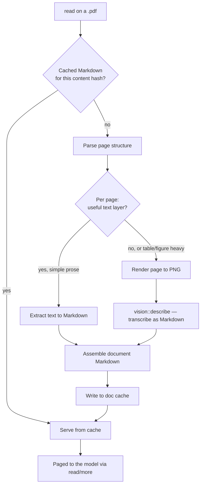

# PDF ingestion plan: documents as Markdown

Status: **shipped in shape, superseded in mechanism.** `read` on a `.pdf`
returns Markdown today, from `src/doc/` behind the default `docparse` feature.

Read this document for the *shape* of the feature — extend `read` rather than
adding a tool, content-address the result, page through `more` — which is what
was built and why. Do not read it for the extractor: the hand-written
`lopdf`-plus-heuristics module it specifies was never written.
`LIGHT-PARSE.md` replaced it with [liteparse](https://github.com/run-llama/liteparse)
(spatial extraction over PDFium, bundled Tesseract OCR) before any of it
landed, and that document is the authority on the conversion half.

What each section below is worth:

| Section | Status |
| --- | --- |
| Why / Why Markdown is the target | still the rationale |
| Extend `read`, do not add a tool | **shipped**, unchanged, and still the load-bearing decision |
| New module `src/pdf/` | superseded — shipped as `src/doc/`, see below |
| Triage rule | superseded — liteparse merges OCR per page internally |
| Vision fallback | **not implemented**; `VISION-MODEL.md` remains design |
| Caching | **shipped**, as specified |
| Error handling | **shipped** in substance, different messages |
| Testing / Non-goals | held, with one reason restated |

## Why

`read` on a PDF used to return bytes, not content. The file was opaque, and the
agent's only recourse was to tell the user it could not open it. PDFs are a
common enough input — specs, papers, invoices, exported reports — that this was
a real hole.

## The two problems behind one extension

A PDF is not one format. It is at least two, and they want opposite treatment:

- **Born-digital.** A text layer is present and exact. Extraction is the entire
  job: fast, free, lossless, no model involved. Sending these through a vision
  model would be slower and *less* accurate than reading what is already there.
- **Scanned.** The file is a stack of images with no text at all. Extraction
  returns nothing and only a vision model can help.

A third case sits between them: born-digital but layout-heavy. The text layer
exists, but multi-column flow, tables, and figure captions come out in an order
that reads as noise.

Any design that picks a single strategy loses one of these cases. The plan
below triages per page.

## Why Markdown is the target

Not plain text. plank already converts foreign documents to Markdown: the
`visit_page` tool runs HTML through `extract_page_markdown` and frames the
result with `frame_visit_output`. Markdown preserves headings, lists, and
tables in a form the model reads well, and matching the existing shape means
PDF output looks to the model like something it already knows how to consume.

A note for anyone reaching for the obvious tool: **pandoc cannot do this.**
PDF is an output format for pandoc, not an input one. It has no PDF reader.

## Architecture

> The flow below is the planned one; the vision branch was never built.
> `LIGHT-PARSE.md` carries the diagram of what actually runs.

### Extend `read`, do not add a tool

`read` on a path ending in `.pdf` returns Markdown; `more` pages through it
using the `MoreState` continuation that already exists in `tools/mod.rs`.

This is the most important decision in the plan, and the reason is not
aesthetic. The system prompt's tool table is frozen by `tests/c_parity.rs`, so
a new tool has to be advertised as appended text, and any change to that text
churns the Tier 1 KV fingerprint and forces a full re-prefill. Extending `read`
costs nothing on the prompt side. The model does not learn a new tool; PDFs
simply stop being unreadable.

It also means paging is solved rather than reinvented. A 300-page document
cannot enter the context at once, and `read`/`more` already handle exactly that
negotiation for large text files, including the truncation accounting in
`string_head`.

### New module: `src/pdf/` — superseded

> **Shipped as `src/doc/`, two files.** `mod.rs` (extension routing, conversion,
> the `docparse`-off stub) and `cache.rs`. `extract.rs` and `render.rs` were
> never written: liteparse is the extractor, and with no vision tier there is
> nothing to rasterize for. The plan below is kept for the reasoning about
> where the fiddly parts belong, which is why buying the extractor was the
> right call.

- **`mod.rs`** — entry point called from `files::tool_read`, the page-level
  triage decision, and document assembly. Owns the rule for what counts as a
  usable text layer.
- **`extract.rs`** — pure-Rust text and position extraction via `lopdf`, plus
  the structural heuristics: headings from relative font size, list items from
  leading glyphs, column detection from x-position clustering. Takes page
  objects, returns Markdown. No I/O, no subprocess, so it tests against small
  committed fixture PDFs.
- **`render.rs`** — rasterizes a single page to PNG for the vision fallback.
  Only invoked for pages triage rejected.
- **`cache.rs`** — content-addressed Markdown cache.

The split keeps the part with fiddly heuristics (`extract.rs`) free of process
and filesystem concerns, which is what makes it testable.

## Triage rule — superseded

> **No triage decision exists in plank.** `liteparse::parse` merges OCR per page
> internally and reports its own complexity judgment, so the chars-per-area
> test and the column-clustering test below were never needed. The one
> whole-document check that survived is the empty result: a conversion yielding
> no text at all reports the page count and says the file is likely a scan OCR
> could not resolve.

Per page, extract the text layer first. Fall back to vision when:

- the page yields near-zero characters relative to its area (a scan), or
- extracted spans show multi-column or tabular x-position clustering that the
  heuristics in `extract.rs` decline to linearize.

The first condition is cheap and unambiguous. The second is a judgment call,
and it should be biased toward extraction: a slightly awkward table rendered
instantly beats a perfect one that cost four seconds. The bias is worth
revisiting once there is real usage to look at.

## Vision fallback — not implemented

> **There is no vision tier.** Bundled Tesseract handles ordinary scans inside
> liteparse, which was the whole reason `LIGHT-PARSE.md` demoted this from
> second line to third. `VISION-MODEL.md` is still design, so a photographed
> page, a handwritten annotation, or a figure that needs *describing* rather
> than transcribing remains unreadable — reported as the no-readable-text
> error, not silently.
>
> The dependency-weight argument below is preserved because it is the reason a
> Python document stack was refused, and that judgment still stands.

Rendered pages go through the `VisionEngine` from `VISION-MODEL.md` with a
transcription prompt asking for Markdown that preserves headings and tables. A
modern VLM is competitive with dedicated document converters on layout, which
is why this plan does not take on a Python dependency.

The alternatives were considered and rejected on dependency weight. Marker,
Docling, MinerU, and Nougat are the quality leaders, especially on mathematics
and complex tables, but each is a Python plus torch stack with its own
multi-gigabyte model. For a Rust binary whose current external requirements are
`shasum` and `pngpaste`, that is a large step, and it duplicates a capability
the vision sidecar already provides.

This inherits the vision plan's constraints: opt-in, local, and unavailable
when no model is installed. With vision disabled, PDF reading still works for
born-digital files and reports `Tool error: page N has no text layer (scanned
PDF; enable vision to read it)` for the rest. Partial success is a real result
and should be returned, not discarded.

## Caching — shipped

Conversion costs seconds on a long document, so it is not something anyone
does twice. Converted Markdown is cached under `~/.plank/doc-cache/<hash>.md`,
keyed on the PDF's content hash, mirroring `~/.plank/image-cache` in both
layout and LRU pruning (`MAX_CACHED_DOCS = 64`). The second read of a document
is immediate. Keying on the *source* hash means an edited PDF converts afresh
with no invalidation step.

This directory survives the major-version sweep in `upgrade.rs`, which drops
`image-cache/` and leaves `doc-cache/` alone.

One refinement did not survive the extractor change: a cache entry does not
record which pages came from extraction and which from OCR, because liteparse
merges them internally and does not report the split. If a vision tier is ever
added, reconverting only the pages that previously failed will need that
provenance to come from somewhere.

Cache failure is not conversion failure: a `$HOME` that cannot be written falls
back to a temporary file, costing a re-parse rather than the read.

## Error handling — shipped in substance

Every failure is a tool observation following the `Tool error:` convention. The
shipped messages differ from the sketch below, because the failure modes did:

- Malformed, encrypted, or unparseable PDF → `convert <path>: <reason>` from
  liteparse. There is no separate encrypted-file branch.
- Nothing extractable anywhere → `convert <path>: no readable text (N page(s);
  the file is likely a scan that OCR could not resolve)`.
- Cache directory unwritable → falls back to a temp file; only a total failure
  reports `convert <path>: cannot write the document cache`.
- Built without `docparse` → `read <path>: document conversion is not available
  in this build`.

Per-page partial success is **not** implemented: liteparse returns one
document, and a page it cannot read contributes nothing rather than a marker.
The 90%-readable principle below holds at the document level — a document with
some unreadable pages still returns everything else — but there is no
per-page unreadable annotation in the Markdown.

A document that is 90% readable is useful. Nothing here should throw away good
pages because of a bad one.

## Testing

The constraint held: no test requires a GPU, a network, or a vision model. What
ships is the subset that still applies — a committed `doc_sample.pdf` fixture
driving `read` paging and `more` continuity, whole-file reads, the display-path
guarantee (no `doc-cache` path leaks into an observation), and the unparseable
-file error. The extraction and triage cases below belong to a module that was
never written, and the vision case to a tier that does not exist.

- `extract.rs`: small committed fixture PDFs covering single-column prose, a
  two-column layout, a table, and a heading hierarchy; assert the Markdown.
- Triage: a fixture with a text page and an image-only page asserts the routing
  decision without invoking vision.
- Vision branch: driven by `StubVision` from the vision plan.
- `cache.rs`: hash keying, LRU pruning, and the partial-conversion record.
- Paging: a long fixture asserts `read`/`more` continuity across chunks.

## Non-goals

All of these held.

- No PDF writing or editing.
- No form-field extraction.
- No embedded-attachment or annotation extraction.
- No Office formats. The reason changed: liteparse *does* accept DOCX, XLSX and
  PPTX, but it reaches them by shelling out to LibreOffice or ImageMagick to
  produce a PDF first. That is an undeclared external dependency which would
  make `read` on a `.docx` either a multi-second surprise or an obscure
  failure, depending on what the user happens to have installed. `DOC_EXTENSIONS`
  is `["pdf"]` until that is handled explicitly.
