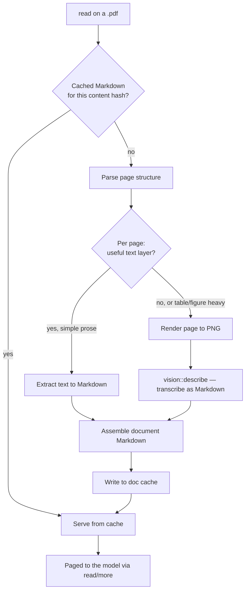

# PDF ingestion plan: documents as Markdown

Status: design, not implemented. Companion to `VISION-MODEL.md`, which this
plan depends on for its second half.

## Why

`read` on a PDF today returns bytes, not content. The file is opaque, and the
agent's only recourse is to tell the user it cannot open it. PDFs are a common
enough input — specs, papers, invoices, exported reports — that this is a real
hole.

## The two problems behind one extension

A PDF is not one format. It is at least two, and they want opposite treatment:

- **Born-digital.** A text layer is present and exact. Extraction is the entire
  job: fast, free, lossless, no model involved. Sending these through a vision
  model would be slower and *less* accurate than reading what is already there.
- **Scanned.** The file is a stack of images with no text at all. Extraction
  returns nothing and only a vision model can help.

A third case sits between them: born-digital but layout-heavy. The text layer
exists, but multi-column flow, tables, and figure captions come out in an order
that reads as noise.

Any design that picks a single strategy loses one of these cases. The plan
below triages per page.

## Why Markdown is the target

Not plain text. plank already converts foreign documents to Markdown: the
`visit_page` tool runs HTML through `extract_page_markdown` and frames the
result with `frame_visit_output`. Markdown preserves headings, lists, and
tables in a form the model reads well, and matching the existing shape means
PDF output looks to the model like something it already knows how to consume.

A note for anyone reaching for the obvious tool: **pandoc cannot do this.**
PDF is an output format for pandoc, not an input one. It has no PDF reader.

## Architecture

### Extend `read`, do not add a tool

`read` on a path ending in `.pdf` returns Markdown; `more` pages through it
using the `MoreState` continuation that already exists in `tools/mod.rs`.

This is the most important decision in the plan, and the reason is not
aesthetic. The system prompt's tool table is frozen by `tests/c_parity.rs`, so
a new tool has to be advertised as appended text, and any change to that text
churns the Tier 1 KV fingerprint and forces a full re-prefill. Extending `read`
costs nothing on the prompt side. The model does not learn a new tool; PDFs
simply stop being unreadable.

It also means paging is solved rather than reinvented. A 300-page document
cannot enter the context at once, and `read`/`more` already handle exactly that
negotiation for large text files, including the truncation accounting in
`string_head`.

### New module: `src/pdf/`

- **`mod.rs`** — entry point called from `files::tool_read`, the page-level
  triage decision, and document assembly. Owns the rule for what counts as a
  usable text layer.
- **`extract.rs`** — pure-Rust text and position extraction via `lopdf`, plus
  the structural heuristics: headings from relative font size, list items from
  leading glyphs, column detection from x-position clustering. Takes page
  objects, returns Markdown. No I/O, no subprocess, so it tests against small
  committed fixture PDFs.
- **`render.rs`** — rasterizes a single page to PNG for the vision fallback.
  Only invoked for pages triage rejected.
- **`cache.rs`** — content-addressed Markdown cache.

The split keeps the part with fiddly heuristics (`extract.rs`) free of process
and filesystem concerns, which is what makes it testable.

## Triage rule

Per page, extract the text layer first. Fall back to vision when:

- the page yields near-zero characters relative to its area (a scan), or
- extracted spans show multi-column or tabular x-position clustering that the
  heuristics in `extract.rs` decline to linearize.

The first condition is cheap and unambiguous. The second is a judgment call,
and it should be biased toward extraction: a slightly awkward table rendered
instantly beats a perfect one that cost four seconds. The bias is worth
revisiting once there is real usage to look at.

## Vision fallback

Rendered pages go through the `VisionEngine` from `VISION-MODEL.md` with a
transcription prompt asking for Markdown that preserves headings and tables. A
modern VLM is competitive with dedicated document converters on layout, which
is why this plan does not take on a Python dependency.

The alternatives were considered and rejected on dependency weight. Marker,
Docling, MinerU, and Nougat are the quality leaders, especially on mathematics
and complex tables, but each is a Python plus torch stack with its own
multi-gigabyte model. For a Rust binary whose current external requirements are
`shasum` and `pngpaste`, that is a large step, and it duplicates a capability
the vision sidecar already provides.

This inherits the vision plan's constraints: opt-in, local, and unavailable
when no model is installed. With vision disabled, PDF reading still works for
born-digital files and reports `Tool error: page N has no text layer (scanned
PDF; enable vision to read it)` for the rest. Partial success is a real result
and should be returned, not discarded.

## Caching

Vision transcription costs seconds per page, so a long document is not
something anyone converts twice. Converted Markdown is cached under
`~/.plank/doc-cache/<sha256>.md`, keyed on the PDF's content hash, mirroring
`~/.plank/image-cache` in both layout and LRU pruning. The second read of a
document is immediate.

Like `~/.plank/vision/`, this directory should survive the major-version sweep
in `upgrade.rs`. Unlike the weights, the reason is not size but cost: the
cached Markdown may represent minutes of GPU time.

A cache entry records which pages came from extraction and which from vision.
Enabling vision later should reconvert only the pages that previously failed.

## Error handling

Every failure is a tool observation following the `Tool error:` convention:

- Encrypted or password-protected PDF → reported as such, no retry.
- Malformed PDF that `lopdf` rejects → parse error, with the page number when
  the failure is localized.
- Scanned page with vision disabled → names the setting that would fix it.
- Vision failure on one page → that page is marked unreadable in the assembled
  Markdown and the rest of the document is still returned.

A document that is 90% readable is useful. Nothing here should throw away good
pages because of a bad one.

## Testing

No test requires a GPU, a network, or a vision model:

- `extract.rs`: small committed fixture PDFs covering single-column prose, a
  two-column layout, a table, and a heading hierarchy; assert the Markdown.
- Triage: a fixture with a text page and an image-only page asserts the routing
  decision without invoking vision.
- Vision branch: driven by `StubVision` from the vision plan.
- `cache.rs`: hash keying, LRU pruning, and the partial-conversion record.
- Paging: a long fixture asserts `read`/`more` continuity across chunks.

## Non-goals

- No PDF writing or editing.
- No form-field extraction.
- No embedded-attachment or annotation extraction.
- No Office formats. `.docx` and `.pptx` are a different problem with different
  libraries, and folding them in here would blur the module's purpose.
