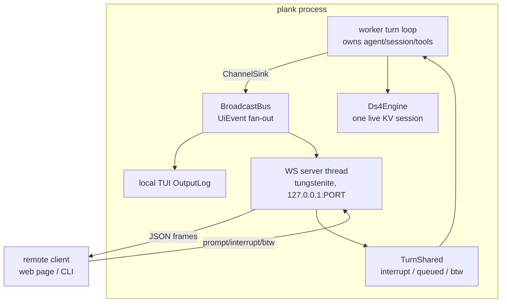

# Remote Control — Driving a Running plank from Elsewhere

Design document for plank's remote-control interface (issue #25, split from #2): a
local server that lets another process or machine submit prompts to, and read the
streaming output of, a running plank instance. This is the **v2.0.0 headline**
(roadmap Phase 6) and is deliberately the *minimal, CLI-only, no-backend* variant
— a local WebSocket server reached over an SSH reverse tunnel, not a claude.ai
bridge.

Status: **design only.** Nothing below is implemented. The reference agent's
`/remote-control` (documented in `vault/REMOTE-CONTROL.md`) is a bidirectional
bridge to a hosted backend with OAuth, environment registration, and work
polling. plank has no backend and will not grow one here; the note's closing
"Minimal Emulation for CLI-Only" section — a plain local WebSocket server plus
`ssh -R` — is the actual design intent, and this document specifies it.

## 1. Goal

Let a prompt submitted from another process or machine drive a running plank
instance, and stream that instance's output back, **without changing what a turn
is** for the local user. The defining properties:

- **Attach, don't fork.** A remote client becomes *another front-end* over the
  existing `worker::UiEvent` channel — the same serialization boundary the TUI
  already uses (`src/worker.rs`) — not a second engine, session, or KV context.
  One live `Ds4Engine` session remains the whole truth (mirroring the BTW design's
  §8 rejection of a second concurrent stream).
- **No backend.** No auth server, no cloud, no environment registration. The
  server binds `127.0.0.1` only; reachability off-box is the user's SSH tunnel.
- **Local-first coexistence.** When a local TUI is running, the remote client
  **mirrors** it (sees the same output) and, by policy, may be granted control;
  it never silently races the local user for the input line.
- **Small surface.** One WebSocket endpoint, one JSON message schema, one
  optional static web client. No new async runtime if avoidable (§4.7).
- **Same guarantees.** Interrupt, queued prompts, `/btw`, tool banners, status
  snapshots, and the KV-cache discipline all behave exactly as locally; the
  remote path reuses them rather than reimplementing them.

Non-goal for v2: web/mobile sync, multi-user collaboration, a hosted relay.
Those are what the reference backend buys and are explicitly out of scope (§9).

## 2. Prior art and context

### 2.1 The reference `/remote-control` (what we are *not* building)

`vault/REMOTE-CONTROL.md` documents the reference implementation: a
`replBridgeEnabled` flag that spins up a `HybridTransport`/`SSETransport` bridge,
registers an *environment* with a backend (`POST /v1/environments/bridge`),
long-polls `/work` for assignments, decodes a JWT `work_secret`, and streams
inbound `user_message` / `control_request` / `cancel_work` frames while POSTing
outbound message/tool/result batches. Three auth layers (OAuth bearer, work-secret
JWT, trusted-device token) and backend-registered callback URLs make it fundamentally
a hosted feature. The note's own "Real Barrier" section concludes a pure local
emulation *"could work for CLI-only usage, but web/mobile sync would break."*
plank chooses exactly that CLI-only branch.

### 2.2 The one lesson that transfers: message channels, not RPC

The reference's inbound/outbound split (server→client streams events; client→server
POSTs prompts, permission responses, cancels) maps cleanly onto plank's existing
`UiEvent` enum. We keep that shape — a duplex stream of typed JSON frames — and
drop everything backend-specific (polling, work secrets, environments).

### 2.3 What already exists in plank

The worker-thread architecture (#12, `76a6428`) did the hard part:

- **`worker::UiEvent`** (`src/worker.rs`) — the enum the worker emits over an
  mpsc channel: `Visible`/`Think`/`Tool`/`Error` (the four `RenderSink` calls),
  `Dim`/`Plain`/`UserEcho` log lines, `EndLine`, and `Status(Status)` snapshots.
  This is *already* the wire-ready description of everything on screen.
- **`worker::ChannelSink`** — a `RenderSink` (`src/viz.rs:32`) that forwards
  render calls into the channel; a hung-up receiver just drops text and the
  worker keeps running. This is the exact resilience a flaky remote link needs.
- **`worker::TurnShared`** — `interrupt: AtomicBool`, `queued: Mutex<Vec<String>>`
  (the C's `queued_user_drain`), and `btw: Mutex<Vec<String>>` with a capped
  FIFO. Remote prompts, interrupts, and `/btw` all have a home already.
- **`Status`** (`src/status.rs`) — the footer snapshot (state, prefill/gen
  progress, tps, ctx used/size, elapsed) already serializable field-by-field.
- The TUI loop (`src/ui.rs:1197` `run_tui`, worker scope at `~2238`) drains
  `rx.try_recv()` into the `OutputLog` and polls crossterm for input on a 100 ms
  cadence — the precise place a second consumer/producer slots in.

plank has **no interactive per-tool permission prompt**: bash runs under a Seatbelt
write-sandbox (`src/sandbox.rs`, `src/tools/bash.rs`), tools are not gated on user
approval. So the protocol's "permission" surface today is only *interrupt* plus a
forward-compatible hook for a future approval gate (§4.5).

### 2.4 The transport decision

plank is entirely synchronous/blocking: `ureq` for HTTP (`web.rs`), threads +
mpsc + `libc::poll` for concurrency, no `tokio`. Introducing an async runtime for
one WebSocket endpoint would be the largest dependency and paradigm change in the
codebase. We therefore choose **blocking `tungstenite`** on dedicated threads over
`axum`/`tokio` (§4.7), matching the worker-thread idiom.

## 3. Architecture overview



The single structural change is turning the worker's *single* mpsc sender into a
**fan-out bus**: one `ChannelSink` per consumer (local TUI + each remote session).
Everything downstream of `UiEvent` is unchanged.

## 4. Detailed design

### 4.1 Front-end selection and startup

Remote control is opt-in, never automatic. Extend `AgentConfig` (`src/config.rs`)
and the selection table (`docs/ARCHITECTURE.md` "Front-end selection"):

- `--remote[=ADDR]` — start the WebSocket server bound to `ADDR`
  (default `127.0.0.1:31415`, echoing the reference note's port). Composable with
  the existing front-ends:
  - `--remote` alone with a TTY → local TUI **plus** remote mirror/controller.
  - `--remote --non-interactive` (or piped) → **headless server mode**: no local
    front-end, the process exists only to serve remote clients. This is the
    "run on a box, drive over SSH" case and the primary target.
- `--remote-token TOKEN` / `PLANK_REMOTE_TOKEN` env — the shared secret (§4.6).
  If `--remote` is given without a token, plank generates one, prints it once to
  stderr, and requires it (no unauthenticated default).
- `/remote` slash command (both dispatchers — `slash` and `tui_slash`, per the
  "two parallel paths" rule) toggles the server at runtime and prints the URL,
  token, and the ready-to-paste `ssh -R` line.

### 4.2 The broadcast bus: remote client as another RenderSink

Today `run_worker_turn` (the scope at `src/ui.rs:~2238`) creates one
`Sender<UiEvent>` wrapped in a `ChannelSink`. Generalize:

- Introduce `worker::BroadcastBus`: holds `Vec<Sender<UiEvent>>` behind a
  `Mutex`, with `subscribe() -> Receiver<UiEvent>` and a `broadcast(&UiEvent)`
  that clones to each sender and prunes hung-up ones. `UiEvent` becomes `Clone`.
- The worker's stream renderer writes to a `ChannelSink` whose sender is a
  bus-fan-out sender (or the bus is the sink directly). The local TUI subscribes;
  each accepted remote session subscribes.
- **Late-join replay.** A remote client that connects mid-turn must not see a
  half-line. Keep a bounded ring buffer of recent `UiEvent`s (the *scrollback
  tail*, e.g. last N KB, reusing `OutputLog`'s existing content is tempting but
  the bus tail is simpler and thread-local to the server). On subscribe, the
  server replays the tail as a `Snapshot` frame, then live events. This is the
  reconnect/resume substrate (§4.8).

Because a dropped remote receiver already degrades gracefully (the `ChannelSink`
doc guarantees the worker keeps running and the transcript stays authoritative),
backpressure and disconnect handling inherit that property for free (§4.9).

### 4.3 Protocol: WebSocket JSON frames

One endpoint, text frames, one JSON object per frame, discriminated by `"type"`.
Versioned envelope so the web client and server can evolve:

```jsonc
// envelope (both directions)
{ "v": 1, "type": "...", "id": 42, /* type-specific fields */ }
```

**Server → client** (mirrors `UiEvent` plus session/control):

| type | fields | source |
|---|---|---|
| `hello` | `protocol_version`, `plank_version`, `session_id`, `controller` (bool) | on connect |
| `snapshot` | `scrollback` (array of prior output frames), `status` | on connect / resume |
| `visible` / `think` / `tool` / `error` | `text` | `UiEvent::{Visible,Think,Tool,Error}` |
| `dim` / `plain` / `user_echo` | `text` | corresponding `UiEvent`s |
| `end_line` | — | `UiEvent::EndLine` |
| `status` | flattened `Status` fields (§2.3) | `UiEvent::Status` (throttled, §4.9) |
| `turn_begin` / `turn_end` | `interrupted` (bool on end) | worker turn boundaries |
| `permission_request` | `request_id`, `tool`, `summary` | reserved (§4.5) |
| `control_denied` | `reason` | e.g. "another client holds control" |
| `bye` | `reason` | server shutting the session |

**Client → server:**

| type | fields | effect |
|---|---|---|
| `auth` | `token` | first frame; see §4.6 |
| `prompt` | `text` | `TurnShared::push_queued` if busy, else start a turn |
| `btw` | `text` | `TurnShared::push_btw` (respects `BTW_QUEUE_CAP`, returns drop notice) |
| `interrupt` | — | set `TurnShared::interrupt` |
| `command` | `text` (a `/slash`) | routed through the same slash dispatcher |
| `request_control` / `release_control` | — | §4.4 |
| `permission_response` | `request_id`, `allow` | reserved (§4.5) |
| `ping` | — | liveness; server replies `pong` (also native WS ping/pong) |

The frame set is a near-1:1 image of `UiEvent` + `TurnShared`, which is the whole
point: the remote path adds a transport, not new turn semantics. A CLI client and
the web client speak the same schema.

### 4.4 Session multiplexing and the coexistence policy

**One controller, many mirrors.** Multiple clients may connect and all *see*
output (mirrors), but at most one entity holds *control* (may submit prompts /
interrupts) at a time. Control is a token held by exactly one of: the local TUI,
or one remote session.

- **Local TUI present** (`--remote` with a TTY): the local user holds control by
  default. Remote clients connect as mirrors. A remote `request_control` surfaces
  a local notice (`push_dim`, e.g. `[remote wants control — /grant to allow]`);
  control transfers only on explicit local `/grant` (or a `--remote-allow-control`
  flag set at startup for unattended-but-TTY boxes). This makes the local user's
  input line never silently contended — the BTW design's "plank deliberately does
  not steer" caution applied to remoting.
- **Headless server mode** (no local front-end): the first authenticated client to
  `request_control` (or auto-request on connect) becomes controller; others
  mirror. Control releases on disconnect (after a grace window, §4.8) or explicit
  `release_control`, then the next requester may take it.
- A non-controller's `prompt`/`interrupt`/`command` frames get `control_denied`.
  `btw` is allowed from mirrors (it is ephemeral and read-only by construction —
  see BTW-DESIGN §4.2), giving read-only observers a safe way to ask questions.

Rationale for single-controller over full multiplex: plank has **one** engine
session and one transcript; concurrent prompt submission would interleave turns
unpredictably and break KV-prefix discipline. Multiplexed *sessions* (separate
transcripts) would require multiple engine contexts — the same duplicate-KV /
Metal-contention cost the BTW design rejected in §8. Deferred to §9.

### 4.5 Permission and interrupt

- **Interrupt** is fully wired today: a client `interrupt` frame sets
  `TurnShared::interrupt`, exactly what Esc/Ctrl-C does. `turn_end.interrupted`
  reflects the outcome. No new mechanism.
- **Permission** is reserved, not built. plank currently gates tool writes with a
  sandbox, not an interactive prompt, so there is nothing to forward. The
  `permission_request`/`permission_response` frames are specified now so that if a
  future interactive-approval feature (e.g. a hook, #8-style) lands, the remote
  controller can answer it without a protocol bump. Until then the server never
  emits `permission_request`.

### 4.6 Authentication (token)

Single shared bearer token, checked on the first frame:

- Client's first frame **must** be `auth { token }`; anything else → close with
  WS code `1008` (policy violation). A missing/wrong token → `4401` (custom
  "unauthorized"), connection closed, attempt logged to `--trace`.
- Token comes from `--remote-token` / `PLANK_REMOTE_TOKEN`, else auto-generated
  (32 bytes, base64url) and printed once to stderr at startup. No default token,
  no unauthenticated mode — binding to loopback is defense-in-depth, not the auth.
- Constant-time comparison. Optional origin allow-list for the web client
  (reject cross-site WebSocket upgrades whose `Origin` is unexpected), mitigating
  a malicious local web page reaching `127.0.0.1` (the CSRF-for-WebSocket risk).
- Rate-limit failed auths per source; a handful of failures closes and briefly
  blocks the peer.

The token is the *only* auth layer — no OAuth, no JWT, no trusted-device token
(all of which the reference note ties to a backend we don't have).

### 4.7 Transport and crate choices

| Concern | Choice | Rationale |
|---|---|---|
| Runtime | **Blocking threads** (no `tokio`) | Whole codebase is synchronous (`ureq`, `libc::poll`, `std::thread::scope`, mpsc). One accept-thread + one thread per connection matches the worker idiom and adds no async paradigm. |
| WS library | **`tungstenite`** (blocking) | Sans-async WebSocket + TLS-agnostic; pairs with `std::net::TcpListener`. `tokio-tungstenite`/`axum` would drag in `tokio` for a single endpoint — rejected. |
| JSON | **`serde` + `serde_json`** | First serde use in plank; unavoidable for a typed schema and far safer than hand-rolled JSON. Small, ubiquitous. Alternatively hand-write encode/decode to avoid the dep — rejected as brittle for a versioned protocol. |
| TLS | **None in-process** — rely on the SSH tunnel (§4.10) | Loopback bind means on-box traffic never hits the network unencrypted; off-box confidentiality/auth is SSH's job. Adding rustls + cert management for a loopback server is unjustified complexity. A `--remote-tls` path with rustls is a documented future option for direct-LAN use without SSH. |
| Web client | **Static HTML/JS**, no build step | Served by the same server at `/` (a `GET` upgrade-less request returns the page); a single file, `xterm.js`-style log pane + input box speaking the §4.3 schema. Optional; the CLI client (§4.11) is the reference consumer. |

Threading: an **accept thread** owns the `TcpListener`; each accepted socket gets
a **connection thread** that (a) authenticates, (b) subscribes to the
`BroadcastBus` and pumps `UiEvent`→JSON to the socket, and (c) reads client frames
and pushes into `TurnShared` / slash dispatch. The bus and `TurnShared` are the
only shared state, both already `Send + Sync` (Mutex/Atomic).

### 4.8 Reconnect and resume

- Each connection is stateless beyond its control token; the *server* holds the
  scrollback ring and current `Status`, so a reconnecting client gets a fresh
  `snapshot` and continues. No client-side session state is required to resume
  viewing.
- **Sequence numbers.** Every server→client frame carries a monotonic `id`; the
  `snapshot` states the highest replayed `id`. A reconnecting client may send
  `auth { token, resume_from: <id> }`; the server replays only frames newer than
  that from its ring (best-effort — if the ring has rolled past, it sends a full
  `snapshot` instead). This mirrors the reference transport's
  `getLastSequenceNum()` without any backend.
- **Control on disconnect.** A controller that drops keeps control for a short
  grace window (e.g. 10 s) so a brief network blip resumes seamlessly; after the
  window control is released and a mirror may claim it. Local TUI control never
  expires.

### 4.9 Backpressure

- Each connection thread owns a bounded outbound queue (the mpsc receiver from the
  bus). If a slow client can't keep up and its channel/socket buffer fills, the
  server **drops that client** (close code `1013`/"try again later") rather than
  blocking the worker — the `ChannelSink` contract already tolerates a vanished
  receiver, so the turn is never stalled by a slow remote. The client reconnects
  and resyncs via `snapshot` (§4.8).
- **`status` throttling.** `Status` snapshots can arrive per-token; the server
  coalesces them to at most ~10/s per connection (send the latest, drop
  intermediates) since they're pure state, not a log. Text frames
  (`visible`/`think`/…) are never coalesced — they're the transcript.
- WS ping/pong (server-initiated, ~15 s) detects dead peers to reclaim control
  and free threads.

### 4.10 The SSH reverse-tunnel story and threat model

No backend, no public listener. To drive plank on a remote box `host`:

```sh
# on host: run plank serving loopback only
plank --remote --non-interactive          # prints token + tunnel hint

# from the laptop: forward a local port to host's loopback server
ssh -L 31415:localhost:31415 user@host
# then point the web/CLI client at ws://localhost:31415
```

Or the *reverse* direction (plank behind NAT reaching out to a bastion):

```sh
# on the NATed plank box:
ssh -R 31415:localhost:31415 user@bastion
# clients on/through the bastion reach ws://localhost:31415
```

**Threat model:**

- **Confidentiality & integrity in transit:** provided entirely by SSH. plank's
  socket carries plaintext JSON but only over `127.0.0.1`, which is not on any
  wire.
- **Bind scope:** default `127.0.0.1` — never `0.0.0.0`. Off-box reach requires an
  explicit tunnel the operator sets up; plank never opens itself to the LAN unless
  the user overrides the bind address (and then §4.7's `--remote-tls` is advised).
- **On-box multi-user risk:** any local user could connect to the loopback port.
  The token defends against that; combine with OS user isolation. Document that a
  shared host means a shared trust boundary.
- **Malicious local web page (CSRF-ish):** a browser page could attempt a
  WebSocket to `ws://127.0.0.1:31415`. Mitigated by the mandatory token
  (the page can't know it) and the `Origin` allow-list (§4.6).
- **What we explicitly *don't* defend:** a compromised SSH endpoint or a leaked
  token = full control of that plank instance (which can run bash under the
  sandbox). This is equivalent to shell access on the box and is stated plainly:
  the token is a capability, treat it like an SSH key.

### 4.11 Minimal client story

Two clients, one schema:

1. **CLI client** — the reference consumer, shippable as a `plank remote <url>`
   subcommand or a tiny standalone binary. Connects, auths, streams
   `visible/think/tool/error` to stdout with the same styling as the plain REPL
   (reuse `render.rs`'s ANSI path against a stdout `RenderSink` fed by decoded
   frames), reads lines from stdin as `prompt`/`command`/`btw`/interrupt (Ctrl-C
   → `interrupt` frame). This makes plank *scriptable* over the tunnel — the
   issue's core ask ("submitting prompts and reading output from another
   process").
2. **Web client** — optional static page served at `/`: a scrollback pane, a
   status footer bound to `status` frames, an input box, and `/btw` + interrupt
   buttons. No framework, no build. Good enough to drive plank from a phone
   browser through the tunnel, without any of the reference's backend sync.

## 5. Implementation plan

Ordered; each step independently landable and testable with `EchoEngine`.

1. **Bus refactor.** Make `UiEvent: Clone`; add `worker::BroadcastBus`
   (subscribe / broadcast / prune) plus a bounded scrollback ring with sequence
   ids. Route the existing local TUI through the bus (one subscriber). Pure
   refactor, no behavior change — covered by existing worker tests.
2. **Config & selection.** `--remote`, `--remote-token`, bind addr, `/remote`
   slash command in *both* dispatchers, front-end table update, token generation
   + one-time stderr print, `ssh` hint. (`src/config.rs`, `src/main.rs`, `src/ui.rs`.)
3. **Server skeleton.** `serde`/`serde_json`/`tungstenite` deps; `src/remote.rs`
   with accept thread + connection threads; `auth` handshake, `hello`, loopback
   bind, token check (constant-time), origin allow-list. No turn wiring yet —
   just mirror `UiEvent`→JSON and `snapshot` replay.
4. **Inbound control.** `prompt`/`btw`/`interrupt`/`command` frames into
   `TurnShared` and the slash dispatcher; single-controller policy
   (`request/release/grant`, `control_denied`); `turn_begin`/`turn_end`.
5. **Resilience.** Sequence numbers + `resume_from`, status throttling, bounded
   outbound queue with slow-client drop, ping/pong, control grace window.
6. **CLI client.** `plank remote <url>` subcommand reusing `render.rs` styling.
7. **Web client.** Static page served at `/`, schema-complete.
8. **Docs.** This file, `README`/`--help` for the SSH recipes and threat model,
   `docs/ARCHITECTURE.md` front-end-selection + module-reference updates.

`serde` is the one notable new dependency; steps 1–2 add none, so the refactor
can merge ahead of the transport work.

## 6. Testing

Unit / integration (`cargo test --lib`, `EchoEngine`, no model, no network where
possible):

- `bus_fans_out_to_multiple_subscribers` — one worker emit reaches TUI + N remote
  subscribers in order; a dropped subscriber is pruned and doesn't stall others.
- `bus_scrollback_replays_on_late_join` — subscribe mid-stream, assert `snapshot`
  contains the tail and live frames follow without a split line.
- `frame_roundtrip` — every `UiEvent` ↔ JSON frame encodes/decodes losslessly
  (property-ish table test); envelope version present.
- `auth_required_first_frame` / `auth_rejects_bad_token` / `auth_constant_time`
  (behavioral) — drive a `tungstenite` client against a loopback server on an
  ephemeral port.
- `single_controller_policy` — second client's `prompt` gets `control_denied`;
  `btw` from a mirror is accepted; grant/release transfers control; disconnect
  releases after the grace window.
- `remote_prompt_starts_turn` / `remote_prompt_queues_when_busy` — assert
  `TurnShared::{push_queued,take_queued}` semantics via the frame path.
- `remote_interrupt_sets_flag` — `interrupt` frame flips `TurnShared::interrupt`;
  `turn_end.interrupted == true`.
- `slow_client_dropped_not_worker` — a stuck reader is closed; the worker turn
  completes; a reconnect resyncs via `resume_from`.
- `status_frames_coalesced` — a burst of `Status` emits ≤ throttle rate downstream.
- `origin_allowlist_rejects_unexpected_origin`.

Manual (real model, macOS): run `plank --remote --non-interactive` on one box,
`ssh -L`, drive from the CLI client and the web page; confirm mirror sees local
TUI output when both are active; confirm `/btw` from a mirror works; pull the
network mid-turn and reconnect, verify `snapshot`/`resume_from` continuity and
that the local turn never stalled; verify the printed `ssh` line works verbatim.

## 7. Constraints and invariants

1. **One engine, one session, one transcript.** The remote path never creates a
   second engine context or transcript; it is a transport over the existing
   worker channel. (Multiplexed sessions are §9, not this.)
2. **The worker is never blocked by a remote client.** A slow/dead/absent remote
   consumer only drops frames — the `ChannelSink` contract in `src/worker.rs` is
   authoritative and must not be weakened.
3. **No unauthenticated access, ever.** No default token; loopback bind is
   defense-in-depth, not the auth boundary.
4. **Loopback by default; off-box reach is the user's tunnel.** plank does not
   open itself to the network without an explicit override.
5. **Two UI paths.** Every slash/config change lands in both `slash` and
   `tui_slash`; the remote control policy must not let a remote client silently
   contend the *local* user's input line.
6. **Schema is versioned.** The `v` envelope field is mandatory; adding frame
   types is backward-compatible, changing existing ones bumps `v`.
7. **`/btw` remains ephemeral over the wire** — a remote `btw` obeys BTW-DESIGN's
   invariants (nothing enters the transcript, `full transcript + suffix` prompt,
   tools denied).

## 8. Open questions

- Should headless server mode auto-grant control to the first client, or require
  an explicit `request_control` even when no local user exists? (Leaning
  auto-grant for scriptability; revisit if it surprises operators.)
- Ring-buffer sizing for scrollback replay vs. memory — fixed KB cap, or last-N
  turns? Start with a KB cap, make it a flag if needed.
- Whether the CLI client is a `plank remote` subcommand (shared binary, shared
  render code) or a separate crate. Subcommand preferred for code reuse.

### 8.1 Resolved (hardening, issue #25)

- **`Origin` allow-list.** Enforced on the WebSocket upgrade in
  `control::handle_connection` via `origin_allowed`. Default policy: a missing
  `Origin` (native `plank remote` clients send none) and any loopback `Origin`
  (`localhost` / `127.0.0.1` / `::1`, any scheme or port) are allowed; every
  other browser `Origin` must be listed with `--control-origin <ORIGIN>`
  (repeatable or comma-separated) or the upgrade is refused with an HTTP 403
  before the handshake completes. `null` (opaque `file://` origins) is treated
  as a non-loopback browser origin and must be allow-listed explicitly.
- **Bounded per-client outbound queue.** Each connection caps its unsent output
  at `--control-queue-max` bytes (default 1 MiB) via tungstenite's
  `max_write_buffer_size`. Writes use a short socket write timeout so a stalled
  client's data accumulates in the buffer rather than blocking the connection
  thread; once the buffer exceeds the cap the client is evicted (its thread
  exits and the bus prunes the dropped subscriber on the next broadcast).
  Healthy clients keep the existing scrollback-replay + live-mirror semantics.
- **Static web client.** A single self-contained HTML+JS page (no external
  deps) is served at `GET /` (and `/index.html`) straight from the control
  server — see `control::WEB_CLIENT_HTML` (`src/remote/web_client.html`). It
  authenticates with a token, renders mirrored output, and sends typed lines as
  `prompt` / `command` / `btw` frames at the same `PROTOCOL_VERSION`.

## 9. Non-goals

- **A backend / claude.ai sync.** No environments, work polling, OAuth, JWT, or
  trusted-device tokens — the entire reference bridge machinery
  (`vault/REMOTE-CONTROL.md`) is out of scope. plank stays backend-free.
- **Multiplexed independent sessions.** Multiple concurrent transcripts would
  require multiple engine/KV contexts — the same duplicate-KV / Metal-contention
  cost rejected in BTW-DESIGN §8. Single controller + mirrors only.
- **A second concurrent generation stream.** One live session, boundary-scheduled
  `/btw`, same as today.
- **In-process TLS / cert management** for the common case. Confidentiality off-box
  is SSH's job; `--remote-tls` (rustls) is a documented future option for direct
  LAN use, not part of the minimal variant.
- **Web/mobile presence in claude.ai/code.** That is precisely what the backend
  buys and what this feature deliberately forgoes.
- **Steering / multi-user collaboration.** Interleaving multiple controllers into
  one turn is a separate design with its own turn-ordering questions.
