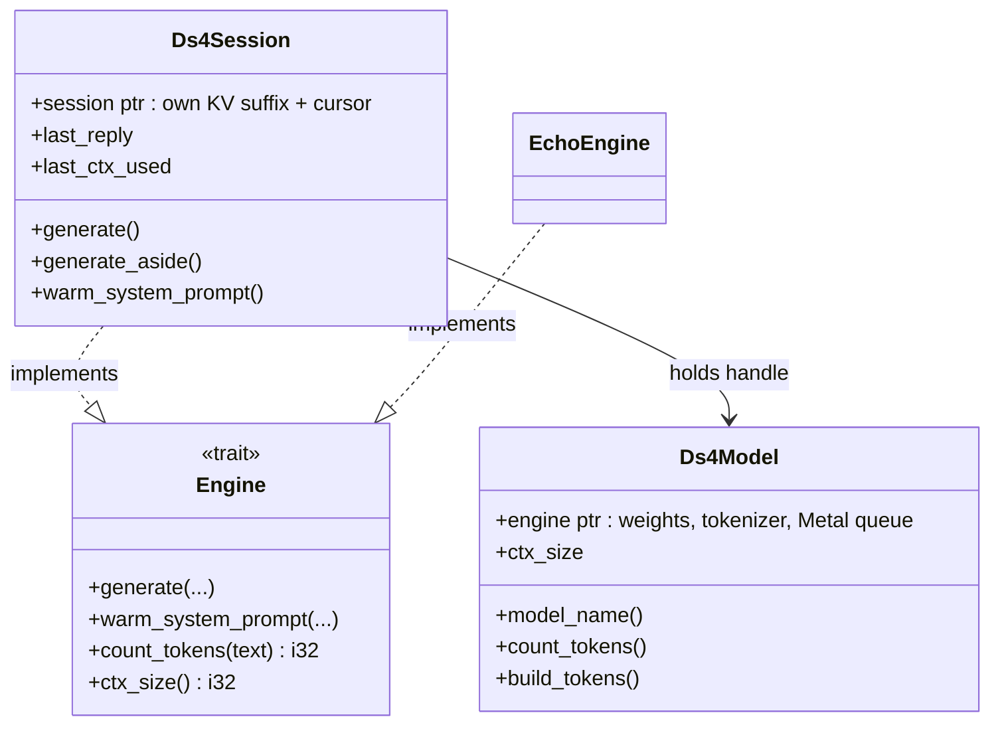
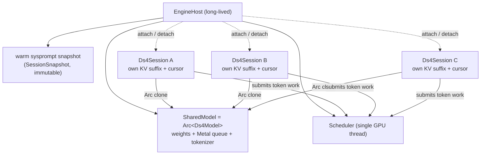
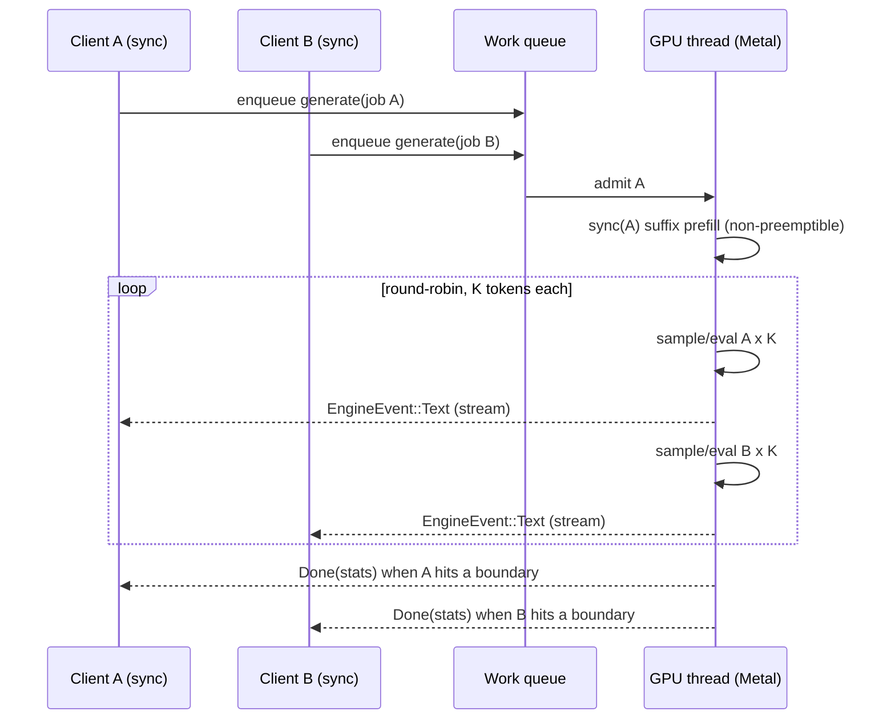

# Shared Reference-Counted Engine — One Model, Many Sessions

Design document for GitHub issue [#28](https://github.com/aovestdipaperino/plank/issues/28):
a single long-lived `ds4_engine` wrapper, handed out via refcount, that multiple
plank sessions attach to concurrently — amortizing the model weights, the Metal
context, and the warm system-prompt prefix across every attached client instead of
paying them N times.

Status: **implemented behind the `--shared-engine` flag (default off).** The
session/model split (§3) is always present and behavior-preserving; the
`EngineHost`, refcount, cooperative scheduler (§4–§6), and multi-tenant
`plank serve` wiring (§8) are gated on `--shared-engine`. Steps 1–4 of §9 have
landed; step 5 (accounting/status surfacing) and idle-KV reclamation remain
deferred (§10, §12). This document builds
directly on the concurrent-sessions analysis already recorded in
[`BTW-SUSPEND-DESIGN.md`](BTW-SUSPEND-DESIGN.md) §8.1 — it does not re-derive the
engine facts, it turns §8.1's "what it would take" list into a concrete design and
justifies the load-bearing refactor by the features that need it.

## 1. Motivation

Today each plank process owns exactly one `Ds4Engine` behind the `Engine` trait
(`src/engine.rs`), and that struct conflates two very different things: the
**model** (weights, tokenizer, the Metal command queue — immutable, ~82 GB
resident for the default quant per `require_min_ram` in `src/main.rs`) and the
**session** (a single `session: *mut ffi::Ds4Session`, the mutable KV cache and
write cursor, `src/ds4engine.rs:26`). Running N plank sessions on one machine means
N model loads, N Metal contexts, and N cold prefills of the byte-identical DS4
system prompt — the model weights dominate resident memory, so this is wasteful
well before N is large.

The C layer never forced this. `ds4_session_create(out, engine, ctx_size)`
(`src/ffi.rs:157`) already creates a session against shared, read-only weights, and
multiple sessions per engine are supported — the single-live-session policy is a
plank *choice*, not an engine limitation (BTW-SUSPEND-DESIGN §2). A shared engine
amortizes the expensive, immutable part once and gives each attached client only
the cheap, mutable part it actually needs: its own KV suffix over the shared warm
prefix.

This is the **concurrency layer under `plank serve`** (ROADMAP v2.0.0; #26): the
remote-engine design (`REMOTE-ENGINE-DESIGN.md` §4.1, §8) ships `plank serve` as
single-tenant v1 and explicitly defers multi-tenant. #28 is that deferred piece —
the in-process primitive that lets one `plank serve` host fan out to many sessions
without loading the model per client.

## 2. Engine facts, established from the code

Everything below is read from `src/ds4engine.rs`, `src/ffi.rs`, and
`src/snapshot.rs`; none of it is speculative.

- **A session is already a distinct C object over shared weights.**
  `ds4_session_create(out, engine, ctx_size)` allocates a session that borrows the
  engine's read-only weights; `ds4_session_free` releases just the session. One
  engine, many sessions is the C-supported shape (`src/ffi.rs:157`, `:162`).
- **plank currently allows exactly one.** `Ds4Engine` holds a single
  `session: *mut ffi::Ds4Session` created lazily by `ensure_session`
  (`src/ds4engine.rs:259`) and kept alive across turns so `ds4_session_sync` reuses
  the cached KV prefix and evaluates only the new suffix (`src/ds4engine.rs:18-22`).
  `generate` conflates engine and session — it mutates the one owned session.
- **Generation is a Rust-side token loop checking `interrupt()` per token.**
  A halt at a token boundary leaves the session's KV fully valid at its cursor
  (`ds4_session_pos`); stopping loses nothing (BTW-SUSPEND-DESIGN §2). This is what
  makes *cooperative* interleaving at token granularity possible.
- **One Metal command queue means concurrency is time-sliced, not parallel.**
  Two sessions calling `ds4_session_eval`/`sample` concurrently on separate threads
  is almost certainly unsound as written; and even if made safe, one queue buys no
  parallel throughput (BTW-SUSPEND-DESIGN §2, §8.1 req 2). This is the single most
  important constraint shaping §5.
- **The snapshot primitive already landed.** `src/snapshot.rs` wraps
  `ds4_session_save_snapshot` / `load_snapshot` / `snapshot_free`
  (`src/ffi.rs:198`) as a safe, `Send` `SessionSnapshot` with `capture`, `restore`,
  `as_bytes`, and `restore_bytes` — and its doc comment already names #12
  (per-session KV payloads) and #29 (`/checkpoint`) as intended consumers. It is
  the cheap-bootstrap dependency this design needs (§6), not something to build.
- **`Ds4Engine` is `unsafe impl Send` but single-threaded by contract.** The
  comment at `src/ds4engine.rs:50-53` states the engine is used single-threaded by
  the agent turn loop. The shared design must uphold that contract — it does not
  weaken it (§5).

## 3. The load-bearing change: session as a first-class object

This is BTW-SUSPEND-DESIGN §8.1 **requirement 1**, verbatim in intent:

> Split "engine" from "session" in the Rust API. [...] Make a session a
> first-class Rust object you can hold two of — weights in one place, KV + cursor
> in each session. **This is the load-bearing change; everything else sits on top.**

Concretely, `Ds4Engine` splits into two types:

- **`Ds4Model`** — owns `engine: *mut ffi::Ds4Engine` (weights, tokenizer, Metal
  queue), `ctx_size`, `model_name`, and the `count_overhead` cache. Immutable after
  `open`. Frees the engine on drop. Everything currently on `Ds4Engine` that reads
  only the engine pointer (`model_name`, `templated_len`, `build_tokens`,
  `build_system_tokens`, `count_tokens`) moves here.
- **`Ds4Session`** (Rust type; distinct from the FFI `ffi::Ds4Session`) — owns one
  `session: *mut ffi::Ds4Session`, its `last_reply: Option<LastReply>` KV-splice
  state, and its `last_ctx_used`. Holds a handle to its `Ds4Model` (§4). All the
  mutable turn state — `ensure_session`, `generate`, `generate_aside`,
  `warm_system_prompt`, checkpoint save/restore — moves here.

The `Engine` trait boundary (`src/engine.rs`) is unchanged in shape: today's
single-owner path becomes a `Ds4Session` that happens to be the sole owner of a
freshly-created `Ds4Model`. `EchoEngine` and the remote engines are untouched. This
refactor is **behavior-preserving and independently landable** (§7 step 1) — it is
worth doing on its own merits because the *same* split is what #12 (per-session KV
payloads), instant `/switch` without re-prefill, and subagent sidechains all need
(BTW-SUSPEND-DESIGN §8.1 verdict). The shared engine is then a small step on top,
not a from-scratch build.

## 4. Refcounted ownership model

A `Ds4Model` is expensive to build and cheap to share read-only, so it lives behind
an `Arc`. A new host type owns it and hands out sessions:

- **`SharedModel = Arc<Ds4Model>`** — the weights + Metal context, loaded once. Its
  `Arc` strong count *is* the refcount the issue asks for: the last `Drop` of the
  last `Ds4Session` (and the host) drops the `Arc` to zero and frees the engine and
  Metal context. There is no manual refcount to get wrong.
- **`EngineHost`** — the long-lived owner created at `plank serve` startup (or in
  the in-process multi-session case). Holds the `SharedModel`, the shared warm
  system-prompt snapshot (§6), and the scheduler (§5). `attach()` returns a fresh
  `Ds4Session` cloned from the warm prefix; the host tracks live sessions for memory
  accounting (§7) and admission control.
- **Each `Ds4Session` holds a `SharedModel` clone.** Its FFI `ffi::Ds4Session` is
  created against `model.engine` and freed on the Rust `Ds4Session`'s drop. The KV
  suffix and cursor are private to it; the weights are shared and never mutated.

The last strong reference to drop frees the model — matching the issue's "last
detach tears down the Metal context and frees the model."

## 5. Thread-safety: a cooperative single-thread scheduler

Per BTW-SUSPEND-DESIGN §8.1 **requirement 2**, the real risk is not memory, it is
that the engine and its single Metal command queue were written for one worker
thread. Two threads calling `ds4_session_eval`/`sample` concurrently is almost
certainly unsound, and one queue buys no parallelism anyway. §8.1 states the
preference explicitly:

> a cooperative scheduler on one thread is cleaner than two threads contending a
> mutex.

**Decision: one dedicated GPU thread owning every `ds4_session_*` call, with
sessions interleaved cooperatively at token granularity.** No `ds4_session_*` call
ever happens off that thread; the `unsafe impl Send` single-threaded contract
(`src/ds4engine.rs:50`) is preserved by construction rather than by a mutex the C
code was never audited against.

Mechanics:

- The `EngineHost` spawns one **GPU worker thread** at startup. It owns the
  `SharedModel` engine pointer for the purpose of making FFI calls and runs a loop
  over a work queue.
- A client's `generate` does not touch the engine directly. It enqueues a
  **generation job** (its session handle, rendered transcript, `GenerationOptions`,
  an interrupt flag, and an `EngineEvent` sink channel) and blocks on that channel,
  keeping the sync `Engine::generate` contract intact — exactly the sync↔async
  bridging pattern REMOTE-ENGINE-DESIGN §4.6 uses for remote engines, here bridging
  sync client ↔ single GPU thread.
- The scheduler **round-robins in slices of K tokens** (K small, e.g. 8–16). It
  runs one session's `sync` (once, at admission) and then K sample/eval steps,
  streams those `EngineEvent::Text` pieces to that session's channel, checks that
  session's interrupt flag, then yields to the next runnable session. A session that
  finishes (no more tokens, or a tool-call boundary) leaves the rotation; a new
  `attach`/`generate` joins it. This is precisely the token-granularity interleaving
  §8.1 calls for, and it reuses the existing per-token loop structure
  (`src/ds4engine.rs`) unchanged — the loop just runs on the scheduler thread and
  cedes after K tokens instead of running a whole pass.
- **Prefill (`ds4_session_sync`) is a non-preemptible unit** in v1: a session being
  admitted prefills its suffix to completion before token rotation resumes for
  others. Prefill already streams progress and honors the cancel callback
  (`progress_cb`, `src/ds4engine.rs:75`), so a long prefill remains interruptible by
  *its own* client, but it does not yield the GPU to other sessions mid-prefill.
  Fairer prefill chunking is a non-goal for v1 (§10); noted because a huge cold
  prefill can starve others.

**Scheduling policy (v1): round-robin fairness, no preemption priority.** Every
runnable session gets one K-token slice per rotation. This is the simplest policy
that prevents one long generation from fully starving a short one, and it is honest
about the hardware: total throughput is fixed by the one queue, so fairness is about
latency distribution, not speedup. Priority/preemption is a documented v2 knob
(§10). The issue's open question "fair scheduling / preemption policy" is answered
this way for v1: **round-robin at K-token granularity, prefill non-preemptible.**

## 6. Cheap bootstrap via snapshot/restore

BTW-SUSPEND-DESIGN §8.1 **requirement 3**: a freshly created session B would
re-prefill the whole transcript — the exact cost the single-session design avoids.
The fix is already in the tree.

At host startup, `warm_system_prompt` runs **once** on a bootstrap session against
the shared `sysprompt.kv` checkpoint (unchanged from today's fast path,
`Ds4Session::warm_system_prompt`), and the host captures that warmed KV as an
immutable `SessionSnapshot` (`SessionSnapshot::capture`, `src/snapshot.rs:73`) — the
"warm sysprompt prefix" the issue names. Then `EngineHost::attach()`:

1. Creates a fresh FFI session (`ds4_session_create`) over the shared weights.
2. `SessionSnapshot::restore`s the warm prefix into it (`src/snapshot.rs:93`),
   giving the new session the system-prompt KV **without re-prefilling it** — the
   snapshot round-trip is lossless (BTW-SUSPEND-DESIGN §4.5).
3. Returns a `Ds4Session` positioned exactly after the shared prefix, ready to
   `sync` only its own conversation suffix.

So attach cost is one snapshot restore (a memcpy-class buffer load), not a cold
system-prompt prefill. This is the same primitive #29 (`/checkpoint`) and #12
(per-session KV payloads) reuse — the snapshot is a shared dependency, not a
per-feature build. The `sysprompt.kv` on-disk checkpoint still bootstraps the very
first warm across process restarts, exactly as REMOTE-ENGINE-DESIGN §4.5 describes
for flavor (a).

## 7. Memory accounting for N live sessions

The weights are shared (paid once); the per-session cost is the KV cache. Each live
`Ds4Session` holds a context of up to `ctx_size` tokens of KV, so **resident memory
grows roughly linearly in the number of attached sessions**, on top of the
one-time model resident set. This is BTW-SUSPEND-DESIGN §8.1 requirement 4 ("bounded
second KV allocation") generalized from two sessions to N.

- **Admission control.** `EngineHost` tracks live sessions and a configured
  `max_sessions` and (v2, built) an aggregate KV-bytes budget
  (`HostConfig::kv_budget_bytes`, `--kv-budget-bytes`, sized from `require_min_ram`
  headroom in `src/main.rs`). `attach()` past either the count cap or the KV-bytes
  budget returns an `EngineError` (a real failure, not `unsupported`) rather than
  OOM-ing the box — the per-session KV bytes are estimated from its `ctx_size` via
  `ModelHandle::kv_bytes_per_token`. Both default off/conservative (no budget =
  count-only), tunable via the `plank serve` config surface (§8).
- **Right-sized contexts (v2, built).** A session's `ctx_size` need not be the
  model max; the host hands out smaller per-session contexts to fit more clients,
  since `ds4_session_create` takes `ctx_size` per session (`src/ffi.rs:157`).
  `EngineHost::attach_sized` takes a requested per-session `ctx_size` (clamped to
  the model max), threaded from the client's `WireOptions::ctx_size` on the serve
  path and/or a `--session-ctx-size` default; unspecified falls back to the model
  ctx_size, matching v1 behavior.
- **Idle reclamation (v2, noted).** A detached session frees its KV immediately on
  drop. An *idle-but-attached* session could optionally be snapshotted to disk (the
  same `SessionSnapshot::as_bytes` persistence path, `src/snapshot.rs:113`) and its
  live context reclaimed, restored on next activity. Designed-for, not built in v1.
- **The shared warm snapshot** costs one system-prompt-sized buffer held for the
  host's lifetime — negligible against the weights and amortized across all
  sessions.

The issue's open question "KV-cache accounting: how per-client suffixes coexist with
one shared `ctx_size` budget" is answered: **each session owns an independent
context of its configured `ctx_size`; there is no shared token budget across
sessions, only a shared weight set and a host-level admission cap on total live
contexts.**

## 8. Relationship to `plank serve` / #26

`REMOTE-ENGINE-DESIGN.md` frames `plank serve` (flavor a) as single-tenant v1: one
`Ds4Engine`, one live session behind a socket (§4.1), with multi-tenant explicitly
deferred (§8). #28 is that deferred concurrency layer, and the two designs compose
cleanly:

- **In-process is the primitive; `plank serve` is a front-end over it.** The issue's
  open question "in-process vs. cross-process daemon" resolves to: build the
  in-process shared engine (`EngineHost` + `Ds4Session`), and let `plank serve` grow
  a multi-tenant mode that maps each network client (`REMOTE-ENGINE-DESIGN` §4.1's
  `session_id` on `/generate`) to an `EngineHost::attach()`ed `Ds4Session`. There is
  no separate daemon protocol to design here — the wire protocol is #26's; #28 is
  what sits behind its request handler.
- **The server's per-request `session_id` becomes the attach key.** REMOTE-ENGINE
  §4.1 already threads `session_id` through `/generate`; multi-tenant serve keys a
  `Ds4Session` per `session_id`, all sharing the one `SharedModel`. The SSE
  event mapping (`Prefill`/`Text`/`Done`) is unchanged — it is fed by the scheduler
  channel (§5) instead of a directly-owned session.
- **Local multi-session too.** The same `EngineHost` serves the in-process case
  (one plank process running several sessions — e.g. subagent sidechains, or a
  future `/switch`) without any network hop. REMOTE-CONTROL-DESIGN's "attach, don't
  fork" model (§1) is the local-front-end analogue; a shared engine is what lets a
  genuinely *independent* session attach rather than mirror.

Ordering: #28's step 1 (the session/model split, §7) should land before or with
#26's `plank serve`, because it makes the server's single-tenant path just "an
`EngineHost` with `max_sessions = 1`" rather than a special case to be retrofitted.

## 9. Implementation plan

Ordered; each step independently landable, and — except where a real Metal box is
required — testable with `EchoEngine`.

1. **Session/model split (behavior-preserving).** Split `Ds4Engine` into
   `Ds4Model` (`Arc`-able weights) and `Ds4Session` (owns one FFI session + turn
   state), `Ds4Session: Engine`. The current single-owner path becomes a
   `Ds4Session` over a solely-owned `Ds4Model`. No new behavior; `tests/c_parity.rs`
   and all existing tests pass unchanged. This is the load-bearing change (§3) and
   is justified on its own by #12/#29/`/switch`.
2. **`EngineHost` + refcounted ownership.** The host owns `SharedModel`, tracks live
   sessions, and exposes `attach()`/`detach` (drop). Warm the system prompt once and
   capture the shared `SessionSnapshot`; `attach()` restores it into a fresh session
   (§6). Add `max_sessions` admission (§7). No scheduler yet — sessions still run
   one-at-a-time under a host mutex (correct, not yet concurrent).
3. **Cooperative GPU-thread scheduler.** Move all `ds4_session_*` calls onto one
   host-owned thread; convert `generate` to enqueue a job and block on a channel;
   round-robin K-token slices with per-session interrupt and streaming (§5).
   Non-preemptible prefill. This is the concurrency payoff.
4. **Multi-tenant `plank serve` wiring (joins with #26).** Map `session_id` →
   `EngineHost::attach()`; feed the SSE `/generate` stream from the scheduler
   channel. Single-tenant serve becomes `max_sessions = 1`. Config: `--max-sessions`
   and per-session `ctx_size` on the `serve` surface (§7, §8), mirrored in both
   slash paths per the two-UI-path rule.
5. **Accounting + status.** Live-session count and aggregate KV usage surfaced to
   the host (and, for serve, to `/info`); admission errors rendered as normal engine
   errors. Optional idle-snapshot reclamation deferred (§7, §10).

**What `EchoEngine` covers:** steps 1, 2, 3, and 5 are exercisable without a model —
`EchoEngine` gets a trivial multi-instance host, and the scheduler's fairness,
interrupt-per-session, channel plumbing, and admission control are all pure logic
over the `Engine` trait. Only the real snapshot-restore-into-fresh-session bootstrap
(§6) and true KV memory behavior need `#[cfg(ds4_engine)]` on a Metal box.

## 10. Testing

CI-safe (`cargo test --lib` + `tests/`, no model):

- `host_attach_detach_refcount` (EchoEngine) — N attach/detach cycles; the model is
  dropped exactly once, after the last session and the host are gone.
- `host_admission_cap` — `attach()` past `max_sessions` returns an `EngineError`
  that is **not** `is_unsupported()` (a real failure), never a panic/OOM.
- `scheduler_round_robin_fairness` — two long echo generations interleave; assert
  each advances within one rotation (no full starvation), FIFO admission order.
- `scheduler_per_session_interrupt` — interrupting session A leaves session B
  streaming and completing normally; A returns `interrupted: true`.
- `scheduler_sync_contract` — `generate` blocks and returns real
  `GenerationStats` despite running on another thread; the UI thread never touches
  the engine.
- `split_preserves_single_owner` — a solely-owned `Ds4Session` behaves exactly as
  today's `Ds4Engine`; `tests/c_parity.rs` fixtures unchanged.

Real Metal (`#[cfg(ds4_engine)]`):

- `attach_restores_warm_prefix` — a freshly attached session's first `sync` prefills
  **only** its conversation suffix, not the system prompt (assert prefill token count
  ≈ suffix, proving the snapshot bootstrap, §6).
- `two_sessions_no_cross_contamination` — two sessions generate different
  conversations concurrently; neither's KV/output leaks into the other.
- `n_sessions_memory_linear` — resident KV grows ~linearly per attached session over
  the one-time weight set (sanity, not a hard bound).

Manual (Metal box, and RunPod/GCP once #26 lands): start `plank serve
--max-sessions N`, attach several clients, confirm one model load, per-client
independent context, fair interleaving in the status line, and clean teardown on
last detach.

## 11. Constraints and invariants

1. **One GPU thread, all `ds4_session_*` calls on it.** The single-threaded engine
   contract (`src/ds4engine.rs:50`) is preserved by construction; no `ds4_session_*`
   call ever runs off the scheduler thread (§5).
2. **Weights are immutable and shared; only KV is per-session.** No session mutates
   `Ds4Model`; the `Arc` is read-only (§3, §4).
3. **Concurrency is time-sliced, not parallel.** Total throughput is bounded by the
   one Metal queue; the scheduler distributes latency fairly, it does not add
   compute (§2, §5).
4. **Refcount teardown is exact.** The last `Ds4Session`/host drop frees the model
   and Metal context; there is no manual refcount and no leak on the error path
   (`Arc` + `Drop`, §4).
5. **Attach never cold-prefills the system prompt.** It restores the shared warm
   snapshot; a session only prefills its own suffix (§6).
6. **Trait boundary unchanged.** `Engine` keeps its shape; `EchoEngine` and remote
   engines need no change; the single-owner local path is byte-identical
   (`tests/c_parity.rs` unaffected) (§3, §9 step 1).
7. **Admission over OOM.** Exceeding the session/KV budget returns a real
   `EngineError`, never an out-of-memory crash (§7).
8. **Prefill is non-preemptible in v1.** A session's suffix prefill runs to
   completion (interruptible only by its own client) before token rotation resumes
   for others (§5).

## 12. Non-goals

- **Parallel compute across sessions.** One command queue; time-slicing only. No
  multi-GPU/multi-queue sharding here (that overlaps `Ds4DistributedOptions`,
  REMOTE-ENGINE-DESIGN §8).
- **Preemption priority / QoS classes.** v1 is flat round-robin; priority, aging,
  and preemptible prefill chunking are documented v2 knobs (§5).
- **Idle-session KV reclamation to disk.** Designed-for via `SessionSnapshot`
  persistence (§7) but not built in v1.
- **A new cross-process daemon protocol.** #28 is the in-process primitive; the
  network surface is #26's `plank serve` protocol, which #28 sits behind (§8).
- **Per-client model variants.** All sessions share one `SharedModel`; running two
  different models means two hosts.
- **Cross-process weight sharing (shared memory / mmap between OS processes).** The
  amortization here is within one host process serving many sessions; sharing
  weights across independent OS processes is a separate, larger effort.
</content>
</invoke>
