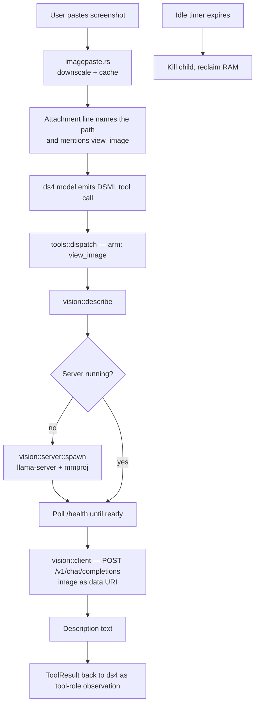

# Vision model plan: interpreting screenshots

Status: design, not implemented.

## Why

plank already accepts images. `imagepaste.rs` catches an empty bracketed paste
(clipboard image) or a pasted file path, downsamples PNGs to 2000px, dedups by
SHA-256 into `~/.plank/image-cache`, and attaches the result to the outgoing
message. But the attachment is only a *path*: the ds4 engine is text-only, so
the model is told "an image exists at `~/.plank/image-cache/<sha>.png`" and can
do nothing with it. A screenshot of a stack trace, a broken layout, or an error
dialog reaches the agent as a filename.

This plan adds a second, local, vision-capable model that turns those pixels
into text the ds4 model can reason about.

## The constraint that shapes everything

`refs/ds4` is antirez's own C kernel (`ds4.c`, `ds4_metal.m`), not llama.cpp.
There is no `mtmd` multimodal path to reuse and no vision tower in the ds4
architecture. A vision GGUF therefore cannot ride on the existing FFI; it needs
its own inference stack.

Three ways to get one were considered:

- Link llama.cpp statically as a second engine beside `ffi.rs`. Self-contained,
  but two inference stacks share one address space and one Metal device, and
  the build grows substantially.
- Use a Rust-native runtime (`mistral.rs`, `candle`). No C build, but a large
  dependency tree, thinner VLM architecture coverage, and its own Metal
  allocator sitting next to ds4's.
- **Spawn `llama-server` as a child process** and talk to it over localhost
  HTTP. Chosen.

The deciding factor is memory. ds4 Flash occupies roughly 87 GB. A vision model
in a separate process can be spawned on first use and killed when idle, and the
OS reclaims every byte. In-process, it is resident for the life of the session.
Process isolation also keeps plank's build exactly as it is today: no new
`build.rs` branch, no new `cfg` gate, no native code.

## Architecture



### New module: `src/vision/`

Three files, mirroring how `engine.rs` splits a trait from its backends:

- **`mod.rs`** — the `VisionEngine` trait (`fn describe(&mut self, image:
  &Path, prompt: &str) -> Result<String, VisionError>`), the `VisionError`
  enum, and a `StubVision` implementation that returns canned text. `StubVision`
  is to vision what `EchoEngine` is to inference: it keeps the whole feature
  testable and the app runnable with no model on disk.
- **`server.rs`** — child-process lifecycle. Finds the `llama-server` binary,
  picks a free localhost port, spawns with `--model`, `--mmproj`, `--port`,
  `--no-warmup`, waits on `/health`, and holds the `Child`. Owns the idle timer
  and a `Drop` impl that kills the child so no orphan survives a plank crash.
- **`client.rs`** — the OpenAI-compatible HTTP call. Builds a
  `/v1/chat/completions` body with a `content` array of one `text` part and one
  `image_url` part whose URL is a `data:image/png;base64,...` URI, parses the
  response, and extracts the message text. Pure request-building and
  response-parsing, no process management, so it unit-tests against a fake
  server.

The split matters: `client.rs` is the part with fiddly wire-format details and
it can be tested without ever spawning a process, while `server.rs` is the part
with OS-level concerns and no parsing.

### Why a trait when there is one backend

The `VisionEngine` boundary is not speculation about future backends. It is
what lets `tools::vision::tool_view_image` be tested with `StubVision` in CI,
where no GGUF and no `llama-server` exist. That is the same reason `Engine`
exists.

## Tool surface

A single new tool, `view_image`:

```
<view_image>
<path>~/.plank/image-cache/abc123.png</path>
<question>What error is shown in this dialog?</question>
</view_image>
```

`path` is required. `question` is optional; when absent the default prompt asks
for a full transcription of visible text plus a description of layout and
visual state, which is what a screenshot usually needs. Output is plain text
framed as a normal tool observation. Failures follow the C convention and start
with `Tool error:`.

Dispatch adds one arm to the match in `src/tools/mod.rs`, alongside
`google_search` and `visit_page`, guarded by a new `tools.vision` setting.

### Advertising it without breaking C parity

The system prompt is frozen by `tests/c_parity.rs` against the C source, so the
tool table in `sysprompt.rs` cannot gain a `view_image` entry. The tool is
advertised the same way MCP tools already are: as text appended after the
frozen prompt, present only when the feature is enabled.

This has a KV-cache consequence worth stating plainly. The Tier 1 fingerprint
is keyed on system prompt text, so the advert block must be byte-stable across
runs, and toggling vision on or off forces one full re-prefill. The advert must
therefore be rendered from settings alone, never from anything that varies with
the machine (no port number, no discovered binary path, no model filename).

## Model acquisition

Two files are needed: the quantized VLM GGUF and its companion `mmproj`
projector. Both land in `~/.plank/vision/`. A Qwen3-VL-class model at Q4 is
roughly 3 to 4 GB, small enough to coexist with ds4 during the seconds it is
alive.

`download.rs` already streams a Hugging Face file with a progress gauge and a
consent prompt; it gets a second entry point that fetches a named pair rather
than the single hardcoded ds4 GGUF. The prompt fires the first time
`view_image` is called with no model present, and declining is a normal
outcome: the tool returns `Tool error: no vision model installed` and the agent
carries on.

The `llama-server` binary is *not* vendored. plank looks for it on `PATH`, then
at a configured path. If it is missing, the error text names the fix
(`brew install llama.cpp`).

## Settings

A new `[vision]` section in `Settings`, following the existing shape in
`settings.rs`:

| Key | Default | Meaning |
| --- | --- | --- |
| `enabled` | `false` | Master switch; also gates the prompt advert |
| `model` | `~/.plank/vision/model.gguf` | VLM weights |
| `mmproj` | `~/.plank/vision/mmproj.gguf` | Projector |
| `binary` | *(PATH lookup)* | Explicit `llama-server` path |
| `idle_timeout_secs` | `300` | Shut the child down after this long unused |
| `max_tokens` | `1024` | Cap on description length |

Opt-in by default. Vision costs disk, RAM, and an external binary, and most
sessions never paste an image, so it should not switch itself on. `enabled`
belongs in `startup_note` so an active vision config is visible at launch.

## Integration with the paste path

`imagepaste.rs` needs no structural change. Only the attachment line the user
and model see changes: when vision is enabled it says the image can be read
with `view_image`, and when disabled it stays exactly as it is today. The
content-addressed cache path is already a stable handle, which is precisely
what the tool wants as its argument.

`upgrade.rs` already drops `~/.plank/image-cache` on a major version
transition. `~/.plank/vision/` should be exempt from that sweep: the weights
are large, slow to fetch, and have no format coupling to plank's caches.

## Error handling

Every failure is a tool observation, never a panic and never a crash of the
session:

- `llama-server` not found → error names the install command.
- Model or projector missing → error offers the download.
- Spawn fails or `/health` never comes up within a timeout → error reports the
  child's stderr tail, captured to `errlog.rs`.
- Request times out → the child is killed rather than left wedged, so the next
  call gets a clean server.
- Path is not an image, or is not under a readable location → rejected before
  any process work, reusing `detect_media_type` from `imagepaste.rs`.

Large images are downscaled through the same `image` crate path
`imagepaste.rs` already uses before base64 encoding, so a 5K screenshot does
not become a multi-megabyte JSON body.

## Testing

No test requires a model, a GPU, or a network:

- `client.rs`: build a request for a known image and assert the JSON shape and
  data URI; parse recorded response bodies, including error and truncated
  forms.
- `mod.rs`: `StubVision` drives `tool_view_image` end to end through
  `tools::dispatch`, covering the success arm and each error arm.
- `server.rs`: port selection and argument-vector construction are pure and
  tested directly; spawn itself is exercised with a fake binary script that
  answers `/health`, kept out of CI's default run.
- Prompt advert: a test asserts the advert text is byte-stable and absent when
  `enabled = false`, protecting the Tier 1 fingerprint.

## Non-goals

- No second *conversational* model. The vision model answers one question about
  one image and is not part of the transcript or the KV cache.
- No video, no PDF, no multi-image comparison in a single call.
- No automatic screenshot capture. The user pastes; plank does not grab the
  screen.
- No remote vision API fallback. This feature is local or it is off.
